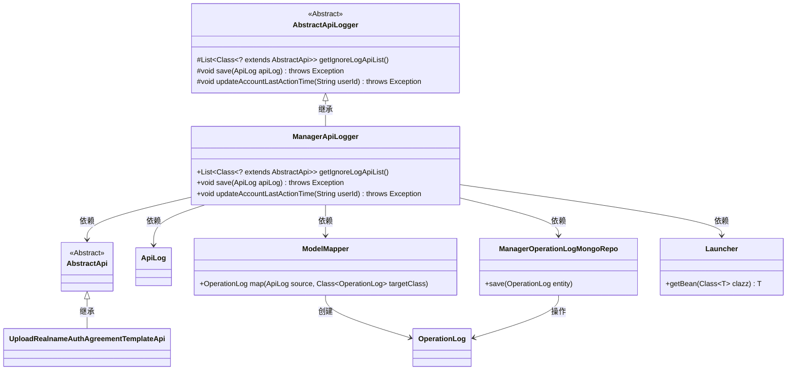
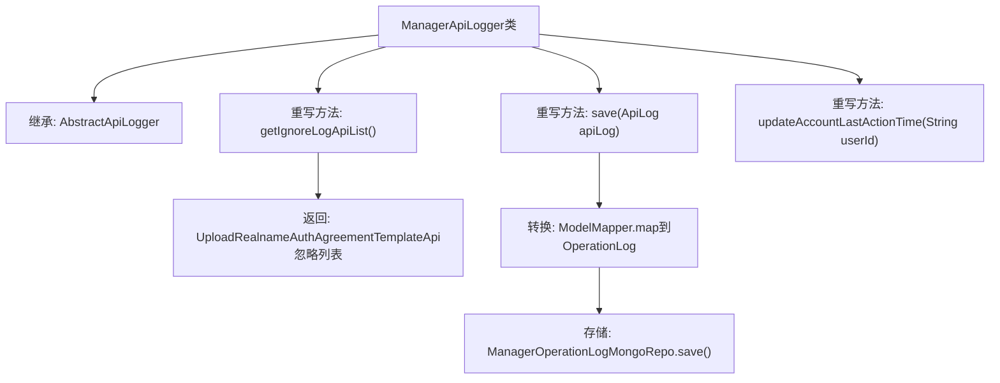

# 基础信息

|      |      |
|------|------|
| 名称 | ManagerApiLogger |
| 编码语言 | .java |
| 代码路径 | WeFe/manager/manager-service/src/main/java/com/welab/wefe/manager/service/operation/ManagerApiLogger.java |
| 包名 | com.welab.wefe.manager.service.operation |
| 依赖项 | ['com.welab.wefe.common.data.mongodb.entity.common.OperationLog', 'com.welab.wefe.common.data.mongodb.repo.ManagerOperationLogMongoRepo', 'com.welab.wefe.common.web.Launcher', 'com.welab.wefe.common.web.api.base.AbstractApi', 'com.welab.wefe.common.web.delegate.api_log.AbstractApiLogger', 'com.welab.wefe.common.web.delegate.api_log.ApiLog', 'com.welab.wefe.common.web.util.ModelMapper', 'com.welab.wefe.manager.service.api.agreement.UploadRealnameAuthAgreementTemplateApi', 'org.springframework.stereotype.Component', 'java.util.Arrays', 'java.util.List'] |
| 概述说明 | ManagerApiLogger继承AbstractApiLogger，忽略UploadRealnameAuthAgreementTemplateApi日志，将ApiLog转为OperationLog并存储至MongoDB，未实现updateAccountLastActionTime方法。 |

# 说明

这是一个名为ManagerApiLogger的Spring组件类，继承自AbstractApiLogger抽象类。它主要实现三个功能：1.通过getIgnoreLogApiList方法定义需要忽略日志记录的API列表，当前仅排除UploadRealnameAuthAgreementTemplateApi类；2.通过save方法将ApiLog对象转换为OperationLog模型后存入MongoDB数据库；3.留空的updateAccountLastActionTime方法暂未实现更新用户最后操作时间功能。该类使用Spring的依赖注入获取ManagerOperationLogMongoRepo实例进行数据库操作。

# 类列表 Class Summary

| 名称   | 类型  | 说明 |
|-------|------|-------------|
| ManagerApiLogger | class | ManagerApiLogger继承AbstractApiLogger，忽略UploadRealnameAuthAgreementTemplateApi日志，将ApiLog转为OperationLog并存储至MongoDB，不更新账户最后操作时间。 |

## 类 ManagerApiLogger

|      |      |
|------|------|
| 访问范围 | @Component;public |
| 类型 | class |
| 名称 | ManagerApiLogger |
| 说明 | ManagerApiLogger继承AbstractApiLogger，忽略UploadRealnameAuthAgreementTemplateApi日志，将ApiLog转为OperationLog并存储至MongoDB，不更新账户最后操作时间。 |

### UML类图

类图描述：该图展示了ManagerApiLogger继承自抽象类AbstractApiLogger，并实现了日志过滤、保存和更新时间功能。通过ModelMapper转换日志对象后，使用ManagerOperationLogMongoRepo进行存储。包含核心类如AbstractApi、ApiLog、OperationLog及其关系，体现了日志处理流程中的对象转换和持久化操作。

### 内部方法调用关系图

该流程图展示了ManagerApiLogger类的核心结构，它继承自AbstractApiLogger并实现了三个关键方法。getIgnoreLogApiList()方法返回需要忽略日志的API列表；save()方法将ApiLog转换为OperationLog后通过MongoDB存储；updateAccountLastActionTime()方法暂未实现具体逻辑。类通过@Component注解成为Spring管理的组件，体现了日志记录与存储的职责分离设计。

### 字段列表 Field List

| 名称  | 类型  | 说明 |
|-------|-------|------|

### 方法列表

| 名称  | 类型  | 说明 |
|-------|-------|------|
| save | void | 代码重写save方法，将ApiLog转为OperationLog后通过MongoRepo保存。 |
| getIgnoreLogApiList | List<Class<? extends AbstractApi>> | 该方法返回忽略日志记录的API列表，仅包含UploadRealnameAuthAgreementTemplateApi类。 |
| updateAccountLastActionTime | void | 空方法，未实现更新用户账户最后操作时间功能。 |

