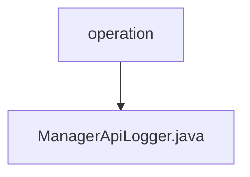

# 基础信息

|      |      |
|------|------|
| 名称 | operation |
| 编码语言 | .java |
| 代码路径 | WeFe/manager/manager-service/src/main/java/com/welab/wefe/manager/service/operation |
| 包名 | docs.manager.manager-service.src.main.java.com.welab.wefe.manager.service.operation |
| 概述说明 | ManagerApiLogger继承AbstractApiLogger，忽略UploadRealnameAuthAgreementTemplateApi日志，将ApiLog转为OperationLog并存储至MongoDB，未实现updateAccountLastActionTime方法。 |

# 说明

这是一个名为ManagerApiLogger的Spring组件类，继承自AbstractApiLogger抽象类。它主要实现三个功能：1.通过getIgnoreLogApiList方法定义需要忽略日志记录的API列表，当前仅排除UploadRealnameAuthAgreementTemplateApi类；2.通过save方法将ApiLog对象转换为OperationLog模型后存入MongoDB数据库；3.留空的updateAccountLastActionTime方法暂未实现更新用户最后操作时间功能。该类使用Spring的依赖注入获取ManagerOperationLogMongoRepo实例进行数据库操作。

### 包内部结构视图

该流程图展示了WeFe项目中manager-service模块的operation包与其包含的ManagerApiLogger.java文件之间的层级关系。operation作为父目录节点，ManagerApiLogger.java作为其子节点，清晰地呈现了Java类文件在项目结构中的位置关系。这种结构常见于Maven或Gradle构建的Java项目，其中operation包可能包含多个与服务操作相关的类文件。

# 文件列表

| 名称   | 类型  | 说明 |
|-------|------|-------------|
| [ManagerApiLogger.java](ManagerApiLogger.md) | file | ManagerApiLogger继承AbstractApiLogger，忽略UploadRealnameAuthAgreementTemplateApi日志，将ApiLog转为OperationLog并存储至MongoDB，未实现updateAccountLastActionTime方法。 |

