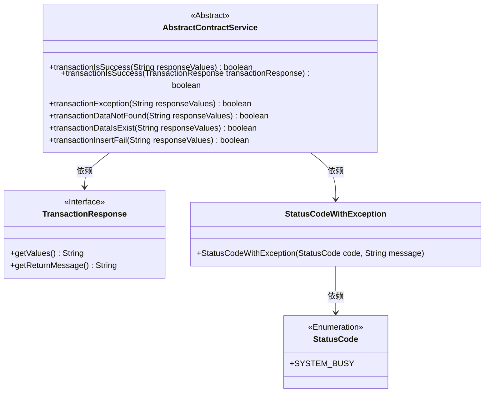
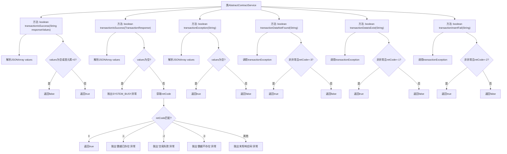

# 基础信息

|      |      |
|------|------|
| 名称 | AbstractContractService |
| 编码语言 | .java |
| 代码路径 | WeFe/manager/manager-service/src/main/java/com/welab/wefe/manager/service/service/AbstractContractService.java |
| 包名 | com.welab.wefe.manager.service.service |
| 依赖项 | ['com.alibaba.fastjson.JSONArray', 'com.welab.wefe.common.StatusCode', 'com.welab.wefe.common.exception.StatusCodeWithException', 'com.welab.wefe.common.util.JObject', 'org.fisco.bcos.sdk.transaction.model.dto.TransactionResponse'] |
| 概述说明 | AbstractContractService类提供多个方法检查区块链交易状态，包括成功、失败、数据存在与否等，通过解析JSON响应值判断结果，异常时抛出错误。 |

# 说明

AbstractContractService类提供了多个方法用于检查区块链交易执行结果。主要功能包括判断交易是否成功、处理交易异常情况以及检测特定错误状态。transactionIsSuccess方法有两个重载版本，一个直接解析响应字符串，另一个处理TransactionResponse对象并针对不同错误码抛出异常。其他辅助方法可检测数据不存在、数据已存在和插入失败等特定情况。所有方法都通过解析JSON格式的响应值进行判断，确保交易状态检查的准确性和全面性。

# 类列表 Class Summary

| 名称   | 类型  | 说明 |
|-------|------|-------------|
| AbstractContractService | class | AbstractContractService类提供多个方法检查区块链交易状态，包括成功、异常、数据不存在、数据已存在及插入失败等情况，通过解析JSON响应值判断结果。 |

## 类 AbstractContractService

|      |      |
|------|------|
| 访问范围 | public |
| 类型 | class |
| 名称 | AbstractContractService |
| 说明 | AbstractContractService类提供多个方法检查区块链交易状态，包括成功、异常、数据不存在、数据已存在及插入失败等情况，通过解析JSON响应值判断结果。 |

### UML类图

类图描述：
AbstractContractService是一个抽象类，提供了多个事务状态判断方法，主要处理区块链交易响应结果。它依赖TransactionResponse接口获取交易数据，并通过StatusCodeWithException处理异常情况。该类核心功能包括：判断交易是否成功、检测数据是否存在、处理插入失败等场景，所有方法都基于JSON格式的响应值进行解析，针对不同错误代码抛出特定异常或返回布尔结果。

### 内部方法调用关系图

该流程图描述了AbstractContractService类中多个交易状态判断方法的逻辑流程。核心方法transactionIsSuccess有两个重载版本，分别处理字符串响应和TransactionResponse对象，其他方法如transactionDataNotFound等均依赖transactionException进行基础校验。所有方法均通过解析JSON响应数据并检查特定状态码来实现不同场景的交易状态判断，包含正常成功、数据已存在、交易失败等情况的处理路径。异常处理流程会抛出带状态码的系统繁忙异常。

### 字段列表 Field List

| 名称  | 类型  | 说明 |
|-------|-------|------|

### 方法列表

| 名称  | 类型  | 说明 |
|-------|-------|------|
| transactionIsSuccess | boolean | 检查响应值是否为有效JSON数组且首元素非负，满足则返回成功，否则失败。 |
| transactionIsSuccess | boolean | 检查交易响应是否成功：解析JSON数组，返回码0为成功，非0抛出对应异常（数据已存在、交易失败、数据不存在或未知错误）。 |
| transactionDataNotFound | boolean | 检查响应数据是否未找到交易数据：非异常且首值为-3时返回真。 |
| transactionDataIsExist | boolean | 检查交易数据是否存在：解析JSON数组，确认无异常且首元素为-1。 |
| transactionException | boolean | 检查响应值是否为无效JSON数组，若为空或null则返回true。 |
| transactionInsertFail | boolean | 检查事务插入失败：解析JSON数组，非事务异常且首元素为-2时返回真。 |

