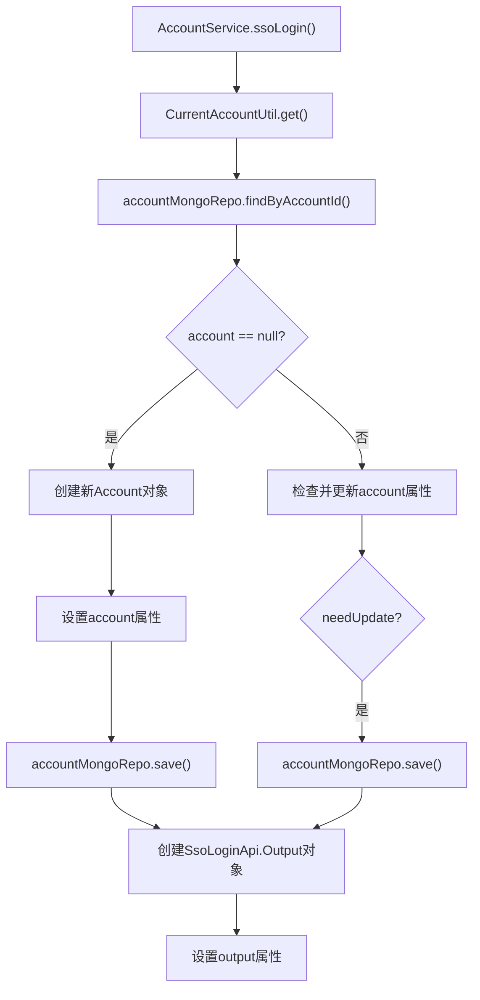

# 基础信息

|      |      |
|------|------|
| 名称 | AccountService |
| 编码语言 | .java |
| 代码路径 | WeFe/manager/manager-service/src/main/java/com/welab/wefe/manager/service/service/AccountService.java |
| 包名 | com.welab.wefe.manager.service.service |
| 依赖项 | ['com.welab.wefe.common.SecurityUtil', 'com.welab.wefe.common.data.mongodb.entity.manager.Account', 'com.welab.wefe.common.data.mongodb.repo.AccountMongoRepo', 'com.welab.wefe.common.exception.StatusCodeWithException', 'com.welab.wefe.common.util.Sha1', 'com.welab.wefe.common.util.StringUtil', 'com.welab.wefe.common.web.service.account.SsoAccountInfo', 'com.welab.wefe.common.web.util.CurrentAccountUtil', 'com.welab.wefe.common.web.util.DatabaseEncryptUtil', 'com.welab.wefe.common.wefe.enums.AuditStatus', 'com.welab.wefe.manager.service.api.account.SsoLoginApi', 'org.springframework.beans.factory.annotation.Autowired', 'org.springframework.stereotype.Service', 'org.springframework.transaction.annotation.Transactional', 'java.util.Date', 'java.util.UUID'] |
| 概述说明 | AccountService类提供SSO登录功能，检查并创建或更新账户信息，返回包含ID、令牌、手机号和昵称的输出。使用MongoDB存储账户数据，确保数据一致性和加密安全。 |

# 说明

该内容描述了一个名为AccountService的Spring服务类，用于处理单点登录（SSO）功能。服务类使用MongoDB存储账户信息，并通过事务管理确保操作一致性。主要逻辑包括：检查账户是否存在，若不存在则创建新账户并设置初始属性（如加密手机号、随机密码盐值等）；若存在则更新账户信息（如昵称、手机号、邮箱等）。最后返回包含用户ID、令牌、手机号和昵称的登录输出对象。整个过程涉及数据加密、状态管理和字段校验。

# 类列表 Class Summary

| 名称   | 类型  | 说明 |
|-------|------|-------------|
| AccountService | class | AccountService类提供SSO登录功能，通过MongoDB存储账户信息。若账户不存在则创建新账户并设置初始属性；若存在则更新不一致的昵称、手机号和邮箱。最后返回包含账户ID、令牌、手机号和昵称的输出对象。 |


## 类 AccountService

|      |      |
|------|------|
| 访问范围 | @Service;@Transactional(transactionManager = "transactionManagerManager", readOnly = true, rollbackFor = Exception.class);public |
| 类型 | class |
| 名称 | AccountService |
| 说明 | AccountService类提供SSO登录功能，通过MongoDB存储账户信息。若账户不存在则创建新账户并设置初始属性；若存在则更新不一致的昵称、手机号和邮箱。最后返回包含账户ID、令牌、手机号和昵称的输出对象。 |


### UML类图

```mermaid
classDiagram
    class AccountService {
        -AccountMongoRepo accountMongoRepo
        +ssoLogin() SsoLoginApi$Output
    }

    class AccountMongoRepo {
        +findByAccountId(String id) Account
        +save(Account account) Account
    }

    class Account {
        -String accountId
        -String phoneNumber
        -String salt
        -String password
        -String nickname
        -String email
        -boolean superAdminRole
        -boolean adminRole
        -AuditStatus auditStatus
        -boolean enable
        -boolean cancelled
        -boolean needUpdatePassword
        -Date lastActionTime
        -String updatedBy
        -long updateTime
        +setter/getter methods...
    }

    class SsoLoginApi$Output {
        -String id
        -String token
        -String phoneNumber
        -String nickname
        +setter/getter methods...
    }

    class CurrentAccountUtil {
        <<Utility>>
        +get() SsoAccountInfo
    }

    class SsoAccountInfo {
        -String id
        -String phoneNumber
        -String name
        -String email
        +setter/getter methods...
    }

    AccountService --> AccountMongoRepo : 依赖
    AccountService --> CurrentAccountUtil : 调用
    AccountService --> SsoLoginApi$Output : 创建
    AccountMongoRepo --> Account : 操作
    CurrentAccountUtil --> SsoAccountInfo : 返回
```

这段代码展示了一个SSO登录服务AccountService的实现，它通过AccountMongoRepo操作MongoDB中的Account实体，并与CurrentAccountUtil工具类交互获取当前账户信息。当账户不存在时会创建新账户，存在时则更新账户信息，最后返回包含登录信息的SsoLoginApi.Output对象。整个流程涉及账户信息验证、加密存储和状态管理等功能。


### 内部方法调用关系图



这段代码是AccountService类中的ssoLogin方法，主要处理单点登录逻辑。首先获取当前账户信息，然后查询MongoDB中是否存在该账户。如果不存在则创建新账户并保存；如果存在则检查并更新账户信息。最后构造并返回包含账户信息的输出对象。整个过程包含了账户的创建、更新和查询操作，并考虑了各种属性更新的条件判断。

### 字段列表 Field List

| 名称  | 类型  | 说明 |
|-------|-------|------|
| accountMongoRepo | AccountMongoRepo | 使用@Autowired自动注入AccountMongoRepo实例。 |

### 方法列表

| 名称  | 类型  | 说明 |
|-------|-------|------|
| ssoLogin | SsoLoginApi.Output | 方法实现单点登录功能，若账户不存在则创建新账户并设置属性，存在则更新不一致信息。最后返回包含ID、令牌、手机号和昵称的输出对象。 |


