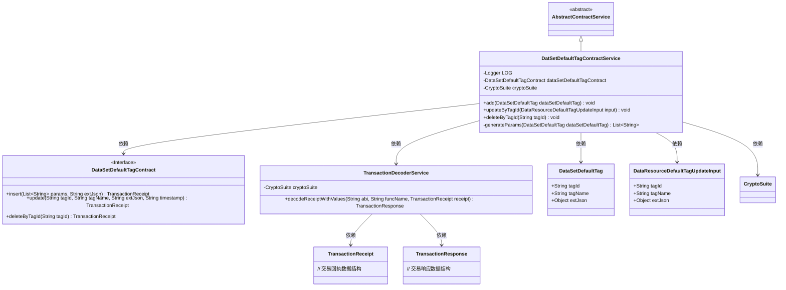
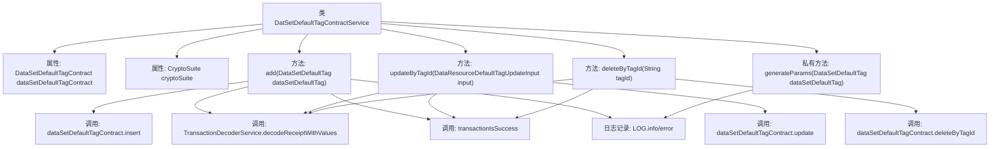

# 基础信息

|      |      |
|------|------|
| 名称 | DatSetDefaultTagContractService |
| 编码语言 | .java |
| 代码路径 | WeFe/manager/manager-service/src/main/java/com/welab/wefe/manager/service/service/DatSetDefaultTagContractService.java |
| 包名 | com.welab.wefe.manager.service.service |
| 依赖项 | ['com.welab.wefe.common.StatusCode', 'com.welab.wefe.common.data.mongodb.entity.union.DataSetDefaultTag', 'com.welab.wefe.common.exception.StatusCodeWithException', 'com.welab.wefe.common.util.DateUtil', 'com.welab.wefe.common.util.JObject', 'com.welab.wefe.common.util.StringUtil', 'com.welab.wefe.manager.service.contract.DataSetDefaultTagContract', 'com.welab.wefe.manager.service.dto.tag.DataResourceDefaultTagUpdateInput', 'org.fisco.bcos.sdk.crypto.CryptoSuite', 'org.fisco.bcos.sdk.model.TransactionReceipt', 'org.fisco.bcos.sdk.transaction.codec.decode.TransactionDecoderService', 'org.fisco.bcos.sdk.transaction.model.dto.TransactionResponse', 'org.slf4j.Logger', 'org.slf4j.LoggerFactory', 'org.springframework.beans.factory.annotation.Autowired', 'org.springframework.stereotype.Service', 'java.util.ArrayList', 'java.util.Date', 'java.util.List'] |
| 概述说明 | DatSetDefaultTagContractService提供数据集默认标签的增删改功能，通过智能合约操作，包含事务处理、日志记录和异常处理。 |

# 说明

DatSetDefaultTagContractService是一个继承自AbstractContractService的服务类，用于管理数据集默认标签的合约操作。它包含三个主要方法：add用于添加新标签，updateByTagId用于更新标签信息，deleteByTagId用于删除标签。每个方法都会发送交易并处理交易回执，使用TransactionDecoderService解码响应并验证交易是否成功。类中使用了日志记录和异常处理，确保操作的可追踪性和错误处理。generateParams方法用于生成标签操作所需的参数列表。

# 类列表 Class Summary

| 名称   | 类型  | 说明 |
|-------|------|-------------|
| DatSetDefaultTagContractService | class | DatSetDefaultTagContractService提供数据集默认标签的增删改功能，通过区块链交易实现，包含异常处理和日志记录。 |

## 类 DatSetDefaultTagContractService

|      |      |
|------|------|
| 访问范围 | @Service;public |
| 类型 | class |
| 名称 | DatSetDefaultTagContractService |
| 说明 | DatSetDefaultTagContractService提供数据集默认标签的增删改功能，通过区块链交易实现，包含异常处理和日志记录。 |

### UML类图

该代码是一个基于区块链的数据集默认标签合约服务实现，继承自抽象合约服务类。主要功能包括添加、更新和删除数据集默认标签，通过调用智能合约接口实现区块链交易，并使用交易解码服务解析交易回执。类图展示了服务类与智能合约接口、加密套件、数据模型及交易处理组件之间的依赖关系，体现了区块链应用分层架构的特点。

### 内部方法调用关系图

这段代码是DatSetDefaultTagContractService类的实现，继承自AbstractContractService。主要功能包括添加(add)、更新(updateByTagId)和删除(deleteByTagId)数据集默认标签，以及生成参数列表(generateParams)。每个操作都会调用智能合约方法，并通过TransactionDecoderService解码交易回执，最后验证交易是否成功。过程中会记录日志，并处理可能出现的异常情况。所有操作都涉及区块链交易处理流程，包括参数生成、合约调用、回执解码和结果验证等步骤。

### 字段列表 Field List

| 名称  | 类型  | 说明 |
|-------|-------|------|
| LOG = LoggerFactory.getLogger(DatSetDefaultTagContractService.class) | Logger | 类DatSetDefaultTagContractService中定义了一个静态不可变日志对象LOG。 |
| cryptoSuite | CryptoSuite | 使用@Autowired自动注入CryptoSuite加密工具实例。 |
| dataSetDefaultTagContract | DataSetDefaultTagContract | 自动注入数据集默认标签合约实例。 |

### 方法列表

| 名称  | 类型  | 说明 |
|-------|-------|------|
| add | void | 该方法用于添加数据集默认标签，通过调用合约插入数据，处理交易回执并检查结果，捕获异常并记录日志。 |
| updateByTagId | void | 方法updateByTagId通过智能合约更新标签信息，处理交易回执并检查结果，失败时抛出异常。 |
| deleteByTagId | void | 该方法通过tagId删除数据集标签，调用智能合约并解析交易回执，失败时抛出异常。 |
| generateParams | List<String> | 生成参数列表方法：接收DataSetDefaultTag对象，返回包含标签ID、名称及两个当前时间戳的字符串列表。 |

