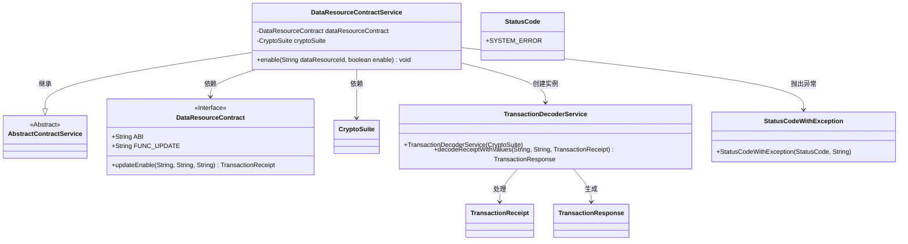
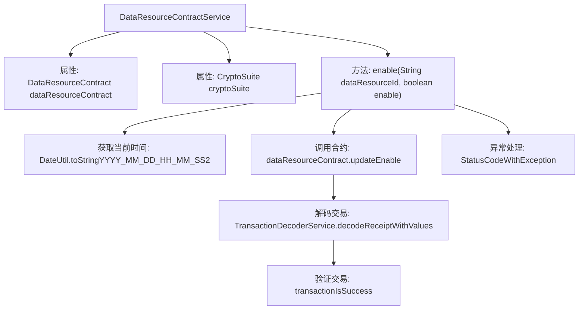

# 基础信息

|      |      |
|------|------|
| 名称 | DataResourceContractService |
| 编码语言 | .java |
| 代码路径 | WeFe/manager/manager-service/src/main/java/com/welab/wefe/manager/service/service/DataResourceContractService.java |
| 包名 | com.welab.wefe.manager.service.service |
| 依赖项 | ['com.welab.wefe.common.StatusCode', 'com.welab.wefe.common.exception.StatusCodeWithException', 'com.welab.wefe.common.util.DateUtil', 'com.welab.wefe.manager.service.contract.DataResourceContract', 'org.fisco.bcos.sdk.crypto.CryptoSuite', 'org.fisco.bcos.sdk.model.TransactionReceipt', 'org.fisco.bcos.sdk.transaction.codec.decode.TransactionDecoderService', 'org.fisco.bcos.sdk.transaction.model.dto.TransactionResponse', 'org.springframework.beans.factory.annotation.Autowired', 'org.springframework.stereotype.Service', 'java.util.Date'] |
| 概述说明 | DataResourceContractService类通过智能合约更新数据资源启用状态，处理交易回执并检查结果，异常时抛出系统错误。 |

# 说明

该内容描述了一个名为DataResourceContractService的服务类，继承自AbstractContractService。它通过@Autowired注入了DataResourceContract和CryptoSuite两个依赖项。类中包含一个enable方法，用于更新数据资源的启用状态。该方法接收数据资源ID和启用标志作为参数，构造更新时间戳，调用智能合约更新状态，并处理交易回执以验证操作是否成功。若出现异常，会抛出StatusCodeWithException并提示系统错误信息。整个过程涉及日期格式化、智能合约交互和交易结果解码。

# 类列表 Class Summary

| 名称   | 类型  | 说明 |
|-------|------|-------------|
| DataResourceContractService | class | DataResourceContractService类通过智能合约更新数据资源启用状态，处理交易回执并检查结果，异常时抛出系统错误。 |

## 类 DataResourceContractService

|      |      |
|------|------|
| 访问范围 | @Service;public |
| 类型 | class |
| 名称 | DataResourceContractService |
| 说明 | DataResourceContractService类通过智能合约更新数据资源启用状态，处理交易回执并检查结果，异常时抛出系统错误。 |

### UML类图

该代码是一个基于区块链的数据资源合约服务类，主要功能是通过智能合约更新数据资源的启用状态。类图展示了DataResourceContractService继承自AbstractContractService，并依赖DataResourceContract和CryptoSuite来执行区块链交易。当调用enable方法时，会创建交易收据并通过TransactionDecoderService解码响应，若出现异常则抛出StatusCodeWithException。整个流程涉及区块链交易处理、响应解码和异常管理机制。

### 内部方法调用关系图

该流程图展示了DataResourceContractService类的核心方法enable的执行流程。方法首先获取当前时间作为时间戳，然后调用智能合约更新数据资源状态，接着通过交易解码服务解析区块链交易回执，最后验证交易是否成功。整个过程包含异常处理机制，当任何步骤出错时会抛出包含错误信息的StatusCodeWithException。该流程清晰地反映了区块链智能合约调用的典型处理过程，包括交易发起、回执解析和状态验证等关键环节。

### 字段列表 Field List

| 名称  | 类型  | 说明 |
|-------|-------|------|
| cryptoSuite | CryptoSuite | 自动注入加密套件实例。 |
| dataResourceContract | DataResourceContract | 自动注入DataResourceContract实例。 |

### 方法列表

| 名称  | 类型  | 说明 |
|-------|-------|------|
| enable | void | 方法enable通过区块链合约更新数据资源启用状态，处理交易回执并检查结果，失败时抛出异常。 |

