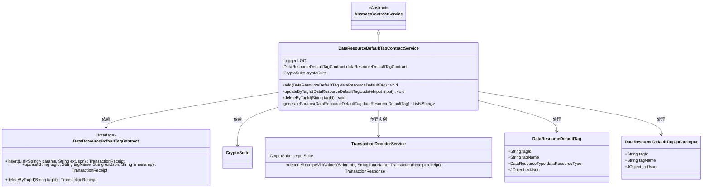
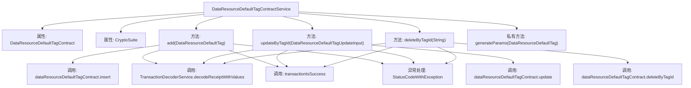

# 基础信息

|      |      |
|------|------|
| 名称 | DataResourceDefaultTagContractService |
| 编码语言 | .java |
| 代码路径 | WeFe/manager/manager-service/src/main/java/com/welab/wefe/manager/service/service/DataResourceDefaultTagContractService.java |
| 包名 | com.welab.wefe.manager.service.service |
| 依赖项 | ['com.welab.wefe.common.StatusCode', 'com.welab.wefe.common.data.mongodb.entity.union.DataResourceDefaultTag', 'com.welab.wefe.common.exception.StatusCodeWithException', 'com.welab.wefe.common.util.DateUtil', 'com.welab.wefe.common.util.JObject', 'com.welab.wefe.common.util.StringUtil', 'com.welab.wefe.manager.service.contract.DataResourceDefaultTagContract', 'com.welab.wefe.manager.service.dto.tag.DataResourceDefaultTagUpdateInput', 'org.fisco.bcos.sdk.crypto.CryptoSuite', 'org.fisco.bcos.sdk.model.TransactionReceipt', 'org.fisco.bcos.sdk.transaction.codec.decode.TransactionDecoderService', 'org.fisco.bcos.sdk.transaction.model.dto.TransactionResponse', 'org.slf4j.Logger', 'org.slf4j.LoggerFactory', 'org.springframework.beans.factory.annotation.Autowired', 'org.springframework.stereotype.Service', 'java.util.ArrayList', 'java.util.Date', 'java.util.List'] |
| 概述说明 | DataResourceDefaultTagContractService提供数据资源默认标签的增删改功能，通过智能合约交易实现，包含异常处理和日志记录。 |

# 说明

DataResourceDefaultTagContractService是一个继承自AbstractContractService的服务类，用于处理数据资源默认标签的增删改操作。该类通过自动注入的DataResourceDefaultTagContract和CryptoSuite实例与区块链交互。主要方法包括：add方法用于添加标签，通过生成参数并发送交易实现；updateByTagId方法根据标签ID更新标签信息；deleteByTagId方法根据标签ID删除标签。所有操作均涉及交易发送、回执解码和结果验证，并记录日志。异常处理包括捕获并记录错误信息，抛出StatusCodeWithException。generateParams方法用于生成交易参数列表。

# 类列表 Class Summary

| 名称   | 类型  | 说明 |
|-------|------|-------------|
| DataResourceDefaultTagContractService | class | DataResourceDefaultTagContractService提供数据资源默认标签的增删改功能，通过智能合约操作并处理交易回执，包含异常处理和日志记录。 |

## 类 DataResourceDefaultTagContractService

|      |      |
|------|------|
| 访问范围 | @Service;public |
| 类型 | class |
| 名称 | DataResourceDefaultTagContractService |
| 说明 | DataResourceDefaultTagContractService提供数据资源默认标签的增删改功能，通过智能合约操作并处理交易回执，包含异常处理和日志记录。 |

### UML类图

类图描述：该图展示了DataResourceDefaultTagContractService继承自AbstractContractService，并依赖DataResourceDefaultTagContract接口和CryptoSuite类。服务类通过TransactionDecoderService解析交易回执，主要处理DataResourceDefaultTag和DataResourceDefaultTagUpdateInput两种数据对象的增删改操作，体现了区块链合约调用的典型分层架构。

### 内部方法调用关系图

该流程图展示了DataResourceDefaultTagContractService类的主要结构和功能。类包含两个自动注入的属性（DataResourceDefaultTagContract和CryptoSuite），三个公开方法（add、updateByTagId和deleteByTagId）以及一个私有方法generateParams。每个公开方法都遵循类似的流程：调用合约方法、解码交易回执、验证交易结果，并包含异常处理逻辑。私有方法generateParams用于生成添加操作所需的参数列表。整个设计体现了对区块链合约操作的封装和统一错误处理机制。

### 字段列表 Field List

| 名称  | 类型  | 说明 |
|-------|-------|------|
| cryptoSuite | CryptoSuite | 使用@Autowired自动注入CryptoSuite加密工具组件。 |
| LOG = LoggerFactory.getLogger(DataResourceDefaultTagContractService.class) | Logger | 定义了一个私有静态不可变的日志对象LOG，用于DataResourceDefaultTagContractService类的日志记录。 |
| dataResourceDefaultTagContract | DataResourceDefaultTagContract | 使用@Autowired自动注入DataResourceDefaultTagContract实例。 |

### 方法列表

| 名称  | 类型  | 说明 |
|-------|-------|------|
| updateByTagId | void | 方法updateByTagId通过区块链合约更新标签数据，输入参数为DataResourceDefaultTagUpdateInput对象。调用合约update方法，传入标签ID、名称、扩展JSON和时间戳。解码交易回执并验证成功，失败则抛出StatusCodeWithException异常。 |
| add | void | 该方法用于添加数据资源默认标签，通过发送交易并解析回执来确认操作成功，捕获异常并记录日志。 |
| deleteByTagId | void | 该方法通过tagId删除数据资源标签，调用智能合约删除操作并解析交易回执，失败时抛出系统错误异常。 |
| generateParams | List<String> | 生成参数列表方法：将标签ID、名称、资源类型及当前时间组成列表返回。 |

