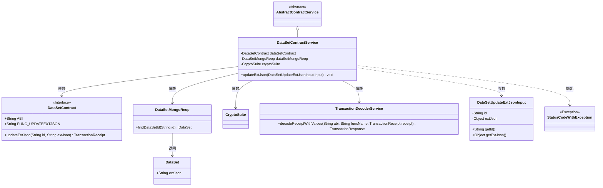
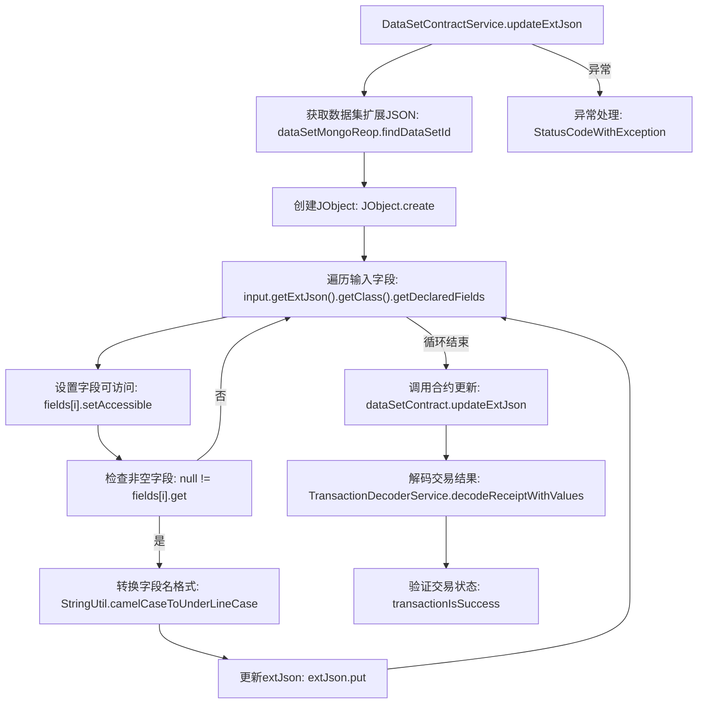

# 基础信息

|      |      |
|------|------|
| 名称 | DataSetContractService |
| 编码语言 | .java |
| 代码路径 | WeFe/manager/manager-service/src/main/java/com/welab/wefe/manager/service/service/DataSetContractService.java |
| 包名 | com.welab.wefe.manager.service.service |
| 依赖项 | ['com.welab.wefe.common.StatusCode', 'com.welab.wefe.common.data.mongodb.repo.DataSetMongoReop', 'com.welab.wefe.common.exception.StatusCodeWithException', 'com.welab.wefe.common.util.JObject', 'com.welab.wefe.common.util.StringUtil', 'com.welab.wefe.manager.service.contract.DataSetContract', 'com.welab.wefe.manager.service.dto.dataset.DataSetUpdateExtJsonInput', 'org.fisco.bcos.sdk.crypto.CryptoSuite', 'org.fisco.bcos.sdk.model.TransactionReceipt', 'org.fisco.bcos.sdk.transaction.codec.decode.TransactionDecoderService', 'org.fisco.bcos.sdk.transaction.model.dto.TransactionResponse', 'org.springframework.beans.factory.annotation.Autowired', 'org.springframework.stereotype.Service', 'java.lang.reflect.Field'] |
| 概述说明 | DataSetContractService类用于更新数据集扩展JSON。通过反射获取输入字段并转换为下划线格式，更新MongoDB数据后调用智能合约更新链上数据，处理交易回执并检查结果。异常时抛出系统错误。 |

# 说明

DataSetContractService是一个继承自AbstractContractService的服务类，用于更新数据集的扩展JSON信息。它通过注入DataSetContract、DataSetMongoReop和CryptoSuite组件实现功能。updateExtJson方法接收输入参数DataSetUpdateExtJsonInput，首先从MongoDB中获取现有扩展JSON，然后利用反射将输入对象中的非空字段转换为下划线命名格式并更新到JSON中。接着调用智能合约的updateExtJson方法提交交易，并使用TransactionDecoderService解码交易回执以验证结果。若过程中出现异常，则抛出StatusCodeWithException提示系统错误。整个过程包含数据查询、反射处理、区块链交易提交和结果验证等关键步骤。

# 类列表 Class Summary

| 名称   | 类型  | 说明 |
|-------|------|-------------|
| DataSetContractService | class | DataSetContractService类提供updateExtJson方法，用于更新数据集扩展JSON。通过反射处理输入字段，转换为下划线格式并更新到MongoDB，最后调用智能合约更新链上数据，处理交易回执并检查结果。异常时抛出系统错误。 |

## 类 DataSetContractService

|      |      |
|------|------|
| 访问范围 | @Service;public |
| 类型 | class |
| 名称 | DataSetContractService |
| 说明 | DataSetContractService类提供updateExtJson方法，用于更新数据集扩展JSON。通过反射处理输入字段，转换为下划线格式并更新到MongoDB，最后调用智能合约更新链上数据，处理交易回执并检查结果。异常时抛出系统错误。 |

### UML类图

该图展示了`DataSetContractService`继承自`AbstractContractService`，并依赖多个组件来实现数据更新功能。核心方法`updateExtJson`通过反射处理输入对象的字段，调用合约更新数据，并解码交易回执验证结果。涉及的主要类包括数据访问对象、区块链合约接口、加密工具和异常处理类，形成完整的数据更新流程。

### 内部方法调用关系图

该流程图展示了DataSetContractService类中updateExtJson方法的完整执行流程。方法首先从MongoDB获取数据集扩展JSON，然后通过反射遍历输入对象的所有字段，将非空字段转换为下划线命名格式并更新到extJson对象中。接着调用智能合约更新数据，最后解码并验证交易结果。整个过程包含异常处理机制，任何步骤出错都会抛出StatusCodeWithException。流程图清晰呈现了数据准备、字段处理、合约调用和结果验证四个主要阶段，以及各阶段的逻辑判断关系。

### 字段列表 Field List

| 名称  | 类型  | 说明 |
|-------|-------|------|
| dataSetMongoReop | DataSetMongoReop | 使用@Autowired自动注入DataSetMongoReop仓库实例。 |
| dataSetContract | DataSetContract | 自动注入DataSetContract实例。 |
| cryptoSuite | CryptoSuite | 自动注入加密工具组件实例。 |

### 方法列表

| 名称  | 类型  | 说明 |
|-------|-------|------|
| updateExtJson | void | 方法updateExtJson用于更新数据集扩展JSON，通过反射处理输入字段，转换为下划线格式并更新到MongoDB，最后调用智能合约验证交易结果。异常时抛出系统错误。 |

