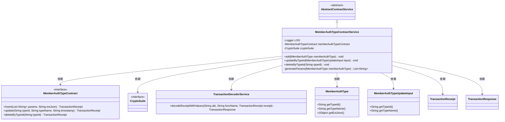
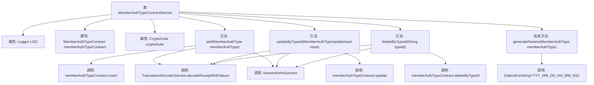

# 基础信息

|      |      |
|------|------|
| 名称 | MemberAuthTypeContractService |
| 编码语言 | .java |
| 代码路径 | WeFe/manager/manager-service/src/main/java/com/welab/wefe/manager/service/service/MemberAuthTypeContractService.java |
| 包名 | com.welab.wefe.manager.service.service |
| 依赖项 | ['com.welab.wefe.common.StatusCode', 'com.welab.wefe.common.data.mongodb.entity.union.MemberAuthType', 'com.welab.wefe.common.exception.StatusCodeWithException', 'com.welab.wefe.common.util.DateUtil', 'com.welab.wefe.common.util.JObject', 'com.welab.wefe.common.util.StringUtil', 'com.welab.wefe.manager.service.contract.MemberAuthTypeContract', 'com.welab.wefe.manager.service.dto.authtype.MemberAuthTypeUpdateInput', 'org.fisco.bcos.sdk.crypto.CryptoSuite', 'org.fisco.bcos.sdk.model.TransactionReceipt', 'org.fisco.bcos.sdk.transaction.codec.decode.TransactionDecoderService', 'org.fisco.bcos.sdk.transaction.model.dto.TransactionResponse', 'org.slf4j.Logger', 'org.slf4j.LoggerFactory', 'org.springframework.beans.factory.annotation.Autowired', 'org.springframework.stereotype.Service', 'java.util.ArrayList', 'java.util.Date', 'java.util.List'] |
| 概述说明 | MemberAuthTypeContractService类提供成员认证类型增删改功能，通过区块链交易实现，包含日志记录和异常处理。 |

# 说明

MemberAuthTypeContractService是一个服务类，继承自AbstractContractService，用于管理成员认证类型的合约操作。主要功能包括添加、更新和删除成员认证类型。添加功能通过insert方法发送交易并处理返回结果；更新功能通过update方法根据类型ID修改类型名称；删除功能通过deleteByTypeId方法根据类型ID删除记录。所有操作均会检查交易响应状态，失败时抛出异常并记录日志。内部方法generateParams用于生成交易参数列表。

# 类列表 Class Summary

| 名称   | 类型  | 说明 |
|-------|------|-------------|
| MemberAuthTypeContractService | class | MemberAuthTypeContractService类提供成员认证类型增删改功能，通过智能合约操作并处理交易回执，包含日志记录和异常处理。 |

## 类 MemberAuthTypeContractService

|      |      |
|------|------|
| 访问范围 | @Service;public |
| 类型 | class |
| 名称 | MemberAuthTypeContractService |
| 说明 | MemberAuthTypeContractService类提供成员认证类型增删改功能，通过智能合约操作并处理交易回执，包含日志记录和异常处理。 |

### UML类图

类图描述：MemberAuthTypeContractService继承自AbstractContractService，是一个服务类，负责处理成员认证类型的增删改操作。它依赖MemberAuthTypeContract接口执行区块链合约操作，使用CryptoSuite进行加密操作，通过TransactionDecoderService解析交易回执。主要方法包括添加(add)、更新(updateByTypeId)和删除(deleteByTypeId)成员认证类型，内部使用generateParams方法生成合约调用参数。

### 内部方法调用关系图

这段代码展示了一个名为MemberAuthTypeContractService的服务类，主要用于处理成员认证类型的增删改操作。该类继承自AbstractContractService，包含三个主要方法：add用于添加成员认证类型，updateByTypeId用于更新指定类型的成员认证信息，deleteByTypeId用于删除指定类型的成员认证。每个方法都会调用智能合约的相应功能，并通过TransactionDecoderService解析交易回执，最后调用transactionIsSuccess验证交易结果。私有方法generateParams用于生成添加操作所需的参数列表。整个过程涉及日志记录、异常处理和日期格式化等辅助功能。

### 字段列表 Field List

| 名称  | 类型  | 说明 |
|-------|-------|------|
| memberAuthTypeContract | MemberAuthTypeContract | 使用@Autowired自动注入MemberAuthTypeContract实例。 |
| cryptoSuite | CryptoSuite | 使用@Autowired自动注入CryptoSuite加密工具实例。 |
| LOG = LoggerFactory.getLogger(MemberAuthTypeContractService.class) | Logger | 类MemberAuthTypeContractService中定义了一个静态不可变的日志记录器LOG。 |

### 方法列表

| 名称  | 类型  | 说明 |
|-------|-------|------|
| add | void | 该方法向区块链发送交易以添加成员认证类型，处理交易回执并检查结果，成功记录日志，失败抛出异常。 |
| updateByTypeId | void | 方法updateByTypeId通过智能合约更新成员认证类型，处理交易回执并检查结果，失败时抛出异常。 |
| deleteByTypeId | void | 该方法通过typeId删除成员授权类型，调用智能合约函数并处理交易回执，失败时抛出异常。 |
| generateParams | List<String> | 生成参数列表方法：根据MemberAuthType获取类型ID和名称，并添加当前时间戳，返回列表。 |

