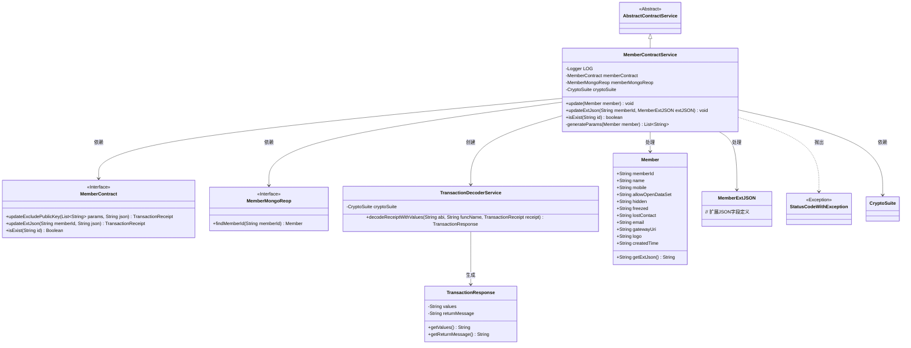
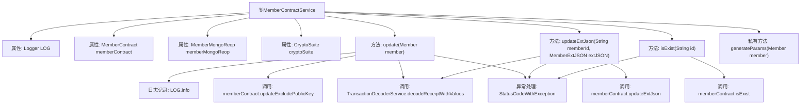

# 基础信息

|      |      |
|------|------|
| 名称 | MemberContractService |
| 编码语言 | .java |
| 代码路径 | WeFe/manager/manager-service/src/main/java/com/welab/wefe/manager/service/service/MemberContractService.java |
| 包名 | com.welab.wefe.manager.service.service |
| 依赖项 | ['com.welab.wefe.common.StatusCode', 'com.welab.wefe.common.data.mongodb.entity.union.Member', 'com.welab.wefe.common.data.mongodb.entity.union.ext.MemberExtJSON', 'com.welab.wefe.common.data.mongodb.repo.MemberMongoReop', 'com.welab.wefe.common.exception.StatusCodeWithException', 'com.welab.wefe.common.util.DateUtil', 'com.welab.wefe.common.util.JObject', 'com.welab.wefe.common.util.StringUtil', 'com.welab.wefe.manager.service.contract.MemberContract', 'org.fisco.bcos.sdk.crypto.CryptoSuite', 'org.fisco.bcos.sdk.model.TransactionReceipt', 'org.fisco.bcos.sdk.transaction.codec.decode.TransactionDecoderService', 'org.fisco.bcos.sdk.transaction.model.dto.TransactionResponse', 'org.slf4j.Logger', 'org.slf4j.LoggerFactory', 'org.springframework.beans.factory.annotation.Autowired', 'org.springframework.stereotype.Service', 'java.lang.reflect.Field', 'java.util.ArrayList', 'java.util.Date', 'java.util.List'] |
| 概述说明 | MemberContractService类继承AbstractContractService，提供成员合约更新、扩展JSON更新及成员存在性检查功能，处理区块链交易并记录日志。 |

# 说明

MemberContractService是一个继承自AbstractContractService的服务类，主要用于处理会员合约相关操作。它包含三个主要方法：update用于更新会员信息，通过区块链交易实现，并处理交易响应；updateExtJson用于更新会员的扩展JSON信息，通过反射动态处理字段；isExist用于检查会员信息是否存在。类中使用了日志记录和异常处理，确保操作的可追踪性和错误处理。此外，generateParams方法用于生成会员信息的参数列表。服务依赖MemberContract和MemberMongoReop等组件，并集成了CryptoSuite进行加密操作。

# 类列表 Class Summary

| 名称   | 类型  | 说明 |
|-------|------|-------------|
| MemberContractService | class | MemberContractService类提供成员合约操作，包括更新成员信息、检查成员存在性及处理交易响应。使用区块链交易和异常处理确保数据一致性。 |

## 类 MemberContractService

|      |      |
|------|------|
| 访问范围 | @Service;public |
| 类型 | class |
| 名称 | MemberContractService |
| 说明 | MemberContractService类提供成员合约操作，包括更新成员信息、检查成员存在性及处理交易响应。使用区块链交易和异常处理确保数据一致性。 |

### UML类图

类图描述：该图展示了MemberContractService继承自AbstractContractService，并依赖MemberContract、MemberMongoReop和CryptoSuite等组件。主要功能包括更新成员信息、检查成员存在性等，通过区块链交易实现数据更新，并处理各种异常情况。TransactionDecoderService用于解析交易回执，Member和MemberExtJSON表示成员数据模型。

### 内部方法调用关系图

该流程图展示了MemberContractService类的结构和主要方法调用关系。类包含4个属性和4个方法，其中update()和updateExtJson()是核心业务方法，涉及区块链交易处理和异常捕获。方法间通过成员变量memberContract进行交互，并统一使用TransactionDecoderService解析交易回执。异常处理贯穿所有公开方法，体现了健壮的错误处理机制。generateParams()作为私有工具方法，为update()提供参数预处理功能。整体结构清晰展现了服务层的业务逻辑和数据流转路径。

### 字段列表 Field List

| 名称  | 类型  | 说明 |
|-------|-------|------|
| LOG = LoggerFactory.getLogger(MemberContractService.class) | Logger | 类MemberContractService中定义了一个私有静态不可变日志对象LOG。 |
| memberContract | MemberContract | 代码中通过@Autowired自动注入MemberContract成员变量。 |
| memberMongoReop | MemberMongoReop | 使用@Autowired自动注入MemberMongoReop成员变量。 |
| cryptoSuite | CryptoSuite | 代码中通过@Autowired自动注入了一个CryptoSuite加密工具类的实例。 |

### 方法列表

| 名称  | 类型  | 说明 |
|-------|-------|------|
| update | void | 更新成员信息，发送交易并处理返回结果。若交易异常或数据不存在则抛出错误，捕获异常时记录日志并提示系统错误。 |
| updateExtJson | void | 更新成员扩展JSON数据方法：通过反射获取字段值，转换为下划线格式后存入JObject，调用智能合约更新并检查交易结果，异常时抛出系统错误。 |
| isExist | boolean | 检查成员信息是否存在，成功返回布尔值，失败抛出系统错误异常。 |
| generateParams | List<String> | 生成参数列表，包含成员ID、姓名、手机号、权限状态、隐藏冻结标记、失联状态、邮箱、网关URI、LOGO、创建时间、当前时间及时间戳。 |

