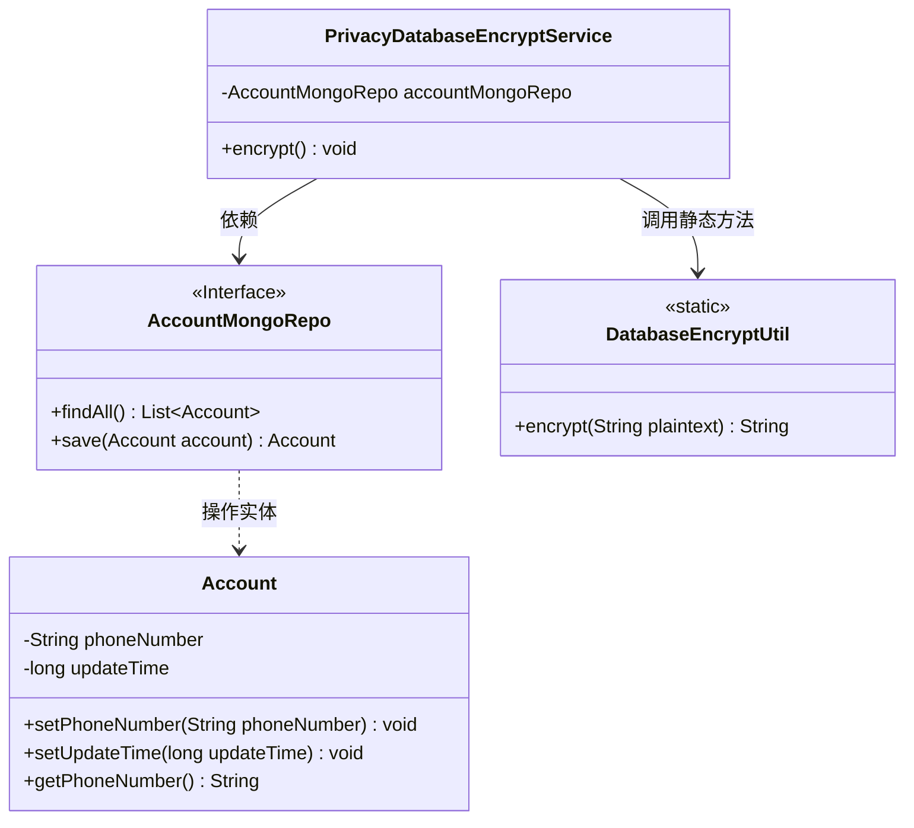
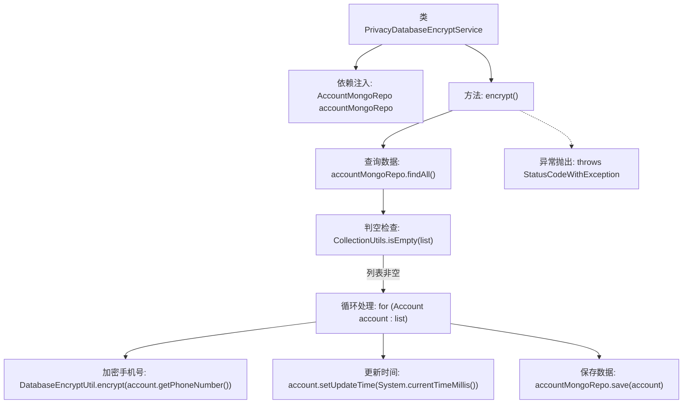

# 基础信息

|      |      |
|------|------|
| 名称 | PrivacyDatabaseEncryptService |
| 编码语言 | .java |
| 代码路径 | WeFe/manager/manager-service/src/main/java/com/welab/wefe/manager/service/service/PrivacyDatabaseEncryptService.java |
| 包名 | com.welab.wefe.manager.service.service |
| 依赖项 | ['com.welab.wefe.common.data.mongodb.entity.manager.Account', 'com.welab.wefe.common.data.mongodb.repo.AccountMongoRepo', 'com.welab.wefe.common.exception.StatusCodeWithException', 'com.welab.wefe.common.web.util.DatabaseEncryptUtil', 'org.springframework.beans.factory.annotation.Autowired', 'org.springframework.stereotype.Service', 'org.springframework.util.CollectionUtils', 'java.util.List'] |
| 概述说明 | 隐私数据库加密服务，通过AccountMongoRepo获取账户列表，使用DatabaseEncryptUtil加密电话号码并更新修改时间，最后保存至数据库。 |

# 说明

这是一个名为PrivacyDatabaseEncryptService的服务类，用于对数据库中的隐私数据进行加密处理。它通过自动注入的AccountMongoRepo来获取所有账户数据，检查列表是否为空后，遍历每个账户对象，使用DatabaseEncryptUtil工具加密电话号码字段，并更新最后修改时间戳，最后将加密后的账户数据保存回数据库。整个过程封装在encrypt方法中，可能抛出StatusCodeWithException异常。

# 类列表 Class Summary

| 名称   | 类型  | 说明 |
|-------|------|-------------|
| PrivacyDatabaseEncryptService | class | 隐私数据库加密服务，通过AccountMongoRepo获取账户列表，对每个账户的手机号进行加密并更新修改时间，最后保存到数据库。 |

## 类 PrivacyDatabaseEncryptService

|      |      |
|------|------|
| 访问范围 | @Service;public |
| 类型 | class |
| 名称 | PrivacyDatabaseEncryptService |
| 说明 | 隐私数据库加密服务，通过AccountMongoRepo获取账户列表，对每个账户的手机号进行加密并更新修改时间，最后保存到数据库。 |

### UML类图

该类图展示了隐私数据加密服务的核心结构。PrivacyDatabaseEncryptService通过依赖AccountMongoRepo接口获取账户数据，遍历时调用DatabaseEncryptUtil的静态加密方法处理电话号码，最后通过仓库保存更新。Account作为实体类存储核心字段，整个流程实现了数据库敏感字段的批量加密功能，包含空集合检查和更新时间记录等边界处理。

### 内部方法调用关系图

这段代码流程图展示了隐私数据加密服务的核心逻辑。服务首先通过MongoDB仓库查询所有账户数据，进行空值检查后遍历处理每个账户：使用工具类加密手机号字段，更新修改时间戳，最后保存回数据库。整个过程被封装在可能抛出StatusCodeWithException的方法中，体现了数据加密批处理的完整流程和安全防护机制。

### 字段列表 Field List

| 名称  | 类型  | 说明 |
|-------|-------|------|
| accountMongoRepo | AccountMongoRepo | 使用@Autowired自动注入AccountMongoRepo实例。 |

### 方法列表

| 名称  | 类型  | 说明 |
|-------|-------|------|
| encrypt | void | 加密所有账户的手机号并更新修改时间。若无账户则直接返回。 |

