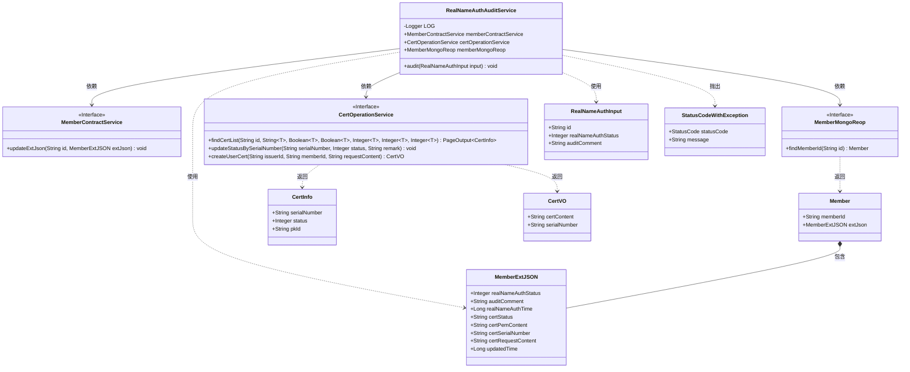
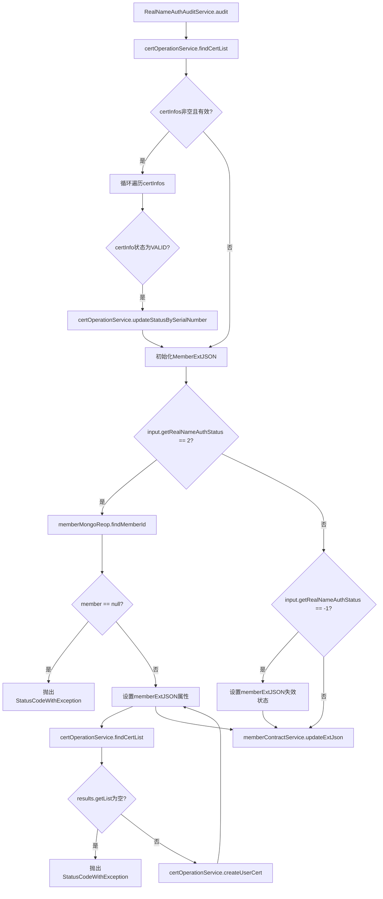

# 基础信息

|      |      |
|------|------|
| 名称 | RealNameAuthAuditService |
| 编码语言 | .java |
| 代码路径 | WeFe/manager/manager-service/src/main/java/com/welab/wefe/manager/service/service/RealNameAuthAuditService.java |
| 包名 | com.welab.wefe.manager.service.service |
| 依赖项 | ['com.webank.cert.mgr.model.vo.CertVO', 'com.webank.cert.mgr.service.CertOperationService', 'com.webank.cert.toolkit.enums.CertStatusEnums', 'com.welab.wefe.common.StatusCode', 'com.welab.wefe.common.data.mongodb.dto.PageOutput', 'com.welab.wefe.common.data.mongodb.entity.manager.CertInfo', 'com.welab.wefe.common.data.mongodb.entity.union.Member', 'com.welab.wefe.common.data.mongodb.entity.union.ext.MemberExtJSON', 'com.welab.wefe.common.data.mongodb.repo.MemberMongoReop', 'com.welab.wefe.common.exception.StatusCodeWithException', 'com.welab.wefe.manager.service.dto.member.RealNameAuthInput', 'org.slf4j.Logger', 'org.slf4j.LoggerFactory', 'org.springframework.beans.factory.annotation.Autowired', 'org.springframework.stereotype.Service', 'org.springframework.util.CollectionUtils', 'javax.transaction.Transactional', 'java.util.List'] |
| 概述说明 | RealNameAuthAuditService处理实名认证审核，更新证书状态和成员信息，包括签发新证书或标记无效状态。 |

# 说明

RealNameAuthAuditService是一个用于处理实名认证审核的服务类。它通过依赖注入获取MemberContractService、CertOperationService和MemberMongoReop服务。audit方法接收RealNameAuthInput参数，处理实名认证审核逻辑。首先检查并更新现有证书状态为无效，然后根据审核状态更新成员扩展信息。若审核通过（状态2），会签发新证书并更新证书信息；若审核失败（状态-1），则标记证书无效。最后通过memberContractService更新成员扩展信息。整个过程包含事务管理，确保数据一致性。

# 类列表 Class Summary

| 名称   | 类型  | 说明 |
|-------|------|-------------|
| RealNameAuthAuditService | class | RealNameAuthAuditService处理实名认证审核，更新证书状态和成员信息。审核通过时签发新证书，失败则标记无效。涉及MemberContractService、CertOperationService和MemberMongoReop服务。 |

## 类 RealNameAuthAuditService

|      |      |
|------|------|
| 访问范围 | @Service;public |
| 类型 | class |
| 名称 | RealNameAuthAuditService |
| 说明 | RealNameAuthAuditService处理实名认证审核，更新证书状态和成员信息。审核通过时签发新证书，失败则标记无效。涉及MemberContractService、CertOperationService和MemberMongoReop服务。 |

### UML类图

该类图展示了实名认证审核服务(RealNameAuthAuditService)的核心结构及其依赖关系。服务通过MemberContractService、CertOperationService和MemberMongoReop三个接口完成成员信息更新、证书操作和成员数据查询功能。主要处理流程包括：验证证书状态、更新成员实名认证状态、签发新证书等操作，涉及RealNameAuthInput输入参数、MemberExtJSON扩展信息、CertInfo证书信息等多个数据传输对象。系统通过抛出StatusCodeWithException处理异常情况，整体架构体现了清晰的职责划分和模块化设计。

### 内部方法调用关系图

流程图描述：该流程图展示了实名认证审核服务的核心逻辑流程。首先查询证书列表并处理有效证书，然后根据审核状态(通过/失败)分支处理：通过时需签发新证书并更新用户扩展信息，失败时标记证书失效。整个过程涉及证书状态更新、成员信息查询、证书签发及数据持久化操作，包含多个异常处理分支。

### 字段列表 Field List

| 名称  | 类型  | 说明 |
|-------|-------|------|
| LOG = LoggerFactory.getLogger(RealNameAuthAuditService.class) | Logger | 定义RealNameAuthAuditService类的静态常量LOG，用于日志记录。 |
| memberContractService | MemberContractService | 自动注入会员合同服务实例。 |
| memberMongoReop | MemberMongoReop | 代码片段使用@Autowired自动注入MemberMongoReop仓库实例。 |
| certOperationService | CertOperationService | 使用@Autowired自动注入CertOperationService实例。 |

### 方法列表

| 名称  | 类型  | 说明 |
|-------|-------|------|
| audit | void | 该方法处理实名认证审核：若状态为2（通过），则更新用户证书状态为有效并签发新证书；若状态为-1（失败），则标记证书无效。过程中会检查现有证书状态并更新用户扩展信息。 |

