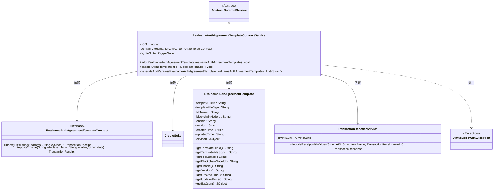
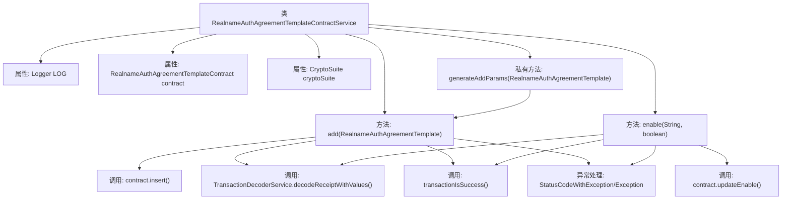
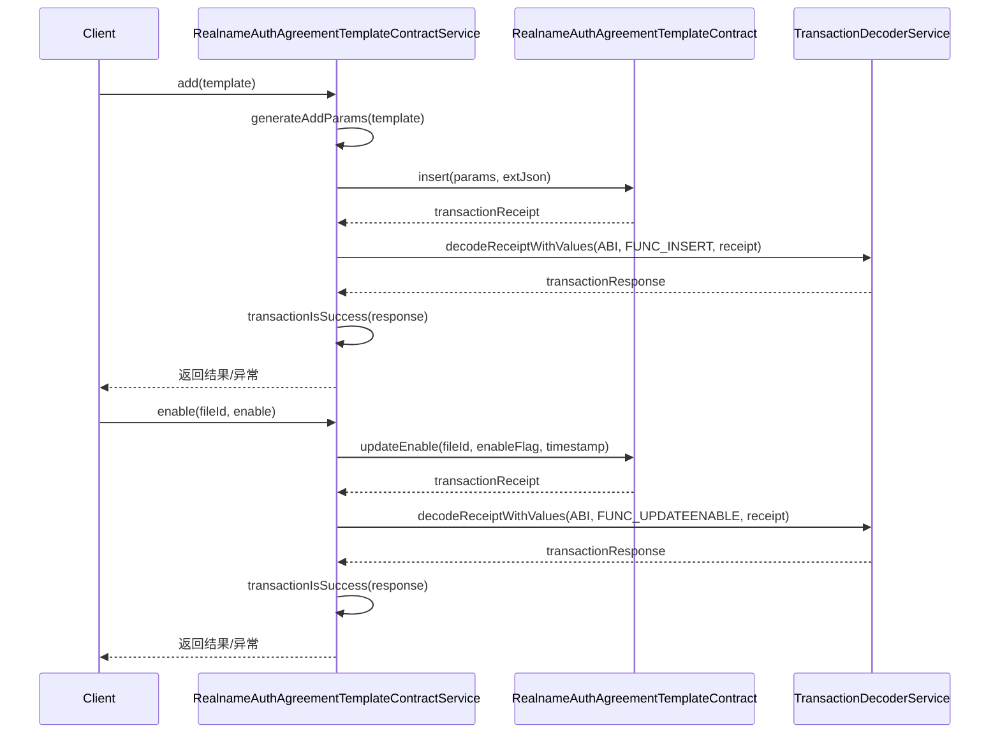

# 基础信息

|      |      |
|------|------|
| 名称 | RealnameAuthAgreementTemplateContractService |
| 编码语言 | .java |
| 代码路径 | WeFe/manager/manager-service/src/main/java/com/welab/wefe/manager/service/service/RealnameAuthAgreementTemplateContractService.java |
| 包名 | com.welab.wefe.manager.service.service |
| 依赖项 | ['com.welab.wefe.common.StatusCode', 'com.welab.wefe.common.data.mongodb.entity.union.RealnameAuthAgreementTemplate', 'com.welab.wefe.common.exception.StatusCodeWithException', 'com.welab.wefe.common.util.JObject', 'com.welab.wefe.manager.service.contract.RealnameAuthAgreementTemplateContract', 'org.fisco.bcos.sdk.crypto.CryptoSuite', 'org.fisco.bcos.sdk.model.TransactionReceipt', 'org.fisco.bcos.sdk.transaction.codec.decode.TransactionDecoderService', 'org.fisco.bcos.sdk.transaction.model.dto.TransactionResponse', 'org.slf4j.Logger', 'org.slf4j.LoggerFactory', 'org.springframework.beans.factory.annotation.Autowired', 'org.springframework.stereotype.Service', 'java.util.ArrayList', 'java.util.Date', 'java.util.List', 'com.welab.wefe.common.util.DateUtil.toStringYYYY_MM_DD_HH_MM_SS2'] |
| 概述说明 | RealnameAuthAgreementTemplateContractService提供实名认证协议模板的添加和启用功能，通过区块链交易实现数据上链，包含异常处理和日志记录。 |

# 说明

RealnameAuthAgreementTemplateContractService是一个服务类，继承自AbstractContractService，用于处理实名认证协议模板的合约操作。该类包含两个主要方法：add方法用于添加新的协议模板，通过合约插入交易并处理交易回执；enable方法用于启用或禁用指定模板文件ID的协议模板。此外，generateAddParams方法用于生成添加协议模板所需的参数列表。类中注入了合约实例和加密套件，并通过日志记录操作过程和异常信息。

# 类列表 Class Summary

| 名称   | 类型  | 说明 |
|-------|------|-------------|
| RealnameAuthAgreementTemplateContractService | class | RealnameAuthAgreementTemplateContractService提供实名认证协议模板的添加和启用功能，通过区块链交易处理数据，包含异常处理和日志记录。 |

## 类 RealnameAuthAgreementTemplateContractService

|      |      |
|------|------|
| 访问范围 | @Service;public |
| 类型 | class |
| 名称 | RealnameAuthAgreementTemplateContractService |
| 说明 | RealnameAuthAgreementTemplateContractService提供实名认证协议模板的添加和启用功能，通过区块链交易处理数据，包含异常处理和日志记录。 |

### UML类图

该类图展示了实名认证协议模板合约服务的核心结构。RealnameAuthAgreementTemplateContractService继承自AbstractContractService，依赖RealnameAuthAgreementTemplateContract接口进行区块链操作，使用CryptoSuite进行加密解密，并处理RealnameAuthAgreementTemplate实体数据。服务包含添加模板和启用/禁用模板两个主要方法，通过TransactionDecoderService解析交易回执，可能抛出StatusCodeWithException异常。整体设计体现了区块链合约服务的典型分层架构。

### 内部方法调用关系图

该流程图展示了实名认证协议模板服务类的核心结构，包含两个主要业务方法：添加模板(add)和启用控制(enable)。时序图详细描述了区块链合约调用的完整流程，包括参数生成、交易发送、回执解码和结果验证等关键步骤，同时覆盖了异常处理路径。类通过组合方式使用合约实例和密码套件，体现了清晰的职责划分。

### 字段列表 Field List

| 名称  | 类型  | 说明 |
|-------|-------|------|
| LOG = LoggerFactory.getLogger(RealnameAuthAgreementTemplateContractService.class) | Logger | 类RealnameAuthAgreementTemplateContractService中定义了一个静态不可变日志记录器LOG。 |
| cryptoSuite | CryptoSuite | 自动注入加密套件实例。 |
| contract | RealnameAuthAgreementTemplateContract | 使用@Autowired自动注入RealnameAuthAgreementTemplateContract合约实例。 |

### 方法列表

| 名称  | 类型  | 说明 |
|-------|-------|------|
| enable | void | 方法enable通过智能合约更新模板启用状态，处理交易回执并检查结果，失败时抛出异常。 |
| add | void | 该方法用于添加实名认证协议模板，通过合约交易插入模板数据，处理交易回执并检查结果，成功记录日志，失败抛出异常。 |
| generateAddParams | List<String> | 生成实名认证协议模板参数列表，包含文件ID、签名、名称、区块链节点ID、启用状态、版本及创建更新时间。 |

