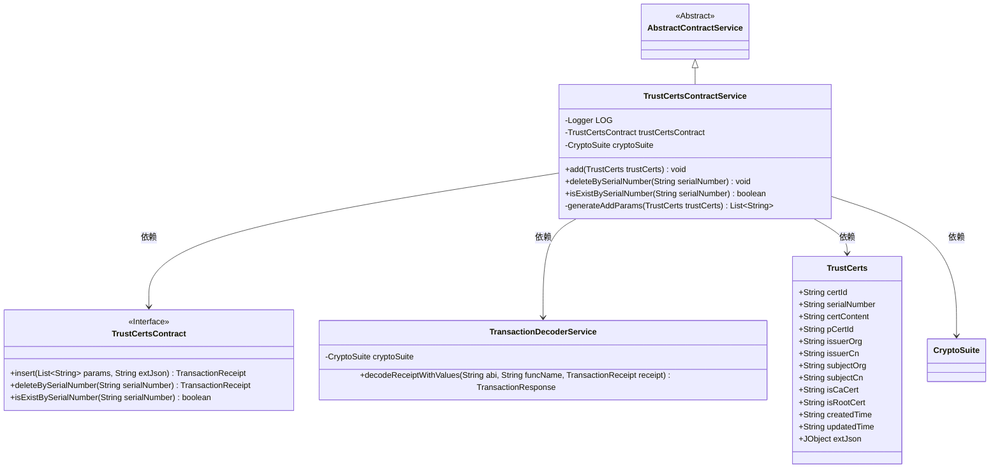
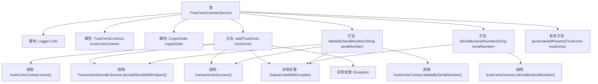

# 基础信息

|      |      |
|------|------|
| 名称 | TrustCertsContractService |
| 编码语言 | .java |
| 代码路径 | WeFe/manager/manager-service/src/main/java/com/welab/wefe/manager/service/service/TrustCertsContractService.java |
| 包名 | com.welab.wefe.manager.service.service |
| 依赖项 | ['com.welab.wefe.common.StatusCode', 'com.welab.wefe.common.data.mongodb.entity.union.TrustCerts', 'com.welab.wefe.common.exception.StatusCodeWithException', 'com.welab.wefe.common.util.JObject', 'com.welab.wefe.common.util.StringUtil', 'com.welab.wefe.manager.service.contract.TrustCertsContract', 'org.fisco.bcos.sdk.crypto.CryptoSuite', 'org.fisco.bcos.sdk.model.TransactionReceipt', 'org.fisco.bcos.sdk.transaction.codec.decode.TransactionDecoderService', 'org.fisco.bcos.sdk.transaction.model.dto.TransactionResponse', 'org.slf4j.Logger', 'org.slf4j.LoggerFactory', 'org.springframework.beans.factory.annotation.Autowired', 'org.springframework.stereotype.Service', 'java.util.ArrayList', 'java.util.List'] |
| 概述说明 | TrustCertsContractService提供证书管理功能，包括添加、删除和查询证书。添加证书时生成参数并发送交易，删除和查询通过序列号操作。异常处理完善，日志记录详细。 |

# 说明

TrustCertsContractService是一个继承自AbstractContractService的服务类，用于管理信任证书的添加、删除和查询操作。该类通过自动注入TrustCertsContract和CryptoSuite实例，提供三个主要方法：add方法用于添加证书，处理交易回执并记录日志；deleteBySerialNumber通过序列号删除证书；isExistBySerialNumber检查证书是否存在。generateAddParams方法将证书属性转换为参数列表。所有操作均包含异常处理，抛出StatusCodeWithException异常。

# 类列表 Class Summary

| 名称   | 类型  | 说明 |
|-------|------|-------------|
| TrustCertsContractService | class | TrustCertsContractService提供添加、删除和检查证书功能，处理交易回执并记录日志，异常时抛出状态码错误。 |

## 类 TrustCertsContractService

|      |      |
|------|------|
| 访问范围 | @Service;public |
| 类型 | class |
| 名称 | TrustCertsContractService |
| 说明 | TrustCertsContractService提供添加、删除和检查证书功能，处理交易回执并记录日志，异常时抛出状态码错误。 |

### UML类图

这段代码展示了一个名为TrustCertsContractService的服务类，它继承自AbstractContractService，主要用于处理与信任证书（TrustCerts）相关的合约操作。该类通过依赖TrustCertsContract接口执行插入、删除和查询操作，使用TransactionDecoderService解析交易回执，并利用CryptoSuite进行加密操作。TrustCerts类包含了证书的各种属性，如证书ID、序列号、颁发者和主题信息等。整个设计体现了清晰的职责分离和模块化思想，通过异常处理和日志记录确保操作的可靠性。

### 内部方法调用关系图

这段代码展示了一个名为TrustCertsContractService的服务类，主要用于管理信任证书的添加、删除和查询操作。类中包含三个主要方法：add()用于添加证书，deleteBySerialNumber()用于删除证书，isExistBySerialNumber()用于检查证书是否存在。每个方法都包含异常处理逻辑，其中add()方法最为复杂，涉及参数生成、交易发送、收据解码和结果验证等多个步骤。私有方法generateAddParams()用于为添加操作准备参数列表。整个类通过依赖注入获取TrustCertsContract和CryptoSuite实例，并使用日志记录器进行日志输出。

### 字段列表 Field List

| 名称  | 类型  | 说明 |
|-------|-------|------|
| cryptoSuite | CryptoSuite | 代码中通过@Autowired自动注入了一个CryptoSuite加密工具类的实例。 |
| LOG = LoggerFactory.getLogger(TrustCertsContractService.class) | Logger | 定义TrustCertsContractService类的静态日志对象LOG。 |
| trustCertsContract | TrustCertsContract | 自动注入TrustCertsContract合约实例。 |

### 方法列表

| 名称  | 类型  | 说明 |
|-------|-------|------|
| add | void | 该方法用于添加信任证书，调用合约插入数据并处理交易回执，成功记录日志，异常则抛出错误。 |
| deleteBySerialNumber | void | 该方法通过序列号删除信任证书，调用智能合约处理并检查交易结果，失败时抛出异常。 |
| isExistBySerialNumber | boolean | 检查证书序列号是否存在，若异常则抛出系统错误。 |
| generateAddParams | List<String> | 生成TrustCerts对象参数列表，包含证书ID、序列号、内容、父证书ID、颁发者信息、主题信息、CA标志、根证书标志及时间戳。空值转为空字符串。 |

