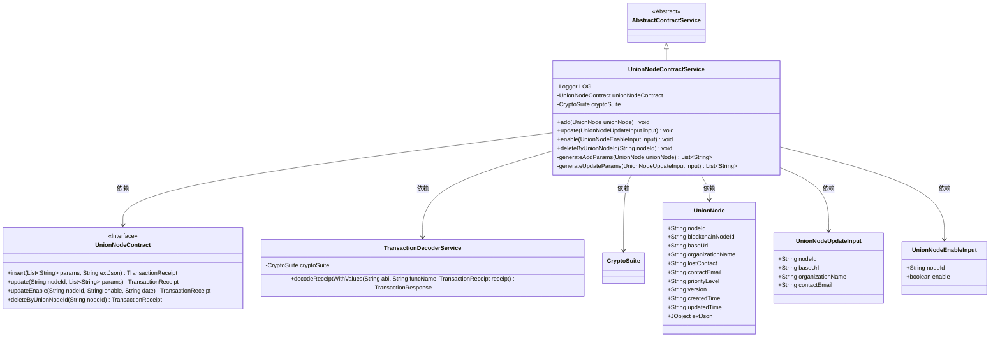
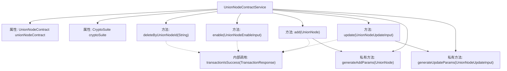
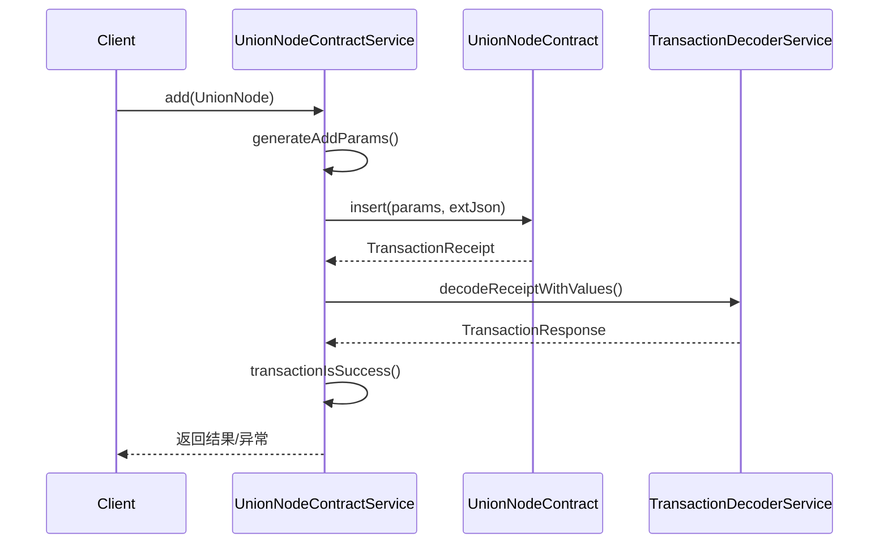

# 基础信息

|      |      |
|------|------|
| 名称 | UnionNodeContractService |
| 编码语言 | .java |
| 代码路径 | WeFe/manager/manager-service/src/main/java/com/welab/wefe/manager/service/service/UnionNodeContractService.java |
| 包名 | com.welab.wefe.manager.service.service |
| 依赖项 | ['com.welab.wefe.common.StatusCode', 'com.welab.wefe.common.data.mongodb.entity.union.UnionNode', 'com.welab.wefe.common.exception.StatusCodeWithException', 'com.welab.wefe.common.util.JObject', 'com.welab.wefe.common.util.StringUtil', 'com.welab.wefe.manager.service.contract.UnionNodeContract', 'com.welab.wefe.manager.service.dto.union.UnionNodeEnableInput', 'com.welab.wefe.manager.service.dto.union.UnionNodeUpdateInput', 'org.fisco.bcos.sdk.crypto.CryptoSuite', 'org.fisco.bcos.sdk.model.TransactionReceipt', 'org.fisco.bcos.sdk.transaction.codec.decode.TransactionDecoderService', 'org.fisco.bcos.sdk.transaction.model.dto.TransactionResponse', 'org.slf4j.Logger', 'org.slf4j.LoggerFactory', 'org.springframework.beans.factory.annotation.Autowired', 'org.springframework.stereotype.Service', 'java.util.ArrayList', 'java.util.Date', 'java.util.List', 'com.welab.wefe.common.util.DateUtil.toStringYYYY_MM_DD_HH_MM_SS2'] |
| 概述说明 | UnionNodeContractService提供联盟节点增删改查功能，包括添加、更新、启用/禁用和删除节点，处理交易回执并记录日志。 |

# 说明

UnionNodeContractService是一个继承自AbstractContractService的服务类，用于管理UnionNode节点的增删改查操作。它通过调用unionNodeContract智能合约实现节点插入、更新、启用/禁用和删除功能。主要方法包括add（添加节点）、update（更新节点信息）、enable（启用/禁用节点）和deleteByUnionNodeId（删除节点）。每个方法都会发送交易并解码交易回执，验证交易是否成功。异常处理包括记录错误日志和抛出StatusCodeWithException。私有方法generateAddParams和generateUpdateParams用于生成交易参数列表。日志记录使用SLF4J的Logger。

# 类列表 Class Summary

| 名称   | 类型  | 说明 |
|-------|------|-------------|
| UnionNodeContractService | class | UnionNodeContractService提供联盟节点增删改查功能，包括添加节点、更新信息、启用/禁用及删除操作，处理交易回执并校验结果。 |

## 类 UnionNodeContractService

|      |      |
|------|------|
| 访问范围 | @Service;public |
| 类型 | class |
| 名称 | UnionNodeContractService |
| 说明 | UnionNodeContractService提供联盟节点增删改查功能，包括添加节点、更新信息、启用/禁用及删除操作，处理交易回执并校验结果。 |

### UML类图

这段代码展示了一个联盟节点合约服务（UnionNodeContractService）的实现，它继承自抽象合约服务（AbstractContractService），主要提供对联盟节点的增删改查操作。服务通过调用UnionNodeContract接口与区块链智能合约交互，使用TransactionDecoderService解析交易回执，并处理各种输入参数类型（UnionNode/UnionNodeUpdateInput/UnionNodeEnableInput）。类图清晰地展示了服务与各组件间的依赖关系，以及参数对象的组成结构。

### 内部方法调用关系图

该流程图展示了UnionNodeContractService类的核心结构和调用关系，包含4个公开业务方法（add/update/enable/delete）和2个私有参数生成方法。时序图重点描述了add方法的完整调用链：客户端请求→参数生成→合约调用→交易解码→结果验证。所有方法共享transactionIsSuccess校验逻辑，异常处理贯穿整个流程。

### 字段列表 Field List

| 名称  | 类型  | 说明 |
|-------|-------|------|
| unionNodeContract | UnionNodeContract | 自动注入UnionNodeContract实例。 |
| cryptoSuite | CryptoSuite | 自动注入加密套件实例。 |
| LOG = LoggerFactory.getLogger(UnionNodeContractService.class) | Logger | UnionNodeContractService类中定义了一个静态不可变的日志记录器LOG。 |

### 方法列表

| 名称  | 类型  | 说明 |
|-------|-------|------|
| enable | void | 方法enable通过智能合约更新节点状态，处理交易回执并检查结果，失败时抛出异常。 |
| generateAddParams | List<String> | 生成UnionNode参数列表，包含节点ID、URL、组织名等字段，空值转空字符串。 |
| deleteByUnionNodeId | void | 该方法通过智能合约删除指定节点ID，处理交易回执并检查结果，失败时抛出异常。 |
| add | void | 该方法向区块链发送交易以添加UnionNode。生成参数后调用合约插入方法，解码交易回执并检查结果。成功则记录日志，失败抛出异常。捕获异常时记录错误并重新抛出。 |
| generateUpdateParams | List<String> | 生成更新参数列表，包含基础URL、组织名称、联系邮箱和当前时间，空值转为空字符串。 |
| update | void | 更新UnionNode节点信息，处理输入参数并调用合约更新方法，解码交易回执验证结果，失败时抛出异常。 |

