# 基础信息

|      |      |
|------|------|
| 名称 | service |
| 编码语言 | .java |
| 代码路径 | WeFe/manager/manager-service/src/main/java/com/welab/wefe/manager/service/service |
| 包名 | docs.manager.manager-service.src.main.java.com.welab.wefe.manager.service.service |
| 概述说明 | DataSetContractService更新数据集扩展JSON，含查询、反射处理、区块链交易和验证。RealNameAuthAuditService处理实名认证审核，更新证书状态和成员信息。RealnameAuthAgreementTemplateContractService管理协议模板的添加和启用。AbstractContractService提供交易结果检查方法。AccountService处理SSO账户创建和更新。DataResourceDefaultTagContractService和DatSetDefaultTagContractService管理标签增删改。TrustCertsContractService处理证书操作。MemberAuthTypeContractService管理认证类型。PrivacyDatabaseEncryptService加密隐私数据。DataResourceContractService更新数据资源状态。UnionNodeContractService管理节点操作。MemberContractService处理会员信息更新和检查。 |

# 说明

## 概述  
该模块是区块链数据管理平台的核心服务层，主要负责成员认证、数据资源标签管理、智能合约交互等业务。所有服务类均继承AbstractContractService基类，提供交易状态检查、异常处理等公共能力。关键数据结构包括DataSetUpdateExtJsonInput（数据集扩展JSON）、RealNameAuthInput（实名认证参数）等。外部依赖包括MongoDB（存储账户/成员数据）、智能合约（如MemberContract）和CryptoSuite（加密套件）。例如，PrivacyDatabaseEncryptService使用DatabaseEncryptUtil加密电话号码字段。

## 主要业务场景  
模块支持三类典型场景：1)实名认证管理（如RealNameAuthAuditService审核状态变更）；2)数据资源标签维护（如DataResourceDefaultTagContractService增删标签）；3)成员信息更新（如MemberContractService处理扩展JSON）。交互模式类似CRUD增强版，结合区块链交易提交（如add/update方法）与MongoDB状态同步。例如，UnionNodeContractService通过generateAddParams生成参数后发送交易。所有操作均包含事务管理，确保数据一致性。

### 包内部结构视图

```mermaid
graph TD
    service --> DataSetContractService.java
    service --> RealNameAuthAuditService.java
    service --> RealnameAuthAgreementTemplateContractService.java
    service --> AbstractContractService.java
    service --> AccountService.java
    service --> DataResourceDefaultTagContractService.java
    service --> DatSetDefaultTagContractService.java
    service --> TrustCertsContractService.java
    service --> MemberAuthTypeContractService.java
    service --> PrivacyDatabaseEncryptService.java
    service --> DataResourceContractService.java
    service --> UnionNodeContractService.java
    service --> MemberContractService.java
```

该流程图展示了manager-service模块中service目录下的13个Java服务类文件。所有服务类都直接隶属于service节点，呈现扁平化结构。这些服务类涵盖数据集合约、实名认证审核、隐私数据库加密等业务功能，反映了该模块的核心服务能力分布。

# 文件列表

| 名称   | 类型  | 说明 |
|-------|------|-------------|
| [DataSetContractService.java](DataSetContractService.md) | file | DataSetContractService类用于更新数据集扩展JSON。通过反射获取输入字段并转换为下划线格式，更新MongoDB数据后调用智能合约更新链上数据，处理交易回执并检查结果。异常时抛出系统错误。 |
| [RealNameAuthAuditService.java](RealNameAuthAuditService.md) | file | RealNameAuthAuditService处理实名认证审核，更新证书状态和成员信息，包括签发新证书或标记无效状态。 |
| [RealnameAuthAgreementTemplateContractService.java](RealnameAuthAgreementTemplateContractService.md) | file | RealnameAuthAgreementTemplateContractService提供实名认证协议模板的添加和启用功能，通过区块链交易实现数据上链，包含异常处理和日志记录。 |
| [AbstractContractService.java](AbstractContractService.md) | file | AbstractContractService类提供多个方法检查区块链交易状态，包括成功、失败、数据存在与否等，通过解析JSON响应值判断结果，异常时抛出错误。 |
| [AccountService.java](AccountService.md) | file | AccountService类提供SSO登录功能，检查并创建或更新账户信息，返回包含ID、令牌、手机号和昵称的输出。使用MongoDB存储账户数据，确保数据一致性和加密安全。 |
| [DataResourceDefaultTagContractService.java](DataResourceDefaultTagContractService.md) | file | DataResourceDefaultTagContractService提供数据资源默认标签的增删改功能，通过智能合约交易实现，包含异常处理和日志记录。 |
| [DatSetDefaultTagContractService.java](DatSetDefaultTagContractService.md) | file | DatSetDefaultTagContractService提供数据集默认标签的增删改功能，通过智能合约操作，包含事务处理、日志记录和异常处理。 |
| [TrustCertsContractService.java](TrustCertsContractService.md) | file | TrustCertsContractService提供证书管理功能，包括添加、删除和查询证书。添加证书时生成参数并发送交易，删除和查询通过序列号操作。异常处理完善，日志记录详细。 |
| [MemberAuthTypeContractService.java](MemberAuthTypeContractService.md) | file | MemberAuthTypeContractService类提供成员认证类型增删改功能，通过区块链交易实现，包含日志记录和异常处理。 |
| [PrivacyDatabaseEncryptService.java](PrivacyDatabaseEncryptService.md) | file | 隐私数据库加密服务，通过AccountMongoRepo获取账户列表，使用DatabaseEncryptUtil加密电话号码并更新修改时间，最后保存至数据库。 |
| [DataResourceContractService.java](DataResourceContractService.md) | file | DataResourceContractService类通过智能合约更新数据资源启用状态，处理交易回执并检查结果，异常时抛出系统错误。 |
| [UnionNodeContractService.java](UnionNodeContractService.md) | file | UnionNodeContractService提供联盟节点增删改查功能，包括添加、更新、启用/禁用和删除节点，处理交易回执并记录日志。 |
| [MemberContractService.java](MemberContractService.md) | file | MemberContractService类继承AbstractContractService，提供成员合约更新、扩展JSON更新及成员存在性检查功能，处理区块链交易并记录日志。 |

