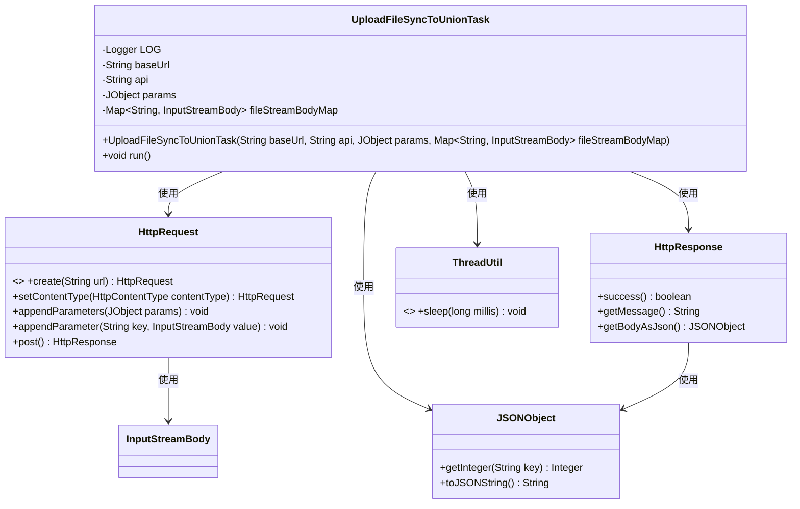
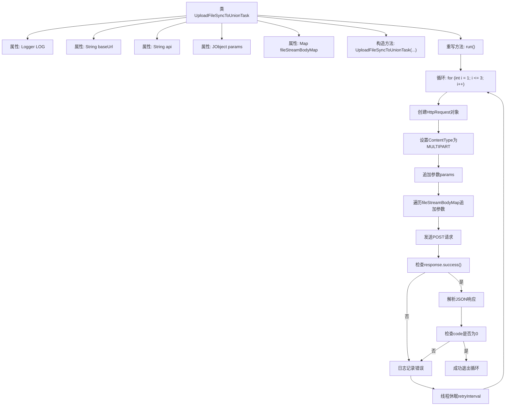

# 基础信息

|      |      |
|------|------|
| 名称 | UploadFileSyncToUnionTask |
| 编码语言 | .java |
| 代码路径 | WeFe/manager/manager-service/src/main/java/com/welab/wefe/manager/service/task/UploadFileSyncToUnionTask.java |
| 包名 | com.welab.wefe.manager.service.task |
| 依赖项 | ['com.alibaba.fastjson.JSONException', 'com.alibaba.fastjson.JSONObject', 'com.welab.wefe.common.http.HttpContentType', 'com.welab.wefe.common.http.HttpRequest', 'com.welab.wefe.common.http.HttpResponse', 'com.welab.wefe.common.util.JObject', 'com.welab.wefe.common.util.StringUtil', 'com.welab.wefe.common.util.ThreadUtil', 'org.apache.http.entity.ContentType', 'org.apache.http.entity.mime.content.InputStreamBody', 'org.slf4j.Logger', 'org.slf4j.LoggerFactory', 'org.springframework.util.MultiValueMap', 'org.springframework.web.multipart.MultipartFile', 'java.io.IOException', 'java.util.Map'] |
| 概述说明 | UploadFileSyncToUnionTask类用于多线程上传文件到指定API，支持3次重试，每次间隔递增，处理参数和文件流，检查响应状态和返回码。 |

# 说明

这是一个名为UploadFileSyncToUnionTask的线程类，用于将文件同步上传到联合服务器。类中包含基础URL、API路径、参数对象和文件流映射等属性。构造函数初始化这些属性。run方法实现了三次重试机制，每次间隔时间递增。它构建HTTP请求，设置多部分内容类型，添加参数和文件流，并发送POST请求。若响应失败、解析JSON异常或返回码非0，会记录错误并重试。成功则终止循环。整个过程通过日志记录错误信息。

# 类列表 Class Summary

| 名称   | 类型  | 说明 |
|-------|------|-------------|
| UploadFileSyncToUnionTask | class | 上传文件同步任务线程类，包含基础URL、API、参数和文件流，支持三次重试，每次间隔递增，通过HTTP请求上传文件并处理响应。 |

## 类 UploadFileSyncToUnionTask

|      |      |
|------|------|
| 访问范围 | public |
| 类型 | class |
| 名称 | UploadFileSyncToUnionTask |
| 说明 | 上传文件同步任务线程类，包含基础URL、API、参数和文件流，支持三次重试，每次间隔递增，通过HTTP请求上传文件并处理响应。 |

### UML类图

这段代码展示了一个多线程文件上传任务类`UploadFileSyncToUnionTask`，它继承自`Thread`类。该类通过HTTP请求将文件和参数上传到指定API接口，支持最多3次重试机制，每次重试间隔时间递增。主要功能包括构建多部分表单请求、处理响应结果和错误重试逻辑。类图中清晰地展示了它与HttpRequest、HttpResponse等辅助类的关系，以及核心的数据流转路径。

### 内部方法调用关系图

这段代码实现了一个带重试机制的文件上传线程类。流程图展示了从初始化到完成上传的完整流程，包括3次重试循环、HTTP请求构建、参数处理、响应验证和错误处理。关键路径涉及请求构建、响应状态检查、JSON解析和业务状态码验证，失败时会间隔300*i毫秒后重试，最多尝试3次。成功条件为HTTP请求成功且返回的JSON中code字段为0。

### 字段列表 Field List

| 名称  | 类型  | 说明 |
|-------|-------|------|
| baseUrl | String | 定义私有字符串变量baseUrl。 |
| fileStreamBodyMap | Map<String, InputStreamBody> | 私有映射，键为字符串，值为InputStreamBody类型，存储文件流对象。 |
| LOG = LoggerFactory.getLogger(this.getClass()) | Logger | 类中定义了一个受保护的final日志对象LOG，使用当前类初始化。 |
| api | String | 声明一个私有字符串变量api。 |
| params | JObject | 私有JSON对象参数变量。 |

### 方法列表

| 名称  | 类型  | 说明 |
|-------|-------|------|
| run | void | 方法实现文件上传同步，最多重试3次，每次间隔递增。构建多部分请求，包含参数和文件流。检查响应状态和JSON返回码，失败则休眠重试，成功则终止。 |

