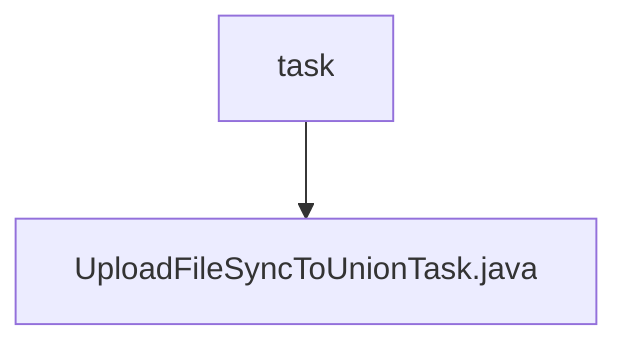

# 基础信息

|      |      |
|------|------|
| 名称 | task |
| 编码语言 | .java |
| 代码路径 | WeFe/manager/manager-service/src/main/java/com/welab/wefe/manager/service/task |
| 包名 | docs.manager.manager-service.src.main.java.com.welab.wefe.manager.service.task |
| 概述说明 | UploadFileSyncToUnionTask类用于多线程上传文件到指定API，支持3次重试，每次间隔递增，处理参数和文件流，检查响应状态和返回码。 |

# 说明

这是一个名为UploadFileSyncToUnionTask的线程类，用于将文件同步上传到联合服务器。类中包含基础URL、API路径、参数对象和文件流映射等属性。构造函数初始化这些属性。run方法实现了三次重试机制，每次间隔时间递增。它构建HTTP请求，设置多部分内容类型，添加参数和文件流，并发送POST请求。若响应失败、解析JSON异常或返回码非0，会记录错误并重试。成功则终止循环。整个过程通过日志记录错误信息。

### 包内部结构视图

该流程图展示了WeFe项目中manager-service模块的任务目录结构。根节点"task"表示任务目录，包含一个子节点"UploadFileSyncToUnionTask.java"，表示文件上传同步到联盟的任务实现类。整个结构简洁明了，反映了任务模块的基本组成。

# 文件列表

| 名称   | 类型  | 说明 |
|-------|------|-------------|
| [UploadFileSyncToUnionTask.java](UploadFileSyncToUnionTask.md) | file | UploadFileSyncToUnionTask类用于多线程上传文件到指定API，支持3次重试，每次间隔递增，处理参数和文件流，检查响应状态和返回码。 |

