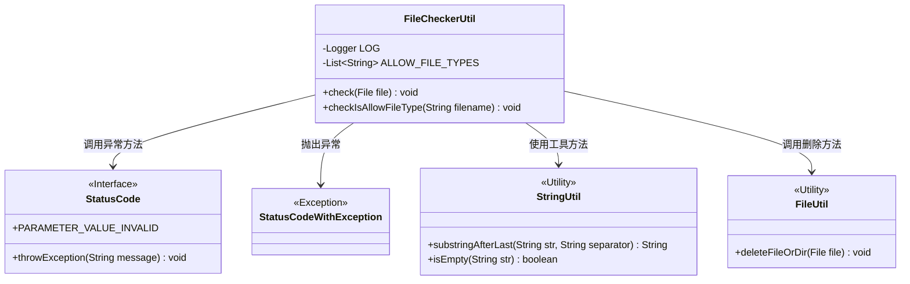
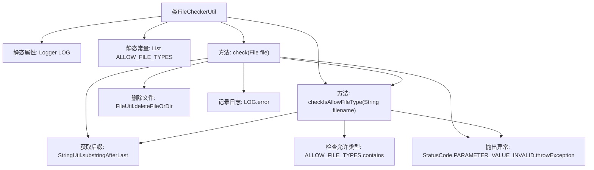

# 基础信息

|      |      |
|------|------|
| 名称 | FileCheckerUtil |
| 编码语言 | .java |
| 代码路径 | WeFe/manager/manager-service/src/main/java/com/welab/wefe/manager/service/util/FileCheckerUtil.java |
| 包名 | com.welab.wefe.manager.service.util |
| 依赖项 | ['com.welab.wefe.common.StatusCode', 'com.welab.wefe.common.exception.StatusCodeWithException', 'com.welab.wefe.common.util.FileUtil', 'com.welab.wefe.common.util.StringUtil', 'org.slf4j.Logger', 'org.slf4j.LoggerFactory', 'java.io.File', 'java.util.Arrays', 'java.util.List'] |
| 概述说明 | FileCheckerUtil类用于检查文件类型，仅允许pdf文件，异常时删除文件并记录日志。 |

# 说明

FileCheckerUtil类用于检查文件类型安全性，包含静态方法check和checkIsAllowFileType。当前仅允许pdf文件类型。check方法验证文件后缀是否合法，非法则删除文件并抛出异常。checkIsAllowFileType方法检查文件名非空且后缀合法。异常情况会记录日志并抛出StatusCodeWithException。

# 类列表 Class Summary

| 名称   | 类型  | 说明 |
|-------|------|-------------|
| FileCheckerUtil | class | FileCheckerUtil类用于检查文件类型，仅允许PDF格式，异常时删除文件并抛出错误。 |

## 类 FileCheckerUtil

|      |      |
|------|------|
| 访问范围 | public |
| 类型 | class |
| 名称 | FileCheckerUtil |
| 说明 | FileCheckerUtil类用于检查文件类型，仅允许PDF格式，异常时删除文件并抛出错误。 |

### UML类图

类图描述：该图展示了FileCheckerUtil工具类及其相关依赖关系。FileCheckerUtil包含文件类型检查的核心逻辑，通过StringUtil处理字符串操作，依赖StatusCode和StatusCodeWithException处理异常情况，并使用FileUtil进行文件删除操作。类图中清晰体现了工具类之间的协作关系以及异常处理机制。

### 内部方法调用关系图

流程图描述了FileCheckerUtil类的结构和方法调用关系。该类包含文件类型检查功能，通过check方法验证文件后缀是否合法，不合法时删除文件并记录错误日志。checkIsAllowFileType方法实现具体校验逻辑，包括空文件名检测、后缀存在性检查和白名单验证。两个方法共享后缀提取和异常抛出操作，形成清晰的校验流程。

### 字段列表 Field List

| 名称  | 类型  | 说明 |
|-------|-------|------|
| ALLOW_FILE_TYPES = Arrays.asList(            "pdf"    ) | List<String> | 允许的文件类型仅为PDF格式。 |
| LOG = LoggerFactory.getLogger(FileCheckerUtil.class) | Logger | 定义FileCheckerUtil类的静态日志对象LOG，使用protected和final修饰。 |

### 方法列表

| 名称  | 类型  | 说明 |
|-------|-------|------|
| check | void | 检查上传文件类型是否允许，仅支持PDF格式，否则删除文件并抛出异常。 |
| checkIsAllowFileType | void | 检查文件类型是否允许：文件名不能为空，必须有后缀且后缀在允许列表中，否则抛出异常。 |

