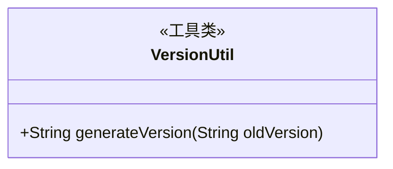
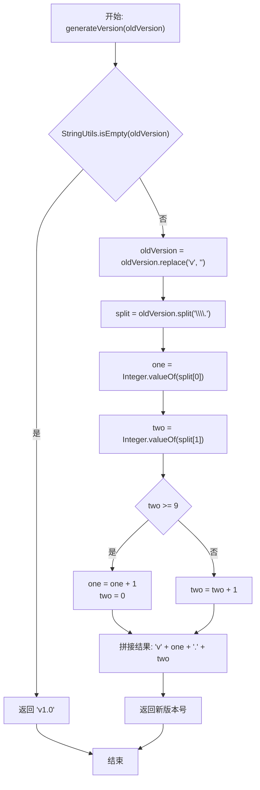
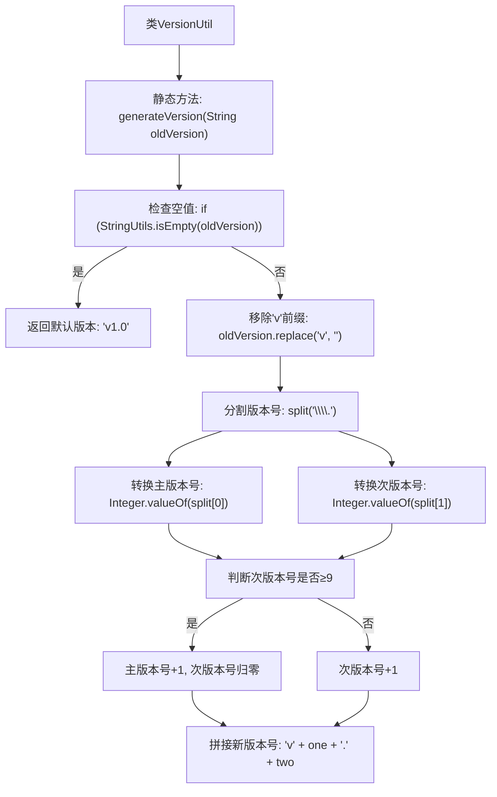

# 基础信息

|      |      |
|------|------|
| 名称 | VersionUtil |
| 编码语言 | .java |
| 代码路径 | WeFe/manager/manager-service/src/main/java/com/welab/wefe/manager/service/util/VersionUtil.java |
| 包名 | com.welab.wefe.manager.service.util |
| 依赖项 | ['org.apache.commons.lang.StringUtils'] |
| 概述说明 | VersionUtil类提供generateVersion方法，用于版本号递增。若旧版本为空返回v1.0，否则解析版本号数字，次版本号大于等于9时主版本加1次版本归零，否则次版本加1。 |

# 说明

VersionUtil类包含一个静态方法generateVersion，用于生成新版本号。若输入为空则返回v1.0，否则解析旧版本号（格式为vX.Y），移除v前缀后按点分割。主版本号X保持不变，次版本号Y加1；若Y≥9则主版本号加1且次版本号归零。最终返回vX.Y格式的新版本号字符串。

# 类列表 Class Summary

| 名称   | 类型  | 说明 |
|-------|------|-------------|
| VersionUtil | class | VersionUtil类提供静态方法generateVersion，用于递增版本号。若输入为空返回v1.0，否则将v1.2格式版本号末位数字加1，超过9则进位。 |

## 类 VersionUtil

|      |      |
|------|------|
| 访问范围 | public |
| 类型 | class |
| 名称 | VersionUtil |
| 说明 | VersionUtil类提供静态方法generateVersion，用于递增版本号。若输入为空返回v1.0，否则将v1.2格式版本号末位数字加1，超过9则进位。 |

### UML类图

类图描述：VersionUtil是一个工具类，提供静态方法generateVersion用于生成新版本号。该方法接收旧版本号字符串，处理后返回新版本号字符串。处理逻辑是：若输入为空返回"v1.0"；否则解析主次版本号数字，次版本号≥9时主版本+1且次版本归零，否则次版本+1。最终返回"v主版本.次版本"格式字符串。

### 内部方法调用关系图

这段流程图描述了VersionUtil类的版本号生成逻辑。当输入空值时返回默认版本v1.0，否则解析输入的版本号字符串，移除'v'前缀后分割主次版本号。若次版本号≥9则进位（主版本+1，次版本归零），否则次版本+1。最终返回带'v'前缀的新版本字符串，如输入"1.2.9"输出"1.3.0"。流程完整展现了版本号递增的业务规则和字符串处理过程。

### 字段列表 Field List

| 名称  | 类型  | 说明 |
|-------|-------|------|

### 方法列表

| 名称  | 类型  | 说明 |
|-------|-------|------|
| generateVersion | String | 静态方法根据旧版本号生成新版本号。空输入返回v1.0。非空时移除v前缀，分割主次版本号。次版本号≥9则主版本+1且次版本归零，否则次版本+1。返回v主版本.次版本格式。 |

