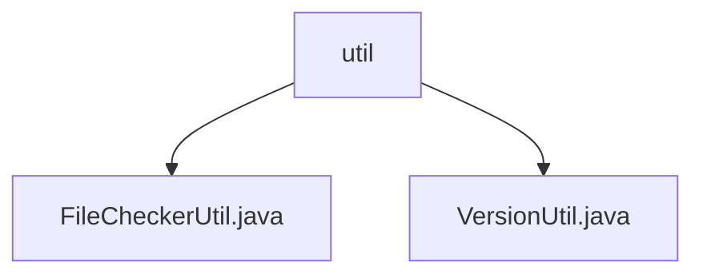

# 基础信息

|      |      |
|------|------|
| 名称 | util |
| 编码语言 | .java |
| 代码路径 | WeFe/manager/manager-service/src/main/java/com/welab/wefe/manager/service/util |
| 包名 | docs.manager.manager-service.src.main.java.com.welab.wefe.manager.service.util |
| 概述说明 | FileCheckerUtil类检查文件类型，仅允许pdf，非法则删除并抛异常。VersionUtil类生成版本号，空输入返回v1.0，否则主版本号不变次版本号加1，次版本≥9则主版本加1次版本归零。 |

# 说明

## 概述  
该模块核心职责是提供文件类型安全检查和版本号生成功能。接口规范包括FileCheckerUtil类的check方法（验证文件后缀合法性）和VersionUtil类的generateVersion方法（递增版本号）。关键数据结构涉及版本号字符串（格式vX.Y）和文件后缀白名单（当前仅PDF）。外部依赖包括日志系统和StatusCodeWithException异常类。例如check方法会删除非法文件，generateVersion支持v1.9→v2.0的进位逻辑。

## 主要业务场景  
典型应用场景包括上传文件时的类型校验（类似网关过滤模式）和迭代系统时的版本管理。业务流程先通过checkIsAllowFileType验证文件名，再调用check执行删除操作；版本生成采用主次版本号分段累加策略。例如上传非PDF文件会触发异常，而空版本号输入会初始化v1.0。集成案例覆盖文件管理模块和自动化部署流程。

### 包内部结构视图

该流程图展示了WeFe项目中manager-service模块下util工具包的文件结构。根节点为util目录，包含两个Java工具类文件：FileCheckerUtil.java用于文件检查功能，VersionUtil.java处理版本相关操作。这种简洁的层级结构体现了工具类集中管理的设计模式，便于开发者快速定位和使用常用工具方法。

# 文件列表

| 名称   | 类型  | 说明 |
|-------|------|-------------|
| [FileCheckerUtil.java](FileCheckerUtil.md) | file | FileCheckerUtil类用于检查文件类型，仅允许pdf文件，异常时删除文件并记录日志。 |
| [VersionUtil.java](VersionUtil.md) | file | VersionUtil类提供generateVersion方法，用于版本号递增。若旧版本为空返回v1.0，否则解析版本号数字，次版本号大于等于9时主版本加1次版本归零，否则次版本加1。 |

