# 基础信息

|      |      |
|------|------|
| 名称 | com |
| 编码语言 | .java |
| 代码路径 | WeFe/mpc/mpc-common/src/main/java/com |
| 包名 | docs.mpc.mpc-common.src.main.java.com |
| 概述说明 | AbstractHttpTransferVariable是处理HTTP请求的抽象类，支持JSON转换和签名验证。安全聚合模块实现密钥交换和加密通信。密码学工具集提供SM2/RSA等算法。MPC基础工具集支持数值转换和随机数据生成。PSI模块处理私有集合交集查询。本地缓存系统采用两级结构。DiffieHellmanKey类管理DH协议参数。PIR模块实现隐私信息检索协议。通信配置类定义请求参数。 |

# 说明

## 概述  
该模块是安全多方计算(MPC)基础框架，核心职责是实现加密协议封装、密钥管理和安全通信，类似零信任架构的中间件层。接口规范包含四类：安全聚合(QuerySAResult)、密钥交换(QueryDiffieHellmanKey)、PSI查询(QueryPrivateSetIntersection)和PIR协议(QueryKeysRequest)，均采用POJO+JSON序列化。关键数据结构涵盖Diffie-Hellman参数(p/g)、PSI批次控制字段、PIR会话标识(uuid)和群运算坐标，依赖BouncyCastle/JCE加密库和JSON工具。例如SM2KeyPair管理国密密钥，LocalIntermediateCache实现线程安全存储。

## 主要业务场景  
模块支撑联邦学习和联合风控场景，典型流程为：1) DH密钥交换→2) 数据安全聚合/PSI比对→3) PIR隐私检索。交互采用请求-响应链模式，通过uuid关联会话，类似加密信封机制。功能完整性体现在：支持SM2/RSA签名、AES/SHA加密、Naor-Pinkas协议和权重调节聚合。例如SignUtil自动选择算法，CacheUtil管理临时数据。API类型分层设计，基础层如DiffieHellmanUtil静态方法，协议层如QuerySAResultRequest对象化操作。集成案例包括跨机构ID安全匹配和加密手机号生成。

### 包内部结构视图

```mermaid
graph TD
    com --> welab
    welab --> wefe
    wefe --> mpc
    mpc --> trasfer
    mpc --> sa
    mpc --> util
    mpc --> commom
    mpc --> psi
    mpc --> cache
    mpc --> key
    mpc --> pir
    mpc --> config
    trasfer --> AbstractHttpTransferVariable.java
    sa --> SecureAggregationApiName.java
    sa --> request
    request --> QuerySAResultRequest.java
    request --> QueryDiffieHellmanKeyResponse.java
    request --> QueryDiffieHellmanKeyRequest.java
    request --> QuerySAResultResponse.java
    util --> SignUtil.java
    util --> EncryptUtil.java
    util --> SM2Util.java
    util --> DiffieHellmanUtil.java
    util --> SHAUtil.java
    util --> RSAUtil.java
    commom --> Operator.java
    commom --> Conversion.java
    commom --> Constants.java
    commom --> RandomPhoneNum.java
    commom --> AccountEncryptionType.java
    psi --> request
    request --> QueryPrivateSetIntersectionRequest.java
    request --> QueryPrivateSetIntersectionResponse.java
    cache --> intermediate
    cache --> CacheInit.java
    intermediate --> impl
    intermediate --> CacheOperation.java
    intermediate --> CacheOperationFactory.java
    intermediate --> CacheUtil.java
    impl --> LocalIntermediateCache.java
    key --> DiffieHellmanKey.java
    pir --> request
    pir --> protocol
    pir --> flow
    pir --> PrivateInformationRetrievalApiName.java
    request --> naor
    request --> QueryRandomResponse.java
    request --> QueryKeysResponse.java
    request --> QueryPIRResultsResponse.java
    request --> QueryRandomRequest.java
    request --> QueryRandomLegalResponse.java
    request --> QueryRandomLegalRequest.java
    request --> QueryKeysRequest.java
    request --> QueryPIRResultsRequest.java
    request --> BaseResponse.java
    naor --> QueryNaorPinkasRandomResponse.java
    naor --> QueryNaorPinkasRandomRequest.java
    naor --> QueryNaorPinkasResultResponse.java
    naor --> QueryNaorPinkasResultRequest.java
    protocol --> ro
    protocol --> nt
    protocol --> se
    protocol --> ot
    ro --> mac
    ro --> hf
    mac --> Sha256MAC.java
    mac --> HashBasedMessageAuthenticationCode.java
    mac --> MessageAuthenticationCode.java
    hf --> Sha256.java
    hf --> HashFunction.java
    nt --> field
    nt --> group
    field --> integers
    field --> GaloisFieldElement.java
    field --> GaloisFieldArithmetic.java
    integers --> IntegersModuloPrimeArithmetic.java
    integers --> IntegersModuloPrimeElement.java
    group --> cyclic
    group --> GroupArithmetic.java
    group --> GroupElement.java
    cyclic --> twisted
    cyclic --> CyclicGroupArithmetic.java
    cyclic --> CyclicGroupElement.java
    twisted --> TwistedEdwardsCurveArithmetic.java
    twisted --> TwistedEdwardsCurveElement.java
    se --> aes
    se --> SymmetricKey.java
    aes --> AESKey.java
    aes --> AESEncryptKey.java
    aes --> AESDecryptKey.java
    ot --> hauck
    ot --> ObliviousTransferKey.java
    ot --> ObliviousTransfer.java
    hauck --> HauckObliviousTransfer.java
    hauck --> HauckTarget.java
    flow --> BasePrivateInformationRetrieval.java
    config --> CommunicationConfig.java
```

该流程图展示了WeFe/mpc/mpc-common项目的完整Java包结构，从顶层com包开始逐级展开到具体实现类。核心模块包括安全聚合(sa)、隐私信息检索(pir)、缓存系统(cache)和加密工具(util)等，其中pir模块具有最复杂的协议实现结构，包含多种加密算法和数学运算协议。整个结构层次清晰，展现了MPC框架中各个功能模块的完整组织方式。

# 文件列表

| 名称   | 类型  | 说明 |
|-------|------|-------------|
| [welab](welab/_module.md) | package | AbstractHttpTransferVariable是处理HTTP请求的抽象类，支持JSON转换和签名验证。安全聚合模块实现密钥交换和加密通信。密码学工具集提供SM2/RSA等算法。MPC基础工具集支持数值转换和随机数据生成。PSI模块处理私有集合交集查询。本地缓存系统采用两级结构。DiffieHellmanKey类管理DH协议参数。PIR模块实现隐私信息检索协议。通信配置类定义请求参数。 |

