# 基础信息

|      |      |
|------|------|
| 名称 | mpc |
| 编码语言 | .java |
| 代码路径 | WeFe/mpc/mpc-common/src/main/java/com/welab/wefe/mpc |
| 包名 | docs.mpc.mpc-common.src.main.java.com.welab.wefe.mpc |
| 概述说明 | AbstractHttpTransferVariable是处理HTTP请求的抽象类，支持JSON转换和签名验证。安全聚合模块实现密钥交换和加密通信。密码学工具集提供SM2/RSA等算法。MPC基础工具集支持数值转换和随机数据生成。PSI模块处理私有集合交集查询。本地缓存系统采用两级结构。DiffieHellmanKey类管理DH协议参数。PIR模块实现隐私信息检索协议。通信配置类定义请求参数。 |

# 说明

## 概述  
该模块是安全多方计算(MPC)基础框架，核心职责是实现加密协议封装、密钥管理和安全通信，类似零信任架构的中间件层。接口规范包含四类：安全聚合(QuerySAResult)、密钥交换(QueryDiffieHellmanKey)、PSI查询(QueryPrivateSetIntersection)和PIR协议(QueryKeysRequest)，均采用POJO+JSON序列化。关键数据结构涵盖Diffie-Hellman参数(p/g)、PSI批次控制字段、PIR会话标识(uuid)和群运算坐标，依赖BouncyCastle/JCE加密库和JSON工具。例如SM2KeyPair管理国密密钥，LocalIntermediateCache实现线程安全存储。

## 主要业务场景  
模块支撑联邦学习和联合风控场景，典型流程为：1) DH密钥交换→2) 数据安全聚合/PSI比对→3) PIR隐私检索。交互采用请求-响应链模式，通过uuid关联会话，类似加密信封机制。功能完整性体现在：支持SM2/RSA签名、AES/SHA加密、Naor-Pinkas协议和权重调节聚合。例如SignUtil自动选择算法，CacheUtil管理临时数据。API类型分层设计，基础层如DiffieHellmanUtil静态方法，协议层如QuerySAResultRequest对象化操作。集成案例包括跨机构ID安全匹配和加密手机号生成。

### 包内部结构视图

```mermaid
graph TD
    mpc --> trasfer
    mpc --> sa
    mpc --> util
    mpc --> commom
    mpc --> psi
    mpc --> cache
    mpc --> key
    mpc --> pir
    mpc --> config
    trasfer --> AbstractHttpTransferVariable.java
    sa --> request
    sa --> SecureAggregationApiName.java
    request --> QuerySAResultRequest.java
    request --> QueryDiffieHellmanKeyResponse.java
    request --> QueryDiffieHellmanKeyRequest.java
    request --> QuerySAResultResponse.java
    util --> SignUtil.java
    util --> EncryptUtil.java
    util --> SM2Util.java
    util --> DiffieHellmanUtil.java
    util --> SHAUtil.java
    util --> RSAUtil.java
    commom --> Operator.java
    commom --> Conversion.java
    commom --> Constants.java
    commom --> RandomPhoneNum.java
    commom --> AccountEncryptionType.java
    psi --> request
    request --> QueryPrivateSetIntersectionRequest.java
    request --> QueryPrivateSetIntersectionResponse.java
    cache --> intermediate
    cache --> CacheInit.java
    intermediate --> impl
    intermediate --> CacheOperation.java
    intermediate --> CacheOperationFactory.java
    intermediate --> CacheUtil.java
    impl --> LocalIntermediateCache.java
    key --> DiffieHellmanKey.java
    pir --> request
    pir --> protocol
    pir --> flow
    pir --> PrivateInformationRetrievalApiName.java
    request --> naor
    request --> QueryRandomResponse.java
    request --> QueryKeysResponse.java
    request --> QueryPIRResultsResponse.java
    request --> QueryRandomRequest.java
    request --> QueryRandomLegalResponse.java
    request --> QueryRandomLegalRequest.java
    request --> QueryKeysRequest.java
    request --> QueryPIRResultsRequest.java
    request --> BaseResponse.java
    naor --> QueryNaorPinkasRandomResponse.java
    naor --> QueryNaorPinkasRandomRequest.java
    naor --> QueryNaorPinkasResultResponse.java
    naor --> QueryNaorPinkasResultRequest.java
    protocol --> ro
    protocol --> nt
    protocol --> se
    protocol --> ot
    ro --> mac
    ro --> hf
    mac --> Sha256MAC.java
    mac --> HashBasedMessageAuthenticationCode.java
    mac --> MessageAuthenticationCode.java
    hf --> Sha256.java
    hf --> HashFunction.java
    nt --> field
    nt --> group
    field --> integers
    field --> GaloisFieldElement.java
    field --> GaloisFieldArithmetic.java
    integers --> IntegersModuloPrimeArithmetic.java
    integers --> IntegersModuloPrimeElement.java
    group --> cyclic
    group --> GroupArithmetic.java
    group --> GroupElement.java
    cyclic --> twisted
    cyclic --> CyclicGroupArithmetic.java
    cyclic --> CyclicGroupElement.java
    twisted --> TwistedEdwardsCurveArithmetic.java
    twisted --> TwistedEdwardsCurveElement.java
    se --> aes
    se --> SymmetricKey.java
    aes --> AESKey.java
    aes --> AESEncryptKey.java
    aes --> AESDecryptKey.java
    ot --> hauck
    ot --> ObliviousTransferKey.java
    ot --> ObliviousTransfer.java
    hauck --> HauckObliviousTransfer.java
    hauck --> HauckTarget.java
    flow --> BasePrivateInformationRetrieval.java
    config --> CommunicationConfig.java
```

该流程图展示了WeFe MPC项目的完整目录结构，从根目录mpc开始，逐级展开所有子模块和文件。主要包含trasfer、sa、util、commom等核心模块，其中pir模块最为复杂，包含request、protocol、flow等多个子模块。protocol模块又细分为ro、nt、se、ot等加密协议实现，每个协议都有详细的实现类和接口。整体结构清晰展示了MPC框架的功能模块划分和依赖关系，特别是密码学相关组件的层级组织。

# 文件列表

| 名称   | 类型  | 说明 |
|-------|------|-------------|
| [sa](sa/_module.md) | package | 该模块封装安全聚合和密钥交换功能，包含四类数据传输对象，支持多方安全计算流程，采用请求-响应模式，依赖JSON处理库。 |
| [trasfer](trasfer/_module.md) | package | 抽象类AbstractHttpTransferVariable提供HTTP查询功能，支持签名和错误处理，返回JSON格式数据。 |
| [config](config/_module.md) | package | 通信配置类，包含请求ID、接口名、服务器地址、商户ID、签名私钥、密钥类型及签名开关等属性，提供各字段的getter和setter方法。 |
| [key](key/_module.md) | package | DiffieHellmanKey类包含BigInteger类型的p和g属性，提供对应的getter和setter方法。 |
| [pir](pir/_module.md) | package | 模块实现Naor-Pinkas协议的隐私信息检索，包含随机数、密钥、结果查询及验证接口。采用两阶段交互，支持动态条件组合和批量处理，应用于联邦学习。密码学基础体系提供数据验证、加密和传输功能，支持PIR和联合风控场景。抽象基类BasePrivateInformationRetrieval提供基础框架，定义uuid和初始化方法。PrivateInformationRetrievalApiName类定义五种检索操作类型常量。 |
| [cache](cache/_module.md) | package | 该模块实现线程安全本地缓存，采用两级结构和工厂模式管理实例。核心接口定义增删查操作，默认实现使用字符串键和5分钟过期策略。适用于临时存储和快速检索场景，支持同步操作和动态替换实现。 |
| [psi](psi/_module.md) | package | QueryPrivateSetIntersectionRequest类封装私有集合交集请求参数，含clientIds等字段及getter/setter。QueryPrivateSetIntersectionResponse类表示响应结果，含加密ID列表、状态码等字段及getter/setter。 |
| [commom](commom/_module.md) | package | Operator枚举定义加减操作及描述。Conversion类处理数值转换。Constants类存储静态配置。RandomPhoneNum生成随机加密手机号。AccountEncryptionType枚举密码加密方式。 |
| [util](util/_module.md) | package | SignUtil提供签名功能，支持SM2和RSA。EncryptUtil支持MD5/SHA256/SHA512哈希和AES解密。SM2Util实现SM2国密算法，含密钥生成、加解密和签名。DiffieHellmanUtil提供DH密钥交换功能。SHAUtil支持SHA和MD5加密。RSAUtil提供RSA加解密、签名验签及密钥处理。 |

