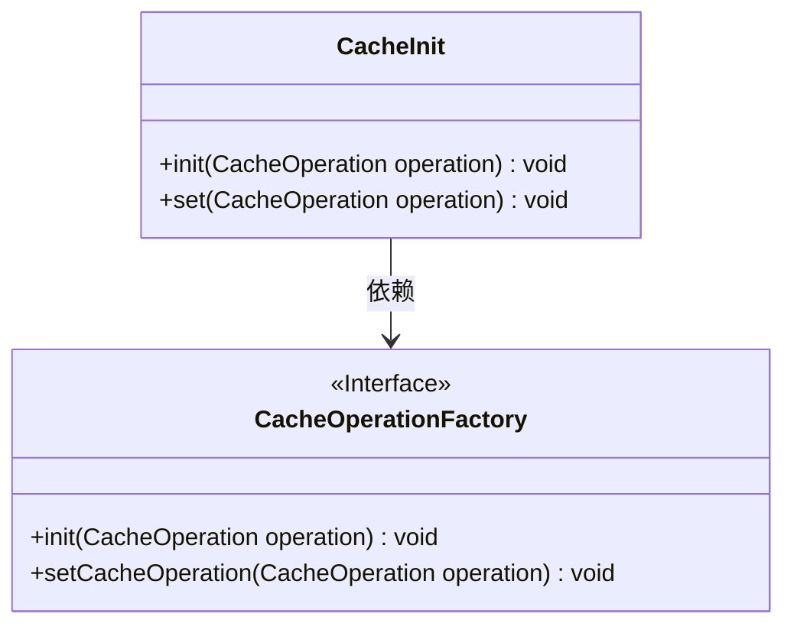
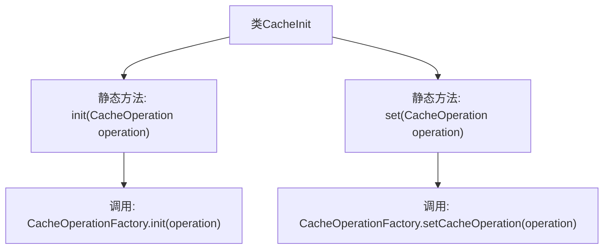

# 基础信息

|      |      |
|------|------|
| 名称 | CacheInit |
| 编码语言 | .java |
| 代码路径 | WeFe/mpc/mpc-common/src/main/java/com/welab/wefe/mpc/cache/CacheInit.java |
| 包名 | com.welab.wefe.mpc.cache |
| 依赖项 | ['com.welab.wefe.mpc.cache.intermediate.CacheOperation', 'com.welab.wefe.mpc.cache.intermediate.CacheOperationFactory'] |
| 概述说明 | CacheInit类提供静态方法init和set，用于初始化与设置缓存操作，均通过CacheOperationFactory实现。 |

# 说明

CacheInit类提供了两个静态方法用于缓存操作。init方法通过CacheOperationFactory初始化缓存操作，set方法通过CacheOperationFactory设置缓存操作。两者均针对同一请求的中间数据缓存实现功能，具体操作由传入的CacheOperation参数决定。

# 类列表 Class Summary

| 名称   | 类型  | 说明 |
|-------|------|-------------|
| CacheInit | class | CacheInit类提供静态方法init和set，用于初始化与设置缓存操作，均通过CacheOperationFactory实现。 |

## 类 CacheInit

|      |      |
|------|------|
| 访问范围 | public |
| 类型 | class |
| 名称 | CacheInit |
| 说明 | CacheInit类提供静态方法init和set，用于初始化与设置缓存操作，均通过CacheOperationFactory实现。 |

### UML类图

这段代码展示了一个缓存初始化类`CacheInit`与缓存操作工厂接口`CacheOperationFactory`之间的关系。`CacheInit`提供了两个静态方法`init`和`set`，它们都接收一个`CacheOperation`参数，并分别调用`CacheOperationFactory`接口中的对应方法来实现缓存操作的初始化和设置。`CacheOperationFactory`被标记为接口，表明具体的缓存操作实现应由其他类来完成。整个设计体现了依赖倒置原则，高层模块`CacheInit`依赖于抽象接口而非具体实现。

### 内部方法调用关系图

这段流程图展示了CacheInit类的结构及其方法调用关系。该类包含两个静态方法：init()和set()，分别通过CacheOperationFactory类执行初始化缓存操作和设置缓存操作。init()方法调用工厂类的init()方法，而set()方法调用工厂类的setCacheOperation()方法。整个流程清晰体现了类间的协作关系，用于实现请求中间数据的缓存管理功能。

### 字段列表 Field List

| 名称  | 类型  | 说明 |
|-------|-------|------|

### 方法列表

| 名称  | 类型  | 说明 |
|-------|-------|------|
| set | void | 静态方法set用于设置缓存操作，通过CacheOperationFactory实现请求间数据缓存。 |
| init | void | 静态方法init接收CacheOperation参数，通过CacheOperationFactory初始化缓存操作，用于同一请求的中间数据缓存处理。 |

