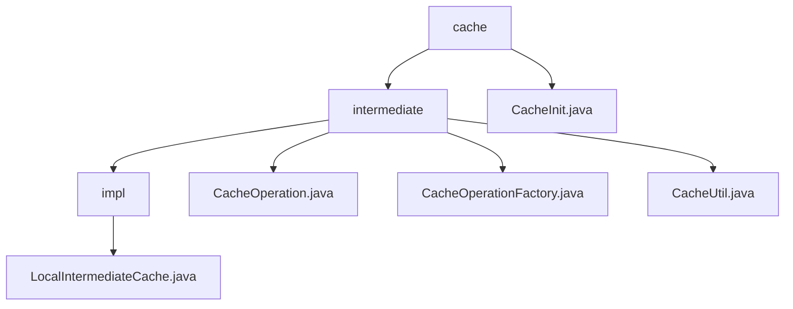

# 基础信息

|      |      |
|------|------|
| 名称 | cache |
| 编码语言 | .java |
| 代码路径 | WeFe/mpc/mpc-common/src/main/java/com/welab/wefe/mpc/cache |
| 包名 | docs.mpc.mpc-common.src.main.java.com.welab.wefe.mpc.cache |
| 概述说明 | 该模块实现线程安全本地缓存，采用两级结构和工厂模式管理实例。核心接口定义增删查操作，默认实现使用字符串键和5分钟过期策略。适用于临时存储和快速检索场景，支持同步操作和动态替换实现。 |

# 说明

## 概述  
该模块实现了一个线程安全的本地缓存系统，采用两级缓存结构和工厂模式管理实例。核心接口CacheOperation定义了增删查操作，LocalIntermediateCache作为默认实现，使用字符串键和5分钟过期策略。例如外层缓存存储内层缓存实例，内层缓存存储实际值。依赖项仅需基础Java环境，关键数据结构包括泛型值T和字符串键值对。工厂类CacheOperationFactory通过同步方法确保单例线程安全，CacheInit类提供静态方法封装初始化流程。

## 主要业务场景  
模块适用于需要临时存储和快速检索数据的场景，类似事件总线模式的数据中转。典型流程包括：通过CacheOperationFactory获取缓存实例，使用save保存数据，get循环获取直至成功。例如CacheUtil封装阻塞式查询，CacheInit提供静态方法初始化操作。交互模式以同步方法为主，支持动态替换缓存实现。功能覆盖缓存生命周期管理，但删除操作待完善。API类型聚焦基础CRUD，集成案例展示工厂与工具类结合使用。

### 包内部结构视图

该流程图展示了MPC项目中缓存模块的层级结构。根节点为cache目录，包含intermediate子目录和CacheInit.java文件。intermediate目录下包含impl实现目录和三个操作类文件，impl目录中包含LocalIntermediateCache.java实现文件。整个结构清晰地反映了缓存模块的代码组织方式。

# 文件列表

| 名称   | 类型  | 说明 |
|-------|------|-------------|
| [intermediate](intermediate/_module.md) | package | LocalIntermediateCache实现CacheOperation接口，采用两级缓存结构，5分钟过期策略，提供增删查功能。CacheOperation定义缓存基本操作。CacheOperationFactory单例管理缓存实例，线程安全。CacheUtil提供循环获取缓存值方法。 |
| [CacheInit.java](CacheInit.md) | file | CacheInit类提供静态方法init和set，用于初始化与设置缓存操作，均通过CacheOperationFactory实现。 |

