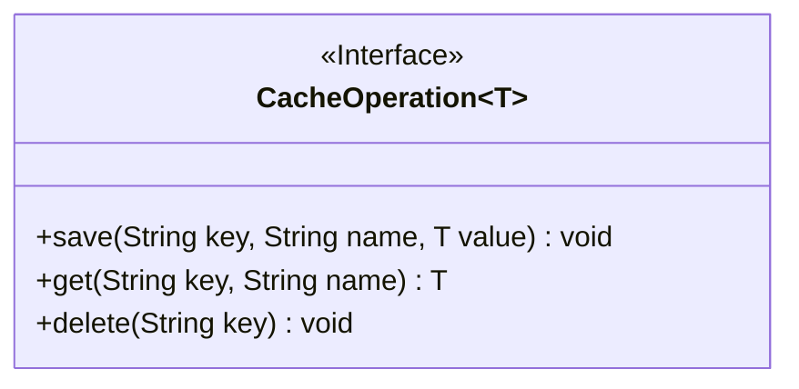
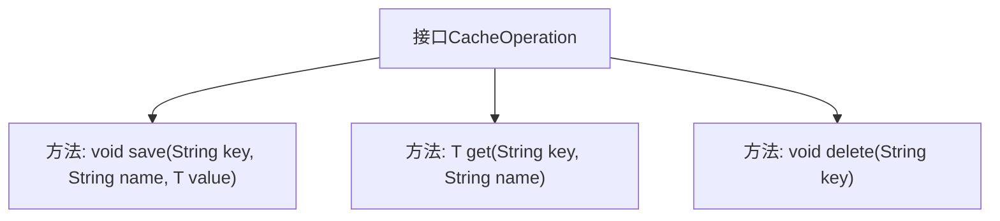

# 基础信息

|      |      |
|------|------|
| 名称 | CacheOperation |
| 编码语言 | .java |
| 代码路径 | WeFe/mpc/mpc-common/src/main/java/com/welab/wefe/mpc/cache/intermediate/CacheOperation.java |
| 包名 | com.welab.wefe.mpc.cache.intermediate |
| 依赖项 | [] |
| 概述说明 | CacheOperation接口定义了缓存操作：save存储数据需key、name和value；get通过key和name获取数据；delete通过key删除数据。 |

# 说明

该接口定义了缓存操作的基本功能，包含三个核心方法。save方法用于存储数据，接收key、name和value三个参数。get方法用于获取数据，通过key和name参数查询并返回对应值。delete方法用于删除数据，仅需key参数即可移除相关缓存。所有方法均支持泛型类型T，确保数据类型灵活性。接口设计简洁，专注于缓存的增删查功能。

# 类列表 Class Summary

| 名称   | 类型  | 说明 |
|-------|------|-------------|
| CacheOperation | interface | CacheOperation接口定义了缓存操作：save存储键值对，get获取值，delete删除键。泛型T表示值类型。 |

## 类 CacheOperation

|      |      |
|------|------|
| 访问范围 | public |
| 类型 | interface |
| 名称 | CacheOperation |
| 说明 | CacheOperation接口定义了缓存操作：save存储键值对，get获取值，delete删除键。泛型T表示值类型。 |

### UML类图

该图展示了一个泛型缓存操作接口`CacheOperation<T>`，定义了三个核心方法：`save`用于存储键值对数据，`get`通过复合键检索数据，`delete`删除指定键的数据。接口使用泛型`T`支持不同类型的数据存储，适用于需要抽象缓存操作的场景，如分布式缓存或本地缓存实现。箭头标注的依赖关系可后续补充具体实现类时展开。

### 内部方法调用关系图

这段代码定义了一个泛型接口CacheOperation<T>，包含三个核心方法：save用于存储键值对数据，get用于根据键名检索数据，delete用于删除指定键的数据。流程图清晰地展示了接口与方法之间的层级关系，每个方法都明确标注了参数和返回类型，体现了缓存操作的基本功能结构。

### 字段列表 Field List

| 名称  | 类型  | 说明 |
|-------|-------|------|

### 方法列表

| 名称  | 类型  | 说明 |
|-------|-------|------|
| get | T | 获取指定键和名称的值。 |
| save | void | 保存键值对数据，key为键，name为名称，value为泛型值。 |
| delete | void | 删除指定键的数据。 |

