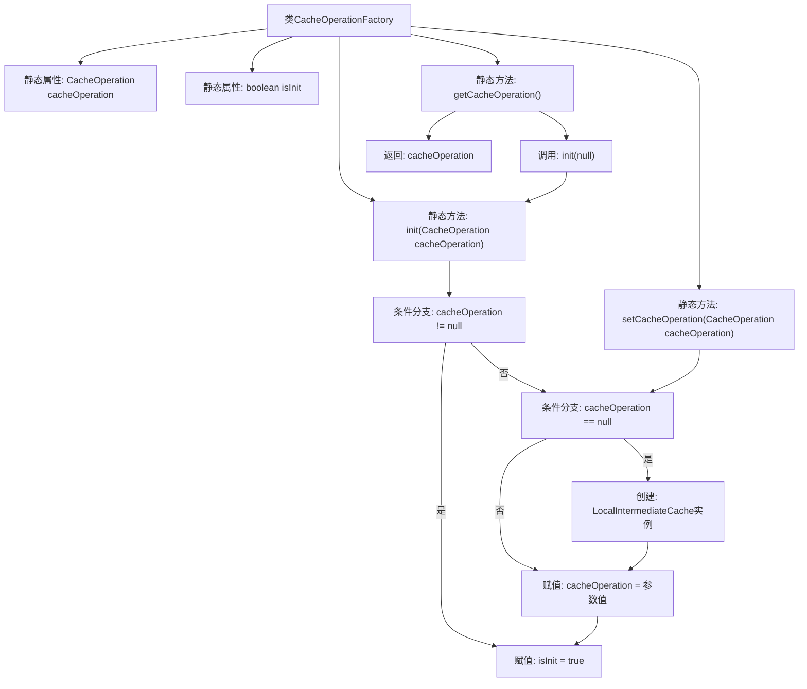

# 基础信息

|      |      |
|------|------|
| 名称 | CacheOperationFactory |
| 编码语言 | .java |
| 代码路径 | WeFe/mpc/mpc-common/src/main/java/com/welab/wefe/mpc/cache/intermediate/CacheOperationFactory.java |
| 包名 | com.welab.wefe.mpc.cache.intermediate |
| 依赖项 | ['com.welab.wefe.mpc.cache.intermediate.impl.LocalIntermediateCache'] |
| 概述说明 | CacheOperationFactory类提供线程安全的缓存操作单例管理，包含初始化、设置和获取方法，未初始化时默认使用LocalIntermediateCache。 |

# 说明

CacheOperationFactory是一个单例工厂类，用于管理CacheOperation实例。它包含静态私有变量cacheOperation和isInit标志。提供三个同步静态方法：init方法初始化缓存操作实例，若参数为空则创建LocalIntermediateCache实例；setCacheOperation方法允许动态替换缓存实例；getCacheOperation方法在未初始化时自动调用init并返回实例。整个类通过同步控制确保线程安全。

# 类列表 Class Summary

| 名称   | 类型  | 说明 |
|-------|------|-------------|
| CacheOperationFactory | class | CacheOperationFactory类提供静态方法管理CacheOperation实例，支持初始化、设置和获取操作，确保线程安全且默认使用LocalIntermediateCache。 |


## 类 CacheOperationFactory

|      |      |
|------|------|
| 访问范围 | public |
| 类型 | class |
| 名称 | CacheOperationFactory |
| 说明 | CacheOperationFactory类提供静态方法管理CacheOperation实例，支持初始化、设置和获取操作，确保线程安全且默认使用LocalIntermediateCache。 |


### UML类图

```mermaid
classDiagram
    class CacheOperationFactory {
        -CacheOperation~static~ cacheOperation
        -boolean~static~ isInit
        +synchronized~static~ init(CacheOperation cacheOperation) void
        +synchronized~static~ setCacheOperation(CacheOperation cacheOperation) void
        +synchronized~static~ getCacheOperation() CacheOperation
    }

    class LocalIntermediateCache {
        <<CacheOperation>>
    }

    interface CacheOperation {
        <<Interface>>
    }

    LocalIntermediateCache ..|> CacheOperation
    CacheOperationFactory --> CacheOperation : 依赖
    CacheOperationFactory --> LocalIntermediateCache : 依赖
```

这段代码展示了一个工厂模式实现的缓存操作管理器。CacheOperationFactory 通过静态方法管理 CacheOperation 实例的初始化和获取，支持懒加载和线程安全。LocalIntermediateCache 是 CacheOperation 接口的默认实现类，当传入参数为 null 时会自动使用该实现。类图清晰地表现了工厂类与接口/实现类之间的依赖关系，以及接口的实现关系。


### 内部方法调用关系图



流程图描述了CacheOperationFactory类的初始化流程控制逻辑。该工厂类通过双重检查机制管理CacheOperation单例，包含初始化检测、空值保护及延迟加载功能。init()方法实现首次初始化锁保护，set方法允许动态替换实现，get方法触发自动初始化并返回实例。所有操作均通过同步控制保证线程安全。

### 字段列表 Field List

| 名称  | 类型  | 说明 |
|-------|-------|------|
| isInit = false | boolean | 静态布尔变量isInit初始为false，用于标记是否初始化。 |
| cacheOperation = null | CacheOperation | 声明一个私有的静态CacheOperation对象，初始值为null。 |

### 方法列表

| 名称  | 类型  | 说明 |
|-------|-------|------|
| setCacheOperation | void | 同步静态方法setCacheOperation用于设置缓存操作实例。若参数为null则使用默认LocalIntermediateCache实例，否则使用传入的cacheOperation对象。 |
| init | void | 同步静态方法init初始化缓存操作，若已初始化则返回；否则根据参数设置缓存操作并标记初始化完成。 |
| getCacheOperation | CacheOperation | 同步静态方法getCacheOperation，检查未初始化则调用init，返回cacheOperation实例。 |


