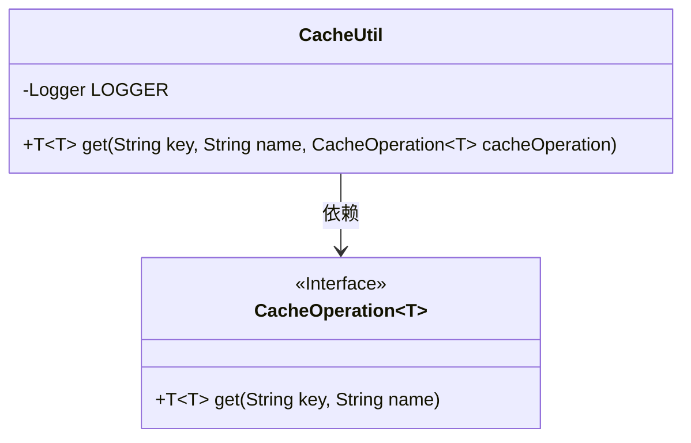
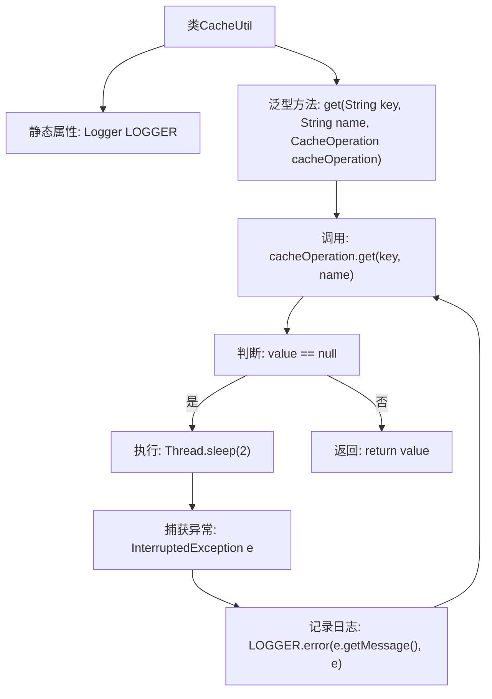

# 基础信息

|      |      |
|------|------|
| 名称 | CacheUtil |
| 编码语言 | .java |
| 代码路径 | WeFe/mpc/mpc-common/src/main/java/com/welab/wefe/mpc/cache/intermediate/CacheUtil.java |
| 包名 | com.welab.wefe.mpc.cache.intermediate |
| 依赖项 | ['org.slf4j.Logger', 'org.slf4j.LoggerFactory'] |
| 概述说明 | CacheUtil类提供静态方法get，通过循环和休眠重试机制从缓存操作中获取指定键和名称的值，直到成功返回非空结果。 |

# 说明

CacheUtil类提供了一个静态方法get，用于从缓存中获取指定键和名称的值。该方法接受一个键、名称和CacheOperation接口实例作为参数。如果获取的值为空，方法会循环尝试，每次等待2毫秒，直到获取到非空值为止。在等待过程中若发生中断异常，会记录错误日志。最终返回获取到的非空值。

# 类列表 Class Summary

| 名称   | 类型  | 说明 |
|-------|------|-------------|
| CacheUtil | class | CacheUtil类提供静态方法get，通过循环和休眠机制确保从缓存操作中获取非空值，失败时记录错误日志。 |

## 类 CacheUtil

|      |      |
|------|------|
| 访问范围 | public |
| 类型 | class |
| 名称 | CacheUtil |
| 说明 | CacheUtil类提供静态方法get，通过循环和休眠机制确保从缓存操作中获取非空值，失败时记录错误日志。 |

### UML类图

这段代码展示了一个缓存工具类`CacheUtil`，它通过泛型接口`CacheOperation<T>`来获取缓存值。主要功能是当缓存值为null时，会循环等待并重试获取，直到获取到非null值为止。类图中清晰地展示了`CacheUtil`对`CacheOperation<T>`接口的依赖关系，以及接口的泛型特性。该设计实现了缓存获取的重试机制，同时通过泛型支持多种类型的数据缓存操作。

### 内部方法调用关系图

这段流程图描述了CacheUtil类的核心方法get的执行逻辑。该方法通过CacheOperation接口获取缓存值，当值为null时会进入循环等待，每次休眠2毫秒后重试，直到获取到非null值为止。过程中会捕获并记录线程中断异常，最终返回获取到的缓存值。流程图清晰展示了方法调用、循环判断和异常处理的完整流程。

### 字段列表 Field List

| 名称  | 类型  | 说明 |
|-------|-------|------|
| LOGGER = LoggerFactory.getLogger(CacheUtil.class) | Logger | 类CacheUtil中定义了一个静态不可变日志记录器LOGGER，用于记录日志。 |

### 方法列表

| 名称  | 类型  | 说明 |
|-------|-------|------|
| get | T | 静态方法通过键和名称获取缓存值，若为空则循环等待2毫秒后重试，直到获取成功返回。异常时记录错误日志。 |

