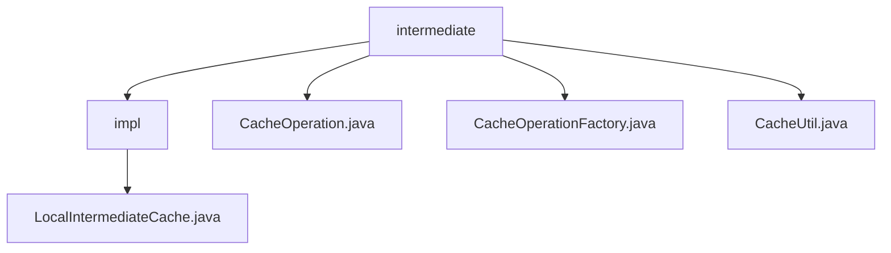

# 基础信息

|      |      |
|------|------|
| 名称 | intermediate |
| 编码语言 | .java |
| 代码路径 | WeFe/mpc/mpc-common/src/main/java/com/welab/wefe/mpc/cache/intermediate |
| 包名 | docs.mpc.mpc-common.src.main.java.com.welab.wefe.mpc.cache.intermediate |
| 概述说明 | LocalIntermediateCache实现CacheOperation接口，采用两级缓存结构，5分钟过期策略，提供增删查功能。CacheOperation定义缓存基本操作。CacheOperationFactory单例管理缓存实例，线程安全。CacheUtil提供循环获取缓存值方法。 |

# 说明

## 概述  
该模块实现了一个线程安全的本地缓存系统，采用两级缓存结构和工厂模式管理实例。核心接口CacheOperation定义了增删查操作，LocalIntermediateCache作为默认实现，使用字符串键和5分钟过期策略。例如外层缓存存储内层缓存实例，内层缓存存储实际值。依赖项仅需基础Java环境，关键数据结构包括泛型值T和字符串键值对。工厂类CacheOperationFactory通过同步方法确保单例线程安全。

## 主要业务场景  
模块适用于需要临时存储和快速检索数据的场景，类似事件总线模式的数据中转。典型流程包括：通过工厂获取缓存实例，使用save保存数据，get循环获取直至成功。例如CacheUtil封装了阻塞式查询逻辑。交互模式以同步方法为主，支持动态替换缓存实现。整合后的功能覆盖缓存生命周期管理，但删除操作待实现。API类型聚焦基础CRUD，集成案例展示如何结合工厂和工具类使用。

### 包内部结构视图

该流程图展示了MPC通用模块中缓存中间件的层级结构。根节点"intermediate"下包含4个子节点，其中"impl"目录包含具体实现类LocalIntermediateCache.java，其余三个为缓存操作相关的工具类和工厂类。结构清晰体现了接口与实现分离的设计原则。

# 文件列表

| 名称   | 类型  | 说明 |
|-------|------|-------------|
| [CacheOperation.java](CacheOperation.md) | file | CacheOperation接口定义了缓存操作：save存储数据需key、name和value；get通过key和name获取数据；delete通过key删除数据。 |
| [CacheOperationFactory.java](CacheOperationFactory.md) | file | CacheOperationFactory类提供线程安全的缓存操作单例管理，包含初始化、设置和获取方法，未初始化时默认使用LocalIntermediateCache。 |
| [CacheUtil.java](CacheUtil.md) | file | CacheUtil类提供静态方法get，通过循环和休眠重试机制从缓存操作中获取指定键和名称的值，直到成功返回非空结果。 |
| [impl](impl/_module.md) | package | LocalIntermediateCache实现CacheOperation接口，使用嵌套Cache结构存储数据，支持5分钟未访问自动过期，提供同步的保存、获取方法，但删除方法未实现。 |

