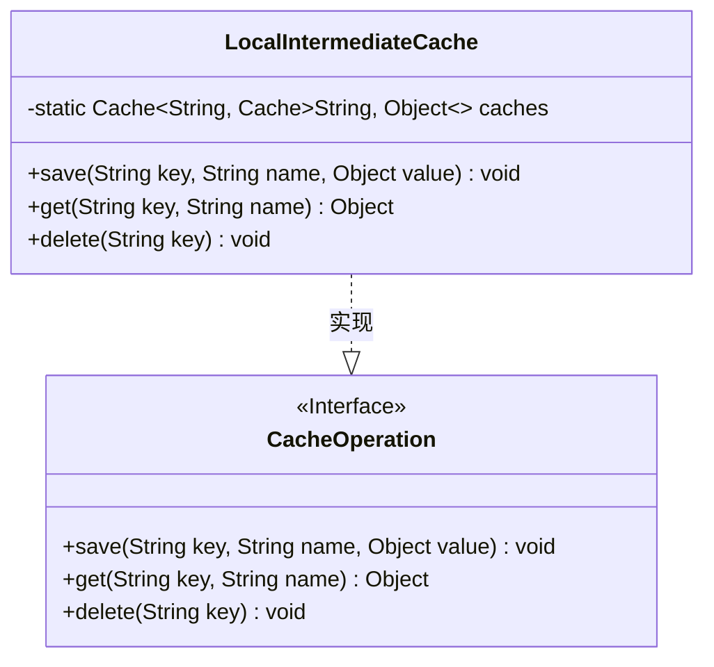
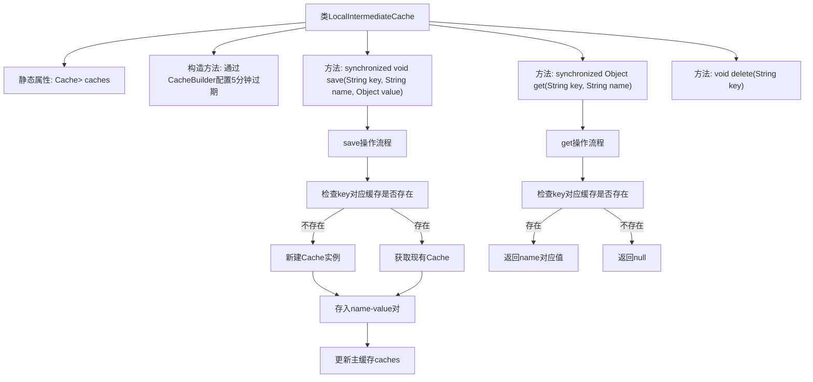

# 基础信息

|      |      |
|------|------|
| 名称 | LocalIntermediateCache |
| 编码语言 | .java |
| 代码路径 | WeFe/mpc/mpc-common/src/main/java/com/welab/wefe/mpc/cache/intermediate/impl/LocalIntermediateCache.java |
| 包名 | com.welab.wefe.mpc.cache.intermediate.impl |
| 依赖项 | ['java.util.concurrent.TimeUnit', 'com.google.common.cache.Cache', 'com.google.common.cache.CacheBuilder', 'com.welab.wefe.mpc.cache.intermediate.CacheOperation'] |
| 概述说明 | LocalIntermediateCache实现CacheOperation接口，使用嵌套Cache结构存储数据，支持5分钟未访问自动过期，提供同步的保存、获取方法，但删除方法未实现。 |

# 说明

LocalIntermediateCache类实现了CacheOperation接口，用于管理本地缓存。它使用两级缓存结构，外层缓存以字符串为键，存储内层缓存对象，内层缓存也以字符串为键存储实际值。外层缓存设置了5分钟访问过期策略。提供了同步的save方法用于保存键值对，get方法用于获取值，以及未实现的delete方法。保存数据时会检查并创建内层缓存实例。

# 类列表 Class Summary

| 名称   | 类型  | 说明 |
|-------|------|-------------|
| LocalIntermediateCache | class | LocalIntermediateCache类实现CacheOperation接口，使用Guava Cache构建二级缓存，支持同步保存和获取数据，默认5分钟过期。 |

## 类 LocalIntermediateCache

|      |      |
|------|------|
| 访问范围 | public |
| 类型 | class |
| 名称 | LocalIntermediateCache |
| 说明 | LocalIntermediateCache类实现CacheOperation接口，使用Guava Cache构建二级缓存，支持同步保存和获取数据，默认5分钟过期。 |

### UML类图

该代码实现了一个本地中间缓存系统，使用Guava Cache构建二级缓存结构。LocalIntermediateCache类实现了CacheOperation接口，通过静态Cache对象维护多个命名空间缓存（第一级key对应第二级Cache）。主要功能包括同步保存键值对(save)、获取缓存值(get)和删除缓存(delete)，其中第一级缓存设置5分钟访问过期策略。类图清晰展示了接口与实现类的关系，以及使用泛型定义的复杂缓存结构。

### 内部方法调用关系图

该流程图展示了LocalIntermediateCache类的核心结构和操作逻辑。类通过Guava Cache构建二级缓存结构，主缓存caches存储以key分组的子缓存。save方法采用同步机制确保线程安全，实现惰性初始化子缓存并维护两级缓存关系；get方法同样同步访问，仅当两级key均存在时才返回值。流程图清晰呈现了缓存命中和未命中时的不同处理路径，以及方法间的调用层级关系。

### 字段列表 Field List

| 名称  | 类型  | 说明 |
|-------|-------|------|
| caches = CacheBuilder.newBuilder().expireAfterAccess(5, TimeUnit.MINUTES).build() | Cache<String, Cache<String, Object>> | 定义了一个静态缓存对象，使用CacheBuilder构建，键为String，值为嵌套缓存，缓存项在5分钟未访问后自动过期。 |

### 方法列表

| 名称  | 类型  | 说明 |
|-------|-------|------|
| save | void | 同步方法保存键值对，若缓存不存在则新建并存储，最后更新主缓存。 |
| get | Object | 同步方法通过键和名称获取缓存值，存在则返回对应值，否则返回空。 |
| delete | void | 空方法：删除指定键值，未实现具体逻辑。 |

