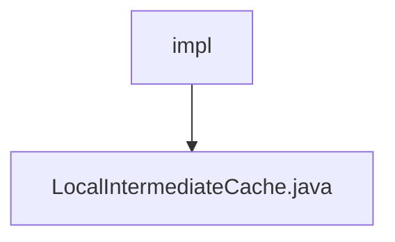

# 基础信息

|      |      |
|------|------|
| 名称 | impl |
| 编码语言 | .java |
| 代码路径 | WeFe/mpc/mpc-common/src/main/java/com/welab/wefe/mpc/cache/intermediate/impl |
| 包名 | docs.mpc.mpc-common.src.main.java.com.welab.wefe.mpc.cache.intermediate.impl |
| 概述说明 | LocalIntermediateCache实现CacheOperation接口，使用嵌套Cache结构存储数据，支持5分钟未访问自动过期，提供同步的保存、获取方法，但删除方法未实现。 |

# 说明

LocalIntermediateCache类实现了CacheOperation接口，用于管理本地缓存。它使用两级缓存结构，外层缓存以字符串为键，存储内层缓存对象，内层缓存也以字符串为键存储实际值。外层缓存设置了5分钟访问过期策略。提供了同步的save方法用于保存键值对，get方法用于获取值，以及未实现的delete方法。保存数据时会检查并创建内层缓存实例。

### 包内部结构视图

该流程图展示了WeFe项目中mpc-common模块的缓存实现结构。根节点"impl"表示中间缓存实现目录，其下包含一个具体实现文件"LocalIntermediateCache.java"，该文件实现了本地中间缓存功能。整个结构简洁明了，体现了单一实现类的模块化设计。

# 文件列表

| 名称   | 类型  | 说明 |
|-------|------|-------------|
| [LocalIntermediateCache.java](LocalIntermediateCache.md) | file | LocalIntermediateCache实现CacheOperation接口，使用嵌套Cache结构存储数据，支持5分钟未访问自动过期，提供同步的保存、获取方法，但删除方法未实现。 |

