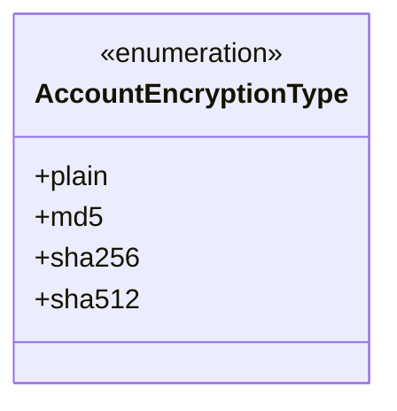
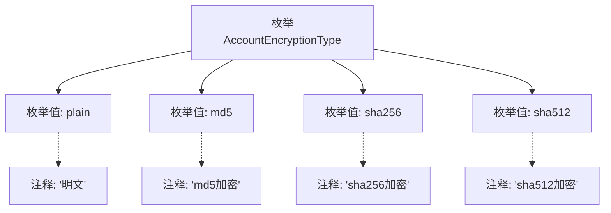

# 基础信息

|      |      |
|------|------|
| 名称 | AccountEncryptionType |
| 编码语言 | .java |
| 代码路径 | WeFe/mpc/mpc-common/src/main/java/com/welab/wefe/mpc/commom/AccountEncryptionType.java |
| 包名 | com.welab.wefe.mpc.commom |
| 依赖项 | [] |
| 概述说明 | 枚举定义账户加密类型：明文、md5、sha256、sha512。 |

# 说明

该枚举定义了账户密码的加密类型，包含四种选项：明文（plain）、MD5加密（md5）、SHA256加密（sha256）和SHA512加密（sha512）。每种类型均有对应的注释说明其加密方式。

# 类列表 Class Summary

| 名称   | 类型  | 说明 |
|-------|------|-------------|
| AccountEncryptionType | enum | 枚举AccountEncryptionType定义了四种账户加密类型：明文、md5、sha256和sha512。 |

## 类 AccountEncryptionType

|      |      |
|------|------|
| 访问范围 | public |
| 类型 | enum |
| 名称 | AccountEncryptionType |
| 说明 | 枚举AccountEncryptionType定义了四种账户加密类型：明文、md5、sha256和sha512。 |

### UML类图

这段代码定义了一个名为AccountEncryptionType的枚举类型，用于表示账户密码的不同加密方式。枚举包含四个值：plain表示明文存储，md5表示使用MD5算法加密，sha256表示使用SHA-256算法加密，sha512表示使用SHA-512算法加密。枚举类型通常用于定义一组固定的常量，这里通过枚举清晰地限定了可选的加密类型，便于在代码中统一管理和使用这些加密方式，同时避免了使用魔法字符串带来的潜在错误。

### 内部方法调用关系图

该流程图展示了AccountEncryptionType枚举的结构，包含四个枚举值(plain、md5、sha256、sha512)及其对应的注释说明。每个枚举值通过虚线连接其文档注释，清晰地呈现了不同加密类型的语义定义。这种设计常用于配置系统中表示可选的加密算法类型。

### 字段列表 Field List

| 名称  | 类型  | 说明 |
|-------|-------|------|

### 方法列表

| 名称  | 类型  | 说明 |
|-------|-------|------|

