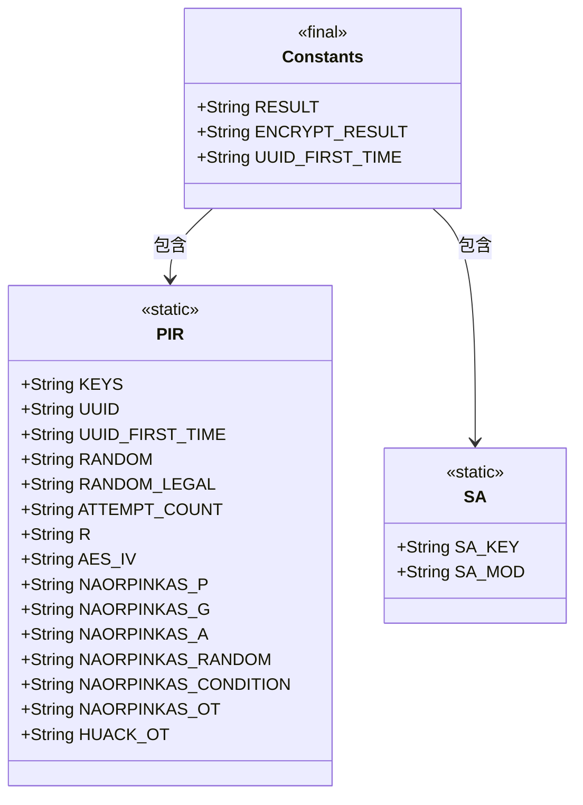

# 基础信息

|      |      |
|------|------|
| 名称 | Constants |
| 编码语言 | .java |
| 代码路径 | WeFe/mpc/mpc-common/src/main/java/com/welab/wefe/mpc/commom/Constants.java |
| 包名 | com.welab.wefe.mpc.commom |
| 依赖项 | [] |
| 概述说明 | 定义常量类Constants，包含RESULT、ENCRYPT_RESULT等通用常量，以及PIR和SA两个子类，分别存储隐私信息检索和安全计算相关的配置参数和密钥名称。 |

# 说明

该代码定义了一个名为Constants的Java类，包含多个静态常量字符串。主要分为三部分：顶层常量包括RESULT、ENCRYPT_RESULT和UUID_FIRST_TIME；PIR静态内部类包含与隐私信息检索相关的常量，如密钥、UUID、随机数、尝试次数、R值、AES初始化向量，以及Naor-Pinkas和Huack的OT协议相关参数；SA静态内部类定义了与安全计算相关的SA_KEY和SA_MOD常量。所有常量均以字符串形式存储配置或标识名称。

# 类列表 Class Summary

| 名称   | 类型  | 说明 |
|-------|------|-------------|
| Constants | class | Java类Constants定义了多个静态常量字符串，包括RESULT、ENCRYPT_RESULT等，并包含PIR和SA两个子类，分别定义相关常量如KEYS、UUID及SA_KEY、SA_MOD等。 |

## 类 Constants

|      |      |
|------|------|
| 访问范围 | public |
| 类型 | class |
| 名称 | Constants |
| 说明 | Java类Constants定义了多个静态常量字符串，包括RESULT、ENCRYPT_RESULT等，并包含PIR和SA两个子类，分别定义相关常量如KEYS、UUID及SA_KEY、SA_MOD等。 |

### UML类图

这段代码定义了一个`Constants`类，包含多个静态常量字符串，用于存储不同模块的配置键名。其中嵌套了两个静态内部类`PIR`和`SA`，分别用于隐私信息检索和安全计算模块的常量定义。类图展示了`Constants`作为容器类与两个内部类的包含关系，所有字段均为公有静态常量，符合工具类设计模式。该结构便于集中管理跨模块的配置键名，提高代码可维护性。

### 内部方法调用关系图

```mermaid
graph TD
    A["类Constants"]
    B["常量: RESULT = 'mpc_origin_result'"]
    C["常量: ENCRYPT_RESULT = 'mpc_encrypt_result'"]
    D["常量: UUID_FIRST_TIME = 'mpc_first_time'"]
    E["嵌套类PIR"]
    F["常量: KEYS = 'pir_keys'"]
    G["常量: UUID = 'pir_uuid'"]
    H["常量: UUID_FIRST_TIME = 'pir_time'"]
    I["常量: RANDOM = 'pir_random'"]
    J["常量: RANDOM_LEGAL = 'pir_random_legal'"]
    K["常量: ATTEMPT_COUNT = 'pir_attempt_count'"]
    L["常量: R = 'pir_r'"]
    M["常量: AES_IV = 'pir_iv'"]
    N["常量: NAORPINKAS_P = 'naorpinkas_p'"]
    O["常量: NAORPINKAS_G = 'naorpinkas_g'"]
    P["常量: NAORPINKAS_A = 'naorpinkas_a'"]
    Q["常量: NAORPINKAS_RANDOM = 'naorpinkas_random'"]
    R["常量: NAORPINKAS_CONDITION = 'naorpinkas_condition'"]
    S["常量: NAORPINKAS_OT = 'naorpinkas_ot'"]
    T["常量: HUACK_OT = 'huack_ot'"]
    U["嵌套类SA"]
    V["常量: SA_KEY = 'sa_key'"]
    W["常量: SA_MOD = 'sa_mod'"]

    A --> B
    A --> C
    A --> D
    A --> E
    E --> F
    E --> G
    E --> H
    E --> I
    E --> J
    E --> K
    E --> L
    E --> M
    E --> N
    E --> O
    E --> P
    E --> Q
    E --> R
    E --> S
    E --> T
    A --> U
    U --> V
    U --> W
```

该流程图展示了Constants类的结构，包含顶层常量和两个嵌套类PIR和SA。PIR类定义了与隐私信息检索相关的常量，如密钥、UUID、随机数和加密参数；SA类定义了与安全计算相关的常量。所有常量均为静态final字符串，用于全局配置和标识符管理。

### 字段列表 Field List

| 名称  | 类型  | 说明 |
|-------|-------|------|
| RESULT = "mpc_origin_result" | String | 定义静态常量RESULT，值为"mpc_origin_result"。 |
| UUID_FIRST_TIME = "mpc_first_time" | String | 静态常量字符串，标识首次使用状态，键名为"mpc_first_time"。 |
| ENCRYPT_RESULT = "mpc_encrypt_result" | String | 定义常量字符串ENCRYPT_RESULT，值为"mpc_encrypt_result"。 |

### 方法列表

| 名称  | 类型  | 说明 |
|-------|-------|------|

