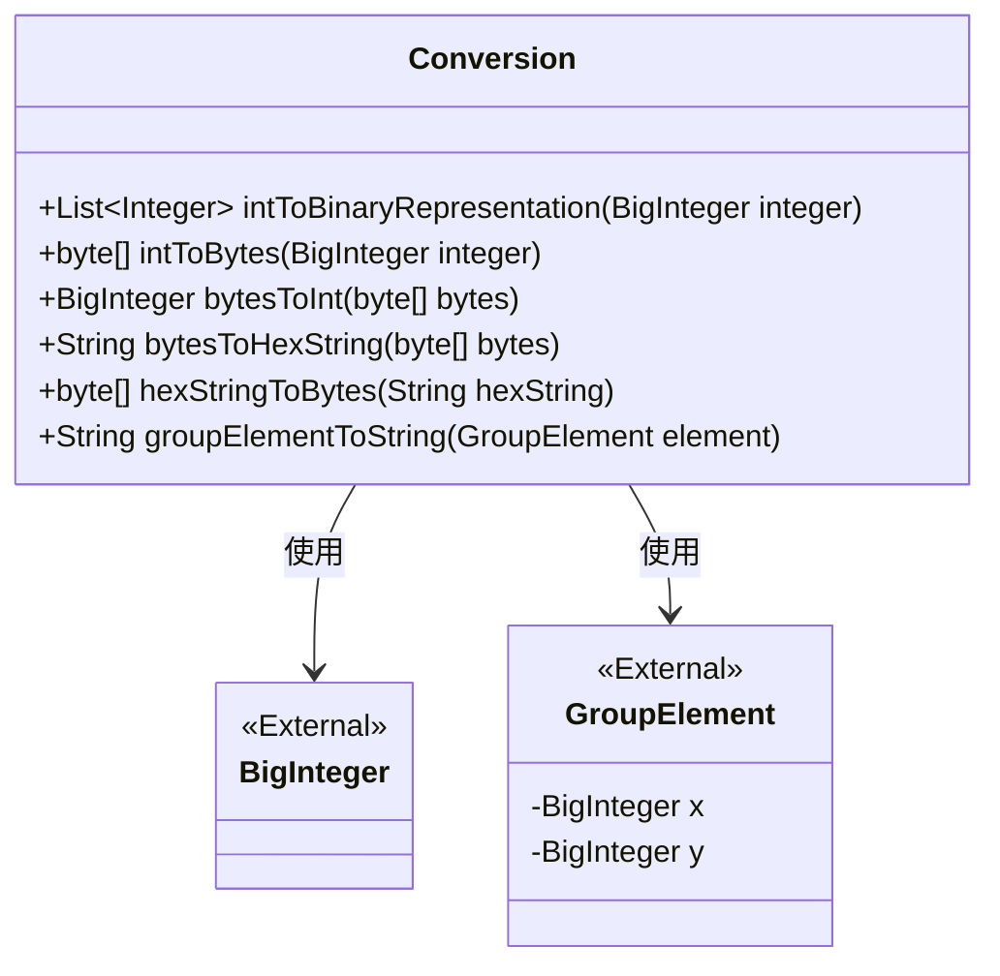
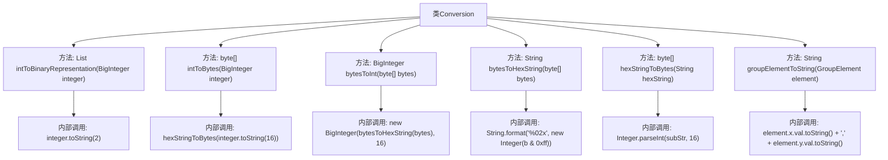

# 基础信息

|      |      |
|------|------|
| 名称 | Conversion |
| 编码语言 | .java |
| 代码路径 | WeFe/mpc/mpc-common/src/main/java/com/welab/wefe/mpc/commom/Conversion.java |
| 包名 | com.welab.wefe.mpc.commom |
| 依赖项 | ['com.welab.wefe.mpc.pir.protocol.nt.group.GroupElement', 'java.math.BigInteger', 'java.util.ArrayList', 'java.util.List'] |
| 概述说明 | Conversion类提供数值转换功能：整数转二进制指数列表、整数与字节数组互转、字节数组与十六进制字符串互转、群元素转字符串。 |

# 说明

Conversion类提供了多种数值转换方法。intToBinaryRepresentation将大整数转换为二进制表示并返回指数列表。intToBytes和bytesToInt实现大整数与字节数组的相互转换。bytesToHexString和hexStringToBytes处理字节数组与十六进制字符串的转换。groupElementToString将群元素转换为坐标字符串。所有方法都基于BigInteger处理大数值，确保精度和安全性。

# 类列表 Class Summary

| 名称   | 类型  | 说明 |
|-------|------|-------------|
| Conversion | class | Conversion类提供数值转换功能：整数转二进制位列表、整数与字节数组互转、字节数组与十六进制字符串互转、群元素转字符串。 |

## 类 Conversion

|      |      |
|------|------|
| 访问范围 | public |
| 类型 | class |
| 名称 | Conversion |
| 说明 | Conversion类提供数值转换功能：整数转二进制位列表、整数与字节数组互转、字节数组与十六进制字符串互转、群元素转字符串。 |

### UML类图

这段代码定义了一个名为`Conversion`的工具类，提供了多种数值转换方法。主要功能包括：将大整数转换为二进制表示（返回指数列表）、整数与字节数组互转、字节数组与十六进制字符串互转，以及将群元素对象转换为字符串。所有方法均为静态方法，不维护状态。该类依赖外部的`BigInteger`和`GroupElement`类，其中`GroupElement`包含x和y两个大整数字段。转换逻辑涉及位操作、基数转换和字符串处理，适用于密码学或数学计算场景。

### 内部方法调用关系图

这段代码展示了一个名为Conversion的工具类，提供了多种数据格式转换功能。主要包含二进制/十六进制字符串与整型/BigInteger之间的相互转换，以及字节数组与十六进制字符串的转换方法。流程图清晰地展示了类结构和方法间的调用关系，如intToBytes方法会调用hexStringToBytes，bytesToInt方法会依赖bytesToHexString等。所有方法都围绕数据格式转换这一核心功能展开，具有明确的输入输出类型和严谨的类型处理逻辑。

### 字段列表 Field List

| 名称  | 类型  | 说明 |
|-------|-------|------|

### 方法列表

| 名称  | 类型  | 说明 |
|-------|-------|------|
| bytesToHexString | String | 将字节数组转换为十六进制字符串，每个字节转为两位十六进制数拼接返回。 |
| bytesToInt | BigInteger | 将字节数组转换为十六进制字符串后转为大整数。 |
| intToBytes | byte[] | 将大整数转换为16进制字符串，再转为字节数组。 |
| intToBinaryRepresentation | List<Integer> | 将大整数转换为二进制表示，返回所有值为1的位对应的指数列表。 |
| hexStringToBytes | byte[] | 将16进制字符串转换为字节数组，空字符串返回空数组，每两个字符解析为一个字节。 |
| groupElementToString | String | 将GroupElement对象的x和y属性值转为字符串并用逗号连接。 |

