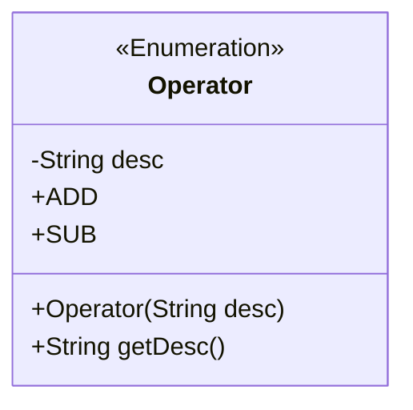
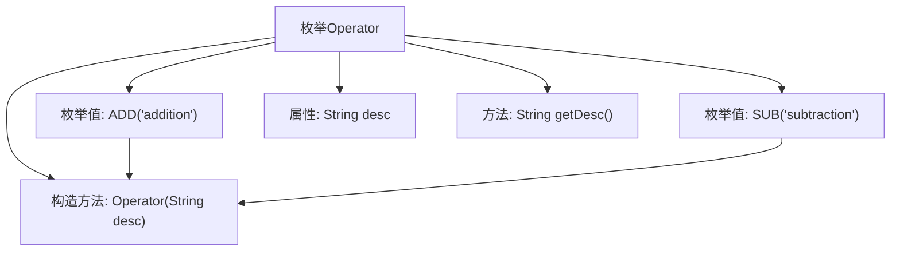

# 基础信息

|      |      |
|------|------|
| 名称 | Operator |
| 编码语言 | .java |
| 代码路径 | WeFe/mpc/mpc-common/src/main/java/com/welab/wefe/mpc/commom/Operator.java |
| 包名 | com.welab.wefe.mpc.commom |
| 依赖项 | [] |
| 概述说明 | 定义枚举Operator，包含ADD和SUB两个值，分别描述为addition和subtraction，提供获取描述的方法getDesc。 |

# 说明

该代码定义了一个名为Operator的枚举类型，包含两个枚举值ADD和SUB，分别表示加法和减法操作。每个枚举值都有一个描述字段desc，通过构造函数初始化。枚举还提供了一个getDesc方法用于获取描述信息。整个结构简洁地封装了操作符及其描述，便于在代码中引用和扩展。

# 类列表 Class Summary

| 名称   | 类型  | 说明 |
|-------|------|-------------|
| Operator | enum | 定义枚举Operator，包含ADD和SUB两个值，分别表示加法和减法，每个枚举值有描述字段desc并通过getDesc方法获取。 |

## 类 Operator

|      |      |
|------|------|
| 访问范围 | public |
| 类型 | enum |
| 名称 | Operator |
| 说明 | 定义枚举Operator，包含ADD和SUB两个值，分别表示加法和减法，每个枚举值有描述字段desc并通过getDesc方法获取。 |

### UML类图

这段类图展示了一个Java枚举类型`Operator`，它包含两个枚举值ADD和SUB，每个枚举值都有一个描述字符串desc。枚举类提供了构造方法`Operator(String desc)`来初始化描述信息，以及公有方法`getDesc()`用于获取描述。枚举类型在类图中用`<<Enumeration>>`标记，清晰地表示了这是一个有限的常量集合，适用于表示固定操作类型的场景。

### 内部方法调用关系图

该流程图描述了Operator枚举的结构，包含两个枚举值ADD和SUB，一个私有属性desc，一个构造方法用于初始化desc，以及一个获取desc的方法getDesc。枚举值通过构造方法初始化其描述信息，整体结构清晰展示了枚举的定义和使用方式。

### 字段列表 Field List

| 名称  | 类型  | 说明 |
|-------|-------|------|

### 方法列表

| 名称  | 类型  | 说明 |
|-------|-------|------|

