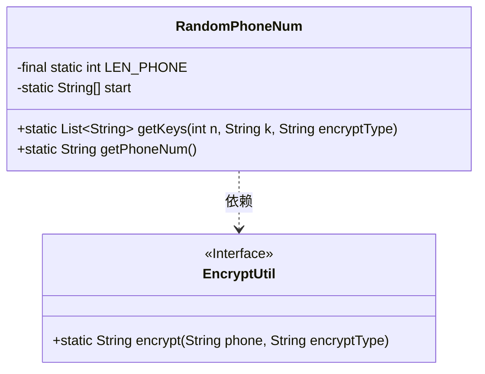
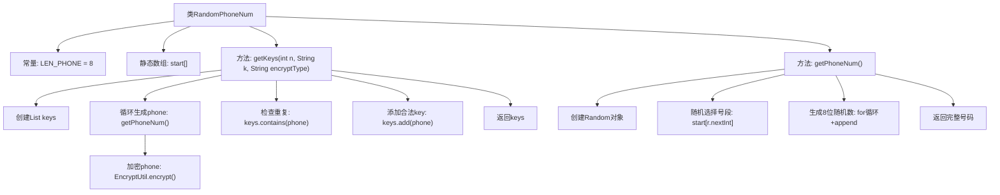

# 基础信息

|      |      |
|------|------|
| 名称 | RandomPhoneNum |
| 编码语言 | .java |
| 代码路径 | WeFe/mpc/mpc-common/src/main/java/com/welab/wefe/mpc/commom/RandomPhoneNum.java |
| 包名 | com.welab.wefe.mpc.commom |
| 依赖项 | ['com.welab.wefe.mpc.util.EncryptUtil', 'java.util.ArrayList', 'java.util.List', 'java.util.Random'] |
| 概述说明 | 生成随机手机号类，包含常见号段，可生成指定数量且不重复的加密号码。 |

# 说明

该代码定义了一个生成随机电话号码的工具类RandomPhoneNum。类中包含中国常见手机号段数组start，总长度为8位。提供两个方法：getPhoneNum()随机生成合法手机号，通过随机选择号段并拼接剩余数字；getKeys()生成指定数量n的加密后唯一手机号列表，使用EncryptUtil加密且排除重复值和指定值k。整个过程确保结果唯一性和加密处理。

# 类列表 Class Summary

| 名称   | 类型  | 说明 |
|-------|------|-------------|
| RandomPhoneNum | class | 生成随机手机号类，包含号段数组和生成方法，支持加密和去重。 |

## 类 RandomPhoneNum

|      |      |
|------|------|
| 访问范围 | public |
| 类型 | class |
| 名称 | RandomPhoneNum |
| 说明 | 生成随机手机号类，包含号段数组和生成方法，支持加密和去重。 |

### UML类图

这段代码描述了一个生成随机电话号码的工具类`RandomPhoneNum`，包含静态方法`getPhoneNum()`用于生成随机号码，以及`getKeys()`用于生成指定数量的加密号码列表。类中定义了合法的号段前缀数组`start`和固定号码长度`LEN_PHONE`。该类依赖`EncryptUtil`接口进行数据加密，通过泛型列表管理生成的号码。流程图展示了核心的类结构和依赖关系，突出了静态工具类的特性与加密功能的解耦设计。

### 内部方法调用关系图

该流程图展示了RandomPhoneNum类的核心功能：通过随机选择号段和生成8位随机数组合成手机号（getPhoneNum方法），再通过加密和去重处理批量生成指定数量的唯一加密号码（getKeys方法）。流程包含号段随机选择、数字生成、加密校验和结果集管理四个关键阶段，体现了从原始数据生成到安全处理的完整链路。

### 字段列表 Field List

| 名称  | 类型  | 说明 |
|-------|-------|------|
| LEN_PHONE = 8 | int | 定义常量LEN_PHONE值为8，表示电话号码长度。 |
| start = {            "130", "131", "132", "133", "134", "135", "136", "137", "138", "139",            "145", "147", "149",            "150", "151", "152", "153", "155", "156", "157", "158", "159",            "166",            "170", "171", "172", "173", "175", "176", "177", "178",            "180", "181", "182", "183", "184", "185", "186", "187", "188", "189",            "198", "199"} | String[] | 中国手机号段列表，包含130-199的部分运营商号段。 |

### 方法列表

| 名称  | 类型  | 说明 |
|-------|-------|------|
| getKeys | List<String> | 该方法生成n个不重复且不等于k的加密手机号列表。通过循环获取手机号并加密，跳过重复或等于k的值，直到收集满n个为止。返回结果列表。 |
| getPhoneNum | String | 生成随机手机号：随机选择号段后拼接8位数字，返回完整号码。 |

