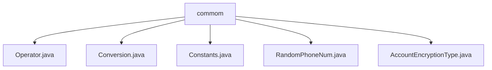

# 基础信息

|      |      |
|------|------|
| 名称 | commom |
| 编码语言 | .java |
| 代码路径 | WeFe/mpc/mpc-common/src/main/java/com/welab/wefe/mpc/commom |
| 包名 | docs.mpc.mpc-common.src.main.java.com.welab.wefe.mpc.commom |
| 概述说明 | Operator枚举定义加减操作及描述。Conversion类处理数值转换。Constants类存储静态配置。RandomPhoneNum生成随机加密手机号。AccountEncryptionType枚举密码加密方式。 |

# 说明

## 概述  
该模块核心职责是提供MPC（安全多方计算）基础工具集，包括操作符定义、数值转换、常量管理和随机数据生成等功能。接口规范涵盖枚举类型（如Operator和AccountEncryptionType）、工具类（如Conversion和RandomPhoneNum）及常量容器（Constants）。关键数据结构包含大整数（BigInteger）、二进制/十六进制数据、群元素坐标和加密手机号。外部依赖涉及加密工具（如AES）、OT协议（Naor-Pinkas/Huack）和哈希算法（MD5/SHA）。例如Operator枚举封装加减法操作，RandomPhoneNum生成加密手机号。

## 主要业务场景  
模块支持安全计算全流程，包括数据预处理（如数值转换）、协议参数配置（通过Constants常量）和隐私数据处理（如随机手机号生成）。交互模式类似工具链模式，各组件可独立调用。典型应用包括：数值格式转换（如intToBytes）、协议参数传递（如PIR常量）和测试数据生成（如getPhoneNum）。API类型涵盖枚举访问、静态方法调用和常量引用，例如通过AccountEncryptionType选择加密算法，或使用Conversion进行大数处理。

### 包内部结构视图

该流程图展示了WeFe项目中mpc-common模块的commom目录结构，包含5个Java类文件：Operator.java、Conversion.java、Constants.java、RandomPhoneNum.java和AccountEncryptionType.java。所有文件都直接位于commom目录下，没有更深层级的子目录结构。

# 文件列表

| 名称   | 类型  | 说明 |
|-------|------|-------------|
| [Operator.java](Operator.md) | file | 定义枚举Operator，包含ADD和SUB两个值，分别描述为addition和subtraction，提供获取描述的方法getDesc。 |
| [Conversion.java](Conversion.md) | file | Conversion类提供数值转换功能：整数转二进制指数列表、整数与字节数组互转、字节数组与十六进制字符串互转、群元素转字符串。 |
| [Constants.java](Constants.md) | file | 定义常量类Constants，包含RESULT、ENCRYPT_RESULT等通用常量，以及PIR和SA两个子类，分别存储隐私信息检索和安全计算相关的配置参数和密钥名称。 |
| [RandomPhoneNum.java](RandomPhoneNum.md) | file | 生成随机手机号类，包含常见号段，可生成指定数量且不重复的加密号码。 |
| [AccountEncryptionType.java](AccountEncryptionType.md) | file | 枚举定义账户加密类型：明文、md5、sha256、sha512。 |

