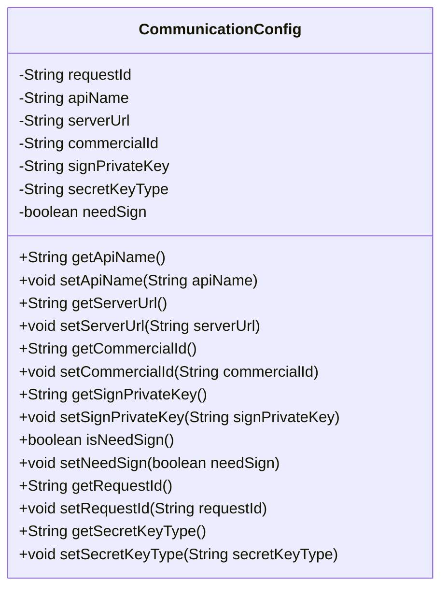

# 基础信息

|      |      |
|------|------|
| 名称 | CommunicationConfig |
| 编码语言 | .java |
| 代码路径 | WeFe/mpc/mpc-common/src/main/java/com/welab/wefe/mpc/config/CommunicationConfig.java |
| 包名 | com.welab.wefe.mpc.config |
| 依赖项 | ['java.util.UUID'] |
| 概述说明 | 通信配置类，包含请求ID、接口名、服务器地址、商户ID、签名私钥、密钥类型及签名开关等属性，提供各字段的getter和setter方法。 |

# 说明

CommunicationConfig类定义了通信配置参数，包含请求ID、接口名、服务器地址、商户ID、签名私钥、密钥类型和是否需要签名等属性。每个属性都有对应的getter和setter方法，请求ID默认生成无横线的UUID字符串。

# 类列表 Class Summary

| 名称   | 类型  | 说明 |
|-------|------|-------------|
| CommunicationConfig | class | 通信配置类，包含请求ID、接口名、服务器地址、商户ID、签名私钥、密钥类型及是否需签名等属性及对应getter/setter方法。 |

## 类 CommunicationConfig

|      |      |
|------|------|
| 访问范围 | public |
| 类型 | class |
| 名称 | CommunicationConfig |
| 说明 | 通信配置类，包含请求ID、接口名、服务器地址、商户ID、签名私钥、密钥类型及是否需签名等属性及对应getter/setter方法。 |

### UML类图

这段代码定义了一个名为CommunicationConfig的配置类，主要用于管理通信相关的配置信息。该类包含多个私有字段如requestId、apiName、serverUrl等，分别用于存储请求ID、接口名称、服务器地址等配置参数，并通过公有getter和setter方法提供对这些字段的访问和修改。其中requestId在初始化时会自动生成一个去除了连字符的UUID字符串，needSign字段默认值为true表示默认需要签名。这个类适用于需要动态配置通信参数的场景，如API调用时的基础配置管理。

### 内部方法调用关系图

```mermaid
graph TD
    A["类CommunicationConfig"]
    B["属性: String requestId = UUID生成"]
    C["属性: String apiName"]
    D["属性: String serverUrl"]
    E["属性: String commercialId"]
    F["属性: String signPrivateKey"]
    G["属性: String secretKeyType"]
    H["属性: boolean needSign = true"]
    I["方法: getApiName()"]
    J["方法: setApiName(String)"]
    K["方法: getServerUrl()"]
    L["方法: setServerUrl(String)"]
    M["方法: getCommercialId()"]
    N["方法: setCommercialId(String)"]
    O["方法: getSignPrivateKey()"]
    P["方法: setSignPrivateKey(String)"]
    Q["方法: isNeedSign()"]
    R["方法: setNeedSign(boolean)"]
    S["方法: getRequestId()"]
    T["方法: setRequestId(String)"]
    U["方法: getSecretKeyType()"]
    V["方法: setSecretKeyType(String)"]

    A --> B
    A --> C
    A --> D
    A --> E
    A --> F
    A --> G
    A --> H
    A --> I
    A --> J
    A --> K
    A --> L
    A --> M
    A --> N
    A --> O
    A --> P
    A --> Q
    A --> R
    A --> S
    A --> T
    A --> U
    A --> V
```

该流程图展示了CommunicationConfig类的完整结构，包含8个属性和14个方法。核心属性包括自动生成的requestId、接口配置参数(apiName/serverUrl)和签名相关字段(signPrivateKey/needSign等)。所有属性均配有getter/setter方法，其中requestId在初始化时通过UUID生成并移除横线，needSign默认值为true。类设计主要用于封装通信配置信息，支持动态修改各参数值。

### 字段列表 Field List

| 名称  | 类型  | 说明 |
|-------|-------|------|
| requestId = UUID.randomUUID().toString().replaceAll("-", "") | String | 生成唯一请求ID，去除UUID中的横线。 |
| commercialId | String | 声明一个私有字符串变量commercialId。 |
| signPrivateKey | String | 私有字符串变量，用于存储签名私钥。 |
| needSign = true | boolean | 布尔变量needSign初始化为true，表示需要签名。 |
| secretKeyType | String | 私有字符串变量，存储密钥类型信息。 |
| serverUrl | String | 私有字符串变量serverUrl，用于存储服务器URL地址。 |
| apiName | String | 私有字符串变量apiName |

### 方法列表

| 名称  | 类型  | 说明 |
|-------|-------|------|
| setServerUrl | void | 设置服务器URL的方法，将输入参数赋值给类的serverUrl变量。 |
| setNeedSign | void | 定义了一个公共方法setNeedSign，用于设置needSign属性的布尔值。 |
| setCommercialId | void | 设置商业ID的方法，将参数值赋给类的commercialId属性。 |
| getApiName | String | 获取API名称的方法，返回字符串类型变量apiName。 |
| getCommercialId | String | 获取商业ID的方法，返回字符串类型变量commercialId。 |
| setSignPrivateKey | void | 设置签名私钥的方法，将输入参数赋值给类成员变量signPrivateKey。 |
| setApiName | void | 这是一个Java方法，用于设置类的apiName属性值。方法接收一个字符串参数并赋值给成员变量。 |
| getSecretKeyType | String | 获取密钥类型的方法，返回secretKeyType字符串。 |
| setRequestId | void | 设置请求ID的方法，将传入的requestId赋值给当前对象的requestId属性。 |
| getSignPrivateKey | String | 该方法返回签名私钥字符串。 |
| getRequestId | String | 方法返回请求ID字符串。 |
| getServerUrl | String | 获取服务器URL的方法，直接返回成员变量serverUrl的值。 |
| isNeedSign | boolean | 方法isNeedSign返回布尔值needSign，表示是否需要签名。 |
| setSecretKeyType | void | 设置密钥类型的方法，将输入参数赋值给类的secretKeyType成员变量。 |

