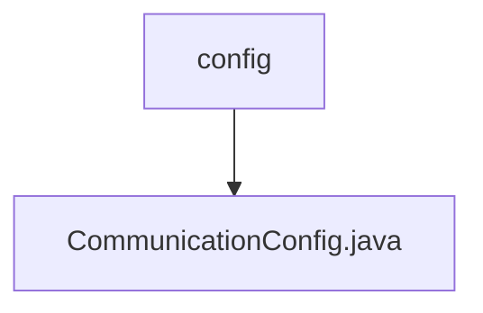

# 基础信息

|      |      |
|------|------|
| 名称 | config |
| 编码语言 | .java |
| 代码路径 | WeFe/mpc/mpc-common/src/main/java/com/welab/wefe/mpc/config |
| 包名 | docs.mpc.mpc-common.src.main.java.com.welab.wefe.mpc.config |
| 概述说明 | 通信配置类，包含请求ID、接口名、服务器地址、商户ID、签名私钥、密钥类型及签名开关等属性，提供各字段的getter和setter方法。 |

# 说明

CommunicationConfig类定义了通信配置参数，包含请求ID、接口名、服务器地址、商户ID、签名私钥、密钥类型和是否需要签名等属性。每个属性都有对应的getter和setter方法，请求ID默认生成无横线的UUID字符串。

### 包内部结构视图

该流程图展示了WeFe项目中mpc-common模块的配置目录结构。根节点为config文件夹，其下包含一个Java配置文件CommunicationConfig.java。这种结构是典型的小型模块配置目录布局，通常用于存放模块的通信配置相关类文件。

# 文件列表

| 名称   | 类型  | 说明 |
|-------|------|-------------|
| [CommunicationConfig.java](CommunicationConfig.md) | file | 通信配置类，包含请求ID、接口名、服务器地址、商户ID、签名私钥、密钥类型及签名开关等属性，提供各字段的getter和setter方法。 |

