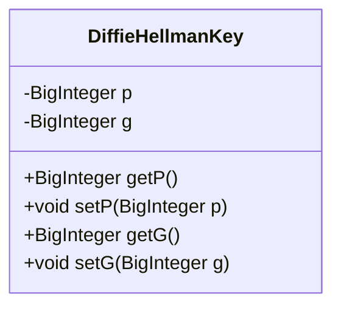
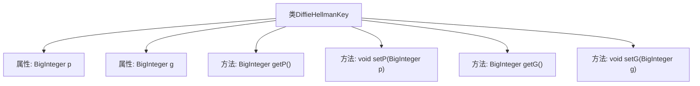

# 基础信息

|      |      |
|------|------|
| 名称 | DiffieHellmanKey |
| 编码语言 | .java |
| 代码路径 | WeFe/mpc/mpc-common/src/main/java/com/welab/wefe/mpc/key/DiffieHellmanKey.java |
| 包名 | com.welab.wefe.mpc.key |
| 依赖项 | ['java.math.BigInteger'] |
| 概述说明 | DiffieHellmanKey类包含BigInteger类型的p和g属性，提供对应的getter和setter方法。 |

# 说明

该代码定义了一个名为DiffieHellmanKey的Java类，用于实现Diffie-Hellman密钥交换协议。类中包含两个私有BigInteger类型成员变量p和g，分别代表素数模数和生成元。提供了四个公共方法：getP和setP用于获取和设置p的值，getG和setG用于获取和设置g的值。这些方法允许外部访问和修改这两个关键参数。整个类结构简洁，专注于存储和管理Diffie-Hellman算法所需的两个核心数值。

# 类列表 Class Summary

| 名称   | 类型  | 说明 |
|-------|------|-------------|
| DiffieHellmanKey | class | DiffieHellmanKey类包含私有变量p和g，分别表示素数和大数基数，提供对应的getter和setter方法。 |

## 类 DiffieHellmanKey

|      |      |
|------|------|
| 访问范围 | public |
| 类型 | class |
| 名称 | DiffieHellmanKey |
| 说明 | DiffieHellmanKey类包含私有变量p和g，分别表示素数和大数基数，提供对应的getter和setter方法。 |

### UML类图

该类图展示了一个DiffieHellmanKey类，用于实现Diffie-Hellman密钥交换算法。类中包含两个私有属性p和g（大素数及其原根），以及对应的getter和setter方法。p和g是密钥交换的核心参数，通过公有方法提供安全的访问和修改方式，确保密钥交换过程的数据封装性。

### 内部方法调用关系图

这段代码定义了一个DiffieHellmanKey类，用于实现Diffie-Hellman密钥交换协议。类中包含两个私有属性p和g（大素数及其原根），以及对应的getter和setter方法。流程图展示了类结构与成员关系，其中p和g作为核心参数可通过公共方法进行安全访问和修改，为密钥交换提供基础数据结构支持。

### 字段列表 Field List

| 名称  | 类型  | 说明 |
|-------|-------|------|
| g | BigInteger | 私有的大整数变量g。 |
| p | BigInteger | 声明一个私有的大整数变量p。 |

### 方法列表

| 名称  | 类型  | 说明 |
|-------|-------|------|
| getG | BigInteger | Java方法：返回BigInteger类型的变量g。 |
| setP | void | Java方法：设置BigInteger类型变量p的值。 |
| setG | void | Java方法：设置BigInteger类型变量g的值。 |
| getP | BigInteger | 方法getP返回BigInteger类型的变量p。 |

