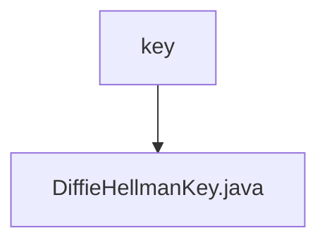

# 基础信息

|      |      |
|------|------|
| 名称 | key |
| 编码语言 | .java |
| 代码路径 | WeFe/mpc/mpc-common/src/main/java/com/welab/wefe/mpc/key |
| 包名 | docs.mpc.mpc-common.src.main.java.com.welab.wefe.mpc.key |
| 概述说明 | DiffieHellmanKey类包含BigInteger类型的p和g属性，提供对应的getter和setter方法。 |

# 说明

该代码定义了一个名为DiffieHellmanKey的Java类，用于实现Diffie-Hellman密钥交换协议。类中包含两个私有BigInteger类型成员变量p和g，分别代表素数模数和生成元。提供了四个公共方法：getP和setP用于获取和设置p的值，getG和setG用于获取和设置g的值。这些方法允许外部访问和修改这两个关键参数。整个类结构简洁，专注于存储和管理Diffie-Hellman算法所需的两个核心数值。

### 包内部结构视图

该流程图展示了WeFe项目中mpc-common模块下的密钥相关文件结构。根节点为key目录，其下包含一个具体的密钥实现文件DiffieHellmanKey.java。这种结构体现了模块化设计中密钥管理功能的单一职责原则，整个层级关系简洁清晰，符合密码学组件的典型目录布局。

# 文件列表

| 名称   | 类型  | 说明 |
|-------|------|-------------|
| [DiffieHellmanKey.java](DiffieHellmanKey.md) | file | DiffieHellmanKey类包含BigInteger类型的p和g属性，提供对应的getter和setter方法。 |

