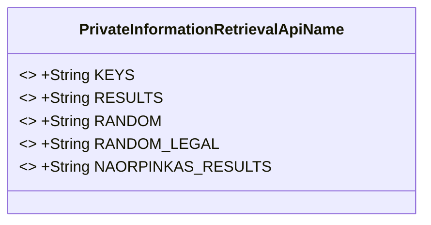
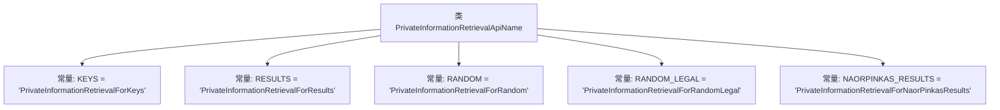

# 基础信息

|      |      |
|------|------|
| 名称 | PrivateInformationRetrievalApiName |
| 编码语言 | .java |
| 代码路径 | WeFe/mpc/mpc-common/src/main/java/com/welab/wefe/mpc/pir/PrivateInformationRetrievalApiName.java |
| 包名 | com.welab.wefe.mpc.pir |
| 依赖项 | [] |
| 概述说明 | 类PrivateInformationRetrievalApiName定义了五个常量字符串，分别用于密钥、结果、随机值、合法随机值及NaorPinkas结果的私有信息检索。 |

# 说明

该内容定义了一个名为PrivateInformationRetrievalApiName的公共类，包含五个静态常量字符串字段，分别表示不同类型的私有信息检索功能。具体包括：KEYS用于密钥检索，RESULTS用于结果检索，RANDOM用于随机检索，RANDOM_LEGAL用于合法随机检索，以及NAORPINKAS_RESULTS用于NaorPinkas算法结果检索。这些常量用于标识不同的私有信息检索操作类型。

# 类列表 Class Summary

| 名称   | 类型  | 说明 |
|-------|------|-------------|
| PrivateInformationRetrievalApiName | class | PrivateInformationRetrievalApiName类定义了五个常量字符串，分别用于密钥、结果、随机、合法随机及NaorPinkas结果的私有信息检索API名称。 |

## 类 PrivateInformationRetrievalApiName

|      |      |
|------|------|
| 访问范围 | public |
| 类型 | class |
| 名称 | PrivateInformationRetrievalApiName |
| 说明 | PrivateInformationRetrievalApiName类定义了五个常量字符串，分别用于密钥、结果、随机、合法随机及NaorPinkas结果的私有信息检索API名称。 |

### UML类图

该代码定义了一个包含多个公共静态常量的工具类，这些常量表示不同类型的私有信息检索API名称。每个常量都是final修饰的字符串，用于标识特定的私有信息检索服务类型，包括密钥检索、结果检索、随机检索、合法随机检索以及Naor-Pinkas结果检索。这种设计模式常用于集中管理API名称常量，提高代码可读性和可维护性。

### 内部方法调用关系图

这段代码定义了一个名为PrivateInformationRetrievalApiName的类，其中包含了五个静态常量字符串，分别表示不同的私有信息检索API名称。这些常量可能用于标识或引用特定的私有信息检索服务或功能模块。每个常量都使用public static final修饰，表明它们是公开的、不可修改的类级别常量。

### 字段列表 Field List

| 名称  | 类型  | 说明 |
|-------|-------|------|
| RANDOM = "PrivateInformationRetrievalForRandom" | String | 静态常量RANDOM，值为"PrivateInformationRetrievalForRandom"，用于表示随机私有信息检索。 |
| NAORPINKAS_RESULTS = "PrivateInformationRetrievalForNaorPinkasResults" | String | 该代码定义了一个静态常量字符串，用于表示NaorPinkas方案的私有信息检索结果标识。 |
| KEYS = "PrivateInformationRetrievalForKeys" | String | 静态常量KEYS定义为"PrivateInformationRetrievalForKeys"，用于密钥的私有信息检索。 |
| RESULTS = "PrivateInformationRetrievalForResults" | String | 定义常量RESULTS，值为"PrivateInformationRetrievalForResults"。 |
| RANDOM_LEGAL = "PrivateInformationRetrievalForRandomLegal" | String | 静态常量RANDOM_LEGAL存储字符串"PrivateInformationRetrievalForRandomLegal"，用于表示随机法律信息的私有检索。 |

### 方法列表

| 名称  | 类型  | 说明 |
|-------|-------|------|

