# 基础信息

|      |      |
|------|------|
| 名称 | pir |
| 编码语言 | .java |
| 代码路径 | WeFe/mpc/mpc-common/src/main/java/com/welab/wefe/mpc/pir |
| 包名 | docs.mpc.mpc-common.src.main.java.com.welab.wefe.mpc.pir |
| 概述说明 | 模块实现Naor-Pinkas协议的隐私信息检索，包含随机数、密钥、结果查询及验证接口。采用两阶段交互，支持动态条件组合和批量处理，应用于联邦学习。密码学基础体系提供数据验证、加密和传输功能，支持PIR和联合风控场景。抽象基类BasePrivateInformationRetrieval提供基础框架，定义uuid和初始化方法。PrivateInformationRetrievalApiName类定义五种检索操作类型常量。 |

# 说明

## 概述  
该模块构建了基于Naor-Pinkas协议的安全多方计算(MPC)体系，核心职责包括隐私信息检索(PIR)和基础密码学操作。通过两阶段交互实现加密查询与结果返回，支持Naor-Pinkas/Huack等OT协议。接口规范涵盖六类PIR操作（如QueryKeysRequest/RandomLegalRequest）和密码学基础API（如SymmetricKey/HauckObliviousTransfer）。关键数据结构包括会话标识(uuid)、模幂参数(s)、曲线点坐标和素数域元素，依赖JCE加密库和BigInteger。例如随机数响应采用挑战-响应机制，Ed25519曲线运算支持安全信封生成。

## 主要业务场景  
模块服务于联邦学习和联合风控场景，提供从基础哈希到高阶协议的完整操作链。PIR典型流程分三步：提交ID集合→验证随机数→提取加密结果，类似零知识证明机制。密码学操作链包括初始化密钥→执行加密/群运算→结果验证，类似有限域算术引擎。交互模式统一为对象化操作，如Galois域元素运算或AES-CBC加解密。API设计采用分层结构，例如NT协议组合素数域运算，attemptCount字段实现查询重试机制。

### 包内部结构视图

```mermaid
graph TD
    pir --> request
    pir --> protocol
    pir --> flow
    pir --> PrivateInformationRetrievalApiName.java
    request --> naor
    request --> QueryRandomResponse.java
    request --> QueryKeysResponse.java
    request --> QueryPIRResultsResponse.java
    request --> QueryRandomRequest.java
    request --> QueryRandomLegalResponse.java
    request --> QueryRandomLegalRequest.java
    request --> QueryKeysRequest.java
    request --> QueryPIRResultsRequest.java
    request --> BaseResponse.java
    naor --> QueryNaorPinkasRandomResponse.java
    naor --> QueryNaorPinkasRandomRequest.java
    naor --> QueryNaorPinkasResultResponse.java
    naor --> QueryNaorPinkasResultRequest.java
    protocol --> ro
    protocol --> nt
    protocol --> se
    protocol --> ot
    ro --> mac
    ro --> hf
    mac --> Sha256MAC.java
    mac --> HashBasedMessageAuthenticationCode.java
    mac --> MessageAuthenticationCode.java
    hf --> Sha256.java
    hf --> HashFunction.java
    nt --> field
    nt --> group
    field --> integers
    field --> GaloisFieldElement.java
    field --> GaloisFieldArithmetic.java
    integers --> IntegersModuloPrimeArithmetic.java
    integers --> IntegersModuloPrimeElement.java
    group --> cyclic
    group --> GroupArithmetic.java
    group --> GroupElement.java
    cyclic --> twisted
    cyclic --> CyclicGroupArithmetic.java
    cyclic --> CyclicGroupElement.java
    twisted --> TwistedEdwardsCurveArithmetic.java
    twisted --> TwistedEdwardsCurveElement.java
    se --> aes
    se --> SymmetricKey.java
    aes --> AESKey.java
    aes --> AESEncryptKey.java
    aes --> AESDecryptKey.java
    ot --> hauck
    ot --> ObliviousTransferKey.java
    ot --> ObliviousTransfer.java
    hauck --> HauckObliviousTransfer.java
    hauck --> HauckTarget.java
    flow --> BasePrivateInformationRetrieval.java
```

该流程图展示了WeFe项目中MPC模块的PIR（私有信息检索）功能目录结构。根节点为pir，下分request、protocol、flow三个主要子目录及一个独立文件。request目录包含多种查询请求/响应类文件及naor子目录；protocol目录结构最复杂，包含ro（随机预言机）、nt（数论）、se（对称加密）、ot（不经意传输）四个子协议实现；flow目录包含基础PIR实现类。整体呈现多层级树状结构，体现模块化加密协议实现。

# 文件列表

| 名称   | 类型  | 说明 |
|-------|------|-------------|
| [PrivateInformationRetrievalApiName.java](PrivateInformationRetrievalApiName.md) | file | 类PrivateInformationRetrievalApiName定义了五个常量字符串，分别用于密钥、结果、随机值、合法随机值及NaorPinkas结果的私有信息检索。 |
| [flow](flow/_module.md) | package | 抽象类BasePrivateInformationRetrieval包含uuid属性和ObliviousTransfer对象，提供设置uuid方法和抽象初始化方法initObliviousTransfer。 |
| [protocol](protocol/_module.md) | package | 1. 数据安全模块：提供MAC和哈希功能，用于数据真实性和完整性校验，依赖Java加密库。  2. 密码学运算模块：支持素数域和椭圆曲线运算，用于安全多方计算和零知识证明。  3. AES加密模块：实现密钥管理和加解密，支持自动IV生成和标准加密流程。  4. 茫然传输协议模块：基于椭圆曲线实现隐私数据传输，用于安全多方计算场景。 |
| [request](request/_module.md) | package | 该模块基于Naor-Pinkas协议实现隐私信息检索，包含随机数请求/响应和结果请求/响应四类操作，支持动态条件组合和批量结果返回，依赖JCE加密库和基础响应类。 |

