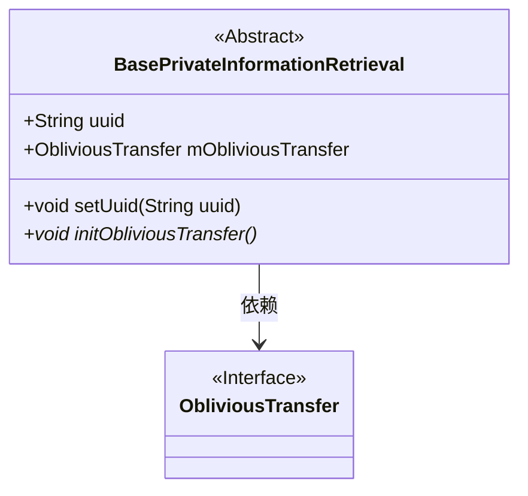
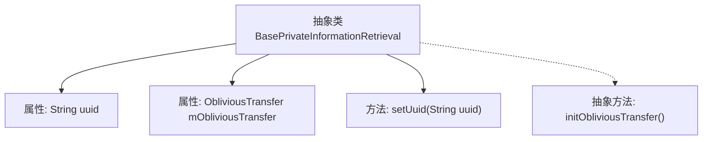

# 基础信息

|      |      |
|------|------|
| 名称 | BasePrivateInformationRetrieval |
| 编码语言 | .java |
| 代码路径 | WeFe/mpc/mpc-common/src/main/java/com/welab/wefe/mpc/pir/flow/BasePrivateInformationRetrieval.java |
| 包名 | com.welab.wefe.mpc.pir.flow |
| 依赖项 | ['com.welab.wefe.mpc.pir.protocol.ot.ObliviousTransfer'] |
| 概述说明 | 抽象类BasePrivateInformationRetrieval包含uuid属性和ObliviousTransfer对象，提供设置uuid方法和抽象初始化方法initObliviousTransfer。 |

# 说明

这是一个抽象基类BasePrivateInformationRetrieval，用于实现私有信息检索功能。它包含两个主要成员：一个字符串类型的uuid变量用于唯一标识，以及一个ObliviousTransfer类型的mObliviousTransfer对象。类中提供了setUuid方法用于设置uuid值，并声明了一个抽象方法initObliviousTransfer，该方法需要子类实现以完成初始化操作。整个类为私有信息检索功能提供了基础框架。

# 类列表 Class Summary

| 名称   | 类型  | 说明 |
|-------|------|-------------|
| BasePrivateInformationRetrieval | class | 抽象类BasePrivateInformationRetrieval包含uuid属性和mObliviousTransfer对象，提供设置uuid的方法和初始化抽象方法。 |

## 类 BasePrivateInformationRetrieval

|      |      |
|------|------|
| 访问范围 | public abstract |
| 类型 | class |
| 名称 | BasePrivateInformationRetrieval |
| 说明 | 抽象类BasePrivateInformationRetrieval包含uuid属性和mObliviousTransfer对象，提供设置uuid的方法和初始化抽象方法。 |

### UML类图

这段类图描述了一个抽象基类BasePrivateInformationRetrieval及其与ObliviousTransfer接口的关系。抽象类包含公有字段uuid和mObliviousTransfer，其中后者是一个接口类型。类中定义了设置uuid的公有方法setUuid()，以及需要子类实现的抽象初始化方法initObliviousTransfer()。箭头表示BasePrivateInformationRetrieval依赖于ObliviousTransfer接口，体现了该抽象类通过接口进行解耦的设计思想。

### 内部方法调用关系图

该流程图展示了抽象类BasePrivateInformationRetrieval的结构，包含两个属性（uuid和mObliviousTransfer）和两个方法（setUuid和抽象方法initObliviousTransfer）。虚线箭头表示抽象方法的特殊性质，表明该方法需要子类实现。整个结构清晰地反映了类的成员组成和继承关系，为理解该类提供了直观的可视化表示。

### 字段列表 Field List

| 名称  | 类型  | 说明 |
|-------|-------|------|
| mObliviousTransfer | ObliviousTransfer | 类成员变量mObliviousTransfer，类型为ObliviousTransfer。 |
| uuid | String | 公共字符串变量uuid，用于存储唯一标识符。 |

### 方法列表

| 名称  | 类型  | 说明 |
|-------|-------|------|
| setUuid | void | 这是一个Java方法，用于设置对象的uuid属性值。方法接受一个字符串参数uuid，并将其赋值给对象的uuid成员变量。 |
| initObliviousTransfer | void | 抽象方法，初始化不经意传输协议。 |

