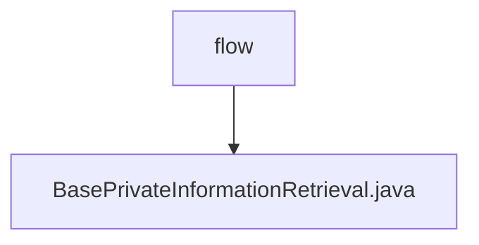

# 基础信息

|      |      |
|------|------|
| 名称 | flow |
| 编码语言 | .java |
| 代码路径 | WeFe/mpc/mpc-common/src/main/java/com/welab/wefe/mpc/pir/flow |
| 包名 | docs.mpc.mpc-common.src.main.java.com.welab.wefe.mpc.pir.flow |
| 概述说明 | 抽象类BasePrivateInformationRetrieval包含uuid属性和ObliviousTransfer对象，提供设置uuid方法和抽象初始化方法initObliviousTransfer。 |

# 说明

这是一个抽象基类BasePrivateInformationRetrieval，用于实现私有信息检索功能。它包含两个主要成员：一个字符串类型的uuid变量用于唯一标识，以及一个ObliviousTransfer类型的mObliviousTransfer对象。类中提供了setUuid方法用于设置uuid值，并声明了一个抽象方法initObliviousTransfer，该方法需要子类实现以完成初始化操作。整个类为私有信息检索功能提供了基础框架。

### 包内部结构视图

该流程图展示了WeFe项目中mpc-common模块的PIR流程结构，其中flow目录包含一个基础私有信息检索类文件。层级关系简洁明了，flow作为父节点，BasePrivateInformationRetrieval作为其唯一子节点，体现了该模块的核心功能实现位置。

# 文件列表

| 名称   | 类型  | 说明 |
|-------|------|-------------|
| [BasePrivateInformationRetrieval.java](BasePrivateInformationRetrieval.md) | file | 抽象类BasePrivateInformationRetrieval包含uuid属性和ObliviousTransfer对象，提供设置uuid方法和抽象初始化方法initObliviousTransfer。 |

