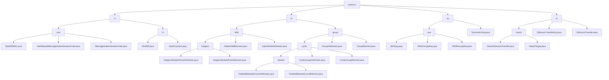

# 基础信息

|      |      |
|------|------|
| 名称 | protocol |
| 编码语言 | .java |
| 代码路径 | WeFe/mpc/mpc-common/src/main/java/com/welab/wefe/mpc/pir/protocol |
| 包名 | docs.mpc.mpc-common.src.main.java.com.welab.wefe.mpc.pir.protocol |
| 概述说明 | 1. 数据安全模块：提供MAC和哈希功能，用于数据真实性和完整性校验，依赖Java加密库。  2. 密码学运算模块：支持素数域和椭圆曲线运算，用于安全多方计算和零知识证明。  3. AES加密模块：实现密钥管理和加解密，支持自动IV生成和标准加密流程。  4. 茫然传输协议模块：基于椭圆曲线实现隐私数据传输，用于安全多方计算场景。 |

# 说明

## 概述  
该模块构成安全多方计算(MPC)的密码学基础体系，核心职责包括数据安全验证（MAC/哈希）、基础运算（素数域/椭圆曲线）、对称加密（AES）和隐私传输（茫然传输）。采用分层设计模式，如MAC的三层继承结构、SymmetricKey接口规范等。关键数据结构涵盖密钥字节数组、曲线点坐标、素数域元素等，依赖Java加密库和BigInteger。例如Sha256MAC实现认证码生成，TwistedEdwardsCurveElement支持Ed25519曲线运算，AESKey管理CBC模式加解密。

## 主要业务场景  
模块服务于隐私信息检索(PIR)和联合风控等场景，提供完整密码学操作链。典型流程包括：初始化密钥/参数→执行加密或群运算→结果验证传输。例如NT协议组合素数域和曲线运算，类似有限域算术引擎；茫然传输通过ObliviousTransferKey实现密钥分发，类似零知识证明机制。交互模式统一为对象化操作，如Galois域元素运算或SymmetricKey加解密。API覆盖从基础哈希到高阶协议，如HauckObliviousTransfer支持安全信封生成，AES加密自动处理IV补全。

### 包内部结构视图

该流程图展示了MPC协议模块的完整层级结构，从顶层protocol目录开始，向下展开ro、nt、se、ot四个子模块。每个子模块进一步细分：ro包含mac和hf加密组件，nt包含field和group数学运算模块，se包含aes对称加密实现，ot包含hauck协议实现。最底层为具体的Java实现类文件，共包含23个节点，完整呈现了协议模块的技术架构。

# 文件列表

| 名称   | 类型  | 说明 |
|-------|------|-------------|
| [ro](ro/_module.md) | package | 模块1实现基于哈希的消息认证码功能，采用三层继承结构支持数据完整性验证，依赖Java加密库生成认证码。模块2提供SHA-256哈希计算服务，通过接口分离设计实现可扩展的摘要功能，适用于数据校验等场景。 |
| [ot](ot/_module.md) | package | 该模块实现基于扭曲爱德华曲线的茫然传输协议，核心类提供密码学安全操作，支持隐私信息检索场景，包含密钥管理和目标生成功能。 |
| [se](se/_module.md) | package | AES对称加密模块，含密钥管理、加解密功能，支持自动IV生成和严格匹配，适用于隐私保护场景。依赖Java加密扩展，遵循SymmetricKey接口规范。 |
| [nt](nt/_module.md) | package | 模块1实现素数域算术运算，支持四则运算及扩展操作，应用于安全多方计算。模块2提供扭曲爱德华兹曲线群运算，支持点运算和编解码，专用于隐私计算场景。两者均依赖Galois域运算。 |

