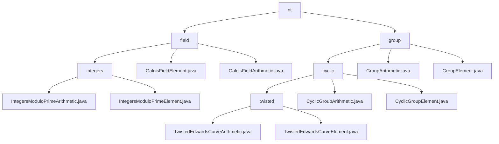

# 基础信息

|      |      |
|------|------|
| 名称 | nt |
| 编码语言 | .java |
| 代码路径 | WeFe/mpc/mpc-common/src/main/java/com/welab/wefe/mpc/pir/protocol/nt |
| 包名 | docs.mpc.mpc-common.src.main.java.com.welab.wefe.mpc.pir.protocol.nt |
| 概述说明 | 模块1实现素数域算术运算，支持四则运算及扩展操作，应用于安全多方计算。模块2提供扭曲爱德华兹曲线群运算，支持点运算和编解码，专用于隐私计算场景。两者均依赖Galois域运算。 |

# 说明

## 概述  
该模块实现密码学基础运算体系，包含素数域算术和椭圆曲线群运算两大核心组件。GaloisFieldElement提供素数域运算（如模逆/快速幂），TwistedEdwardsCurveElement支持曲线点运算（如标量乘法/坐标转换），两者均依赖BigInteger处理大数运算。关键数据结构包括带模数的域元素类、含x/y坐标的曲线点类，以及抽象运算器基类。例如素数域采用Tonelli-Shanks算法开平方，曲线运算默认使用2²⁵⁵-19域参数，类似密码学库的底层实现。

## 主要业务场景  
模块服务于安全多方计算场景，支撑隐私信息检索（PIR）和零知识证明等协议。典型流程为：初始化域/群元素→执行加密运算（如模幂或倍点）→结果序列化传输。例如NT协议组合使用素数域算术和曲线群运算，类似构建有限域算术引擎。完整API覆盖从基础四则运算到高阶密码学操作，如通过CyclicGroupArithmetic实现高效倍点运算，支持自定义曲线参数或默认Ed25519参数。交互模式均基于Galois域运算对象，确保计算过程符合代数约束。

### 包内部结构视图

该流程图展示了WeFe项目中MPC协议模块的目录结构，从nt根目录开始，分为field和group两大分支。field下包含整数运算和伽罗瓦域运算相关实现，group下则包含循环群及其扭曲爱德华曲线等群运算实现。每个子目录都包含对应的算术运算和元素类实现文件，层级清晰，共14个节点。

# 文件列表

| 名称   | 类型  | 说明 |
|-------|------|-------------|
| [group](group/_module.md) | package | 该模块实现扭曲爱德华兹曲线群运算，提供点加、标量乘及编解码功能，用于隐私计算如PIR协议，支持自定义参数和默认运算。 |
| [field](field/_module.md) | package | 该模块实现素数域算术运算，支持加减乘除、幂运算和开平方等操作，用于安全多方计算和密码学场景。核心类包括域元素和运算器，依赖BigInteger类。适用于隐私信息检索和零知识证明协议。 |

