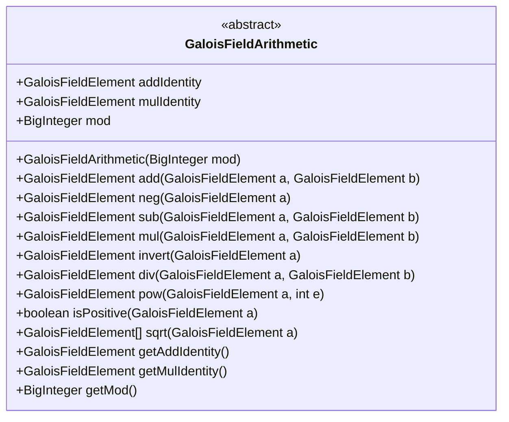

# 基础信息

|      |      |
|------|------|
| 名称 | GaloisFieldArithmetic |
| 编码语言 | .java |
| 代码路径 | WeFe/mpc/mpc-common/src/main/java/com/welab/wefe/mpc/pir/protocol/nt/field/GaloisFieldArithmetic.java |
| 包名 | com.welab.wefe.mpc.pir.protocol.nt.field |
| 依赖项 | ['java.math.BigInteger'] |
| 概述说明 | 抽象类GaloisFieldArithmetic定义伽罗瓦域算术运算，包含加减乘除、幂、开方等抽象方法及模数、单位元属性。 |

# 说明

该抽象类定义了伽罗瓦域算术运算的基本结构，包含加法单位元、乘法单位元和模数属性。提供加法、取反、减法、乘法、求逆、除法、幂运算、判断正数及开平方等抽象方法，并封装了获取单位元和模数的具体方法。所有运算均在指定模数下进行，要求子类实现具体域运算逻辑。

# 类列表 Class Summary

| 名称   | 类型  | 说明 |
|-------|------|-------------|
| GaloisFieldArithmetic | class | 抽象类GaloisFieldArithmetic定义了伽罗瓦域算术运算，包含加法、乘法、取反等抽象方法，以及模数、单位元等属性。 |

## 类 GaloisFieldArithmetic

|      |      |
|------|------|
| 访问范围 | public abstract |
| 类型 | class |
| 名称 | GaloisFieldArithmetic |
| 说明 | 抽象类GaloisFieldArithmetic定义了伽罗瓦域算术运算，包含加法、乘法、取反等抽象方法，以及模数、单位元等属性。 |

### UML类图

该抽象类定义了伽罗瓦域算术运算的基本结构，包含加法/乘法单位元、模数等属性，以及加减乘除、求逆、幂运算等抽象方法。类图清晰地展示了其抽象性质、公有属性和方法签名，为具体实现类提供了运算框架。所有方法均为公开抽象操作，需由子类实现具体域运算逻辑。

### 内部方法调用关系图

```mermaid
graph TD
    A["抽象类GaloisFieldArithmetic"]
    B["属性: GaloisFieldElement addIdentity"]
    C["属性: GaloisFieldElement mulIdentity"]
    D["属性: BigInteger mod"]
    E["构造方法: GaloisFieldArithmetic(BigInteger mod)"]
    F["抽象方法: add(GaloisFieldElement a, GaloisFieldElement b)"]
    G["抽象方法: neg(GaloisFieldElement a)"]
    H["抽象方法: sub(GaloisFieldElement a, GaloisFieldElement b)"]
    I["抽象方法: mul(GaloisFieldElement a, GaloisFieldElement b)"]
    J["抽象方法: invert(GaloisFieldElement a)"]
    K["抽象方法: div(GaloisFieldElement a, GaloisFieldElement b)"]
    L["抽象方法: pow(GaloisFieldElement a, int e)"]
    M["抽象方法: isPositive(GaloisFieldElement a)"]
    N["抽象方法: sqrt(GaloisFieldElement a)"]
    O["具体方法: getAddIdentity()"]
    P["具体方法: getMulIdentity()"]
    Q["具体方法: getMod()"]

    A --> B
    A --> C
    A --> D
    A --> E
    A --> F
    A --> G
    A --> H
    A --> I
    A --> J
    A --> K
    A --> L
    A --> M
    A --> N
    A --> O
    A --> P
    A --> Q
```

这段代码定义了一个抽象类GaloisFieldArithmetic，用于实现伽罗瓦域（有限域）上的算术运算。该类包含3个属性（加法单位元、乘法单位元和模数）、1个构造方法和12个方法（其中9个是抽象方法，3个是具体方法）。抽象方法需要子类实现，包括加法、取负、减法、乘法、求逆、除法、幂运算、判断正性和开平方运算。具体方法用于获取单位元和模数。该设计为不同类型的伽罗瓦域运算提供了统一的接口规范。

### 字段列表 Field List

| 名称  | 类型  | 说明 |
|-------|-------|------|
| addIdentity | GaloisFieldElement | GaloisFieldElement类型的加法单位元。 |
| mulIdentity | GaloisFieldElement | 伽罗瓦域元素的乘法单位元。 |
| mod | BigInteger | 定义了一个名为mod的BigInteger类型公共变量。 |

### 方法列表

| 名称  | 类型  | 说明 |
|-------|-------|------|
| sub | GaloisFieldElement | 抽象方法：GaloisFieldElement类的sub方法，用于计算两个伽罗瓦域元素的减法。 |
| getAddIdentity | GaloisFieldElement | 获取加法单位元的方法，返回addIdentity字段。 |
| sqrt | GaloisFieldElement[] | 抽象方法：计算伽罗瓦域元素的平方根，返回结果数组。 |
| neg | GaloisFieldElement | 抽象方法：GaloisFieldElement neg(GaloisFieldElement a)，用于计算伽罗瓦域元素的加法逆元。 |
| invert | GaloisFieldElement | 抽象方法：GaloisFieldElement invert(GaloisFieldElement a)，用于求伽罗瓦域元素的乘法逆元。 |
| mul | GaloisFieldElement | 抽象方法：伽罗瓦域元素乘法，输入两个元素a和b，返回它们的乘积。 |
| add | GaloisFieldElement | 抽象方法：GaloisFieldElement的加法运算，参数为两个Galois域元素a和b。 |
| getMulIdentity | GaloisFieldElement | 获取乘法单位元的方法，返回mulIdentity字段值。 |
| div | GaloisFieldElement | 抽象方法，用于伽罗瓦域元素的除法运算，参数为两个元素a和b。 |
| isPositive | boolean | 抽象方法，判断伽罗瓦域元素a是否为正数。 |
| pow | GaloisFieldElement | 抽象方法：GaloisFieldElement的幂运算，参数为元素a和指数e。 |
| getMod | BigInteger | 获取mod值的方法，返回BigInteger类型。 |

