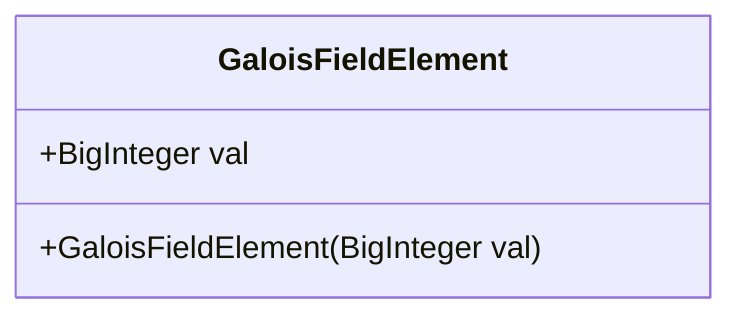
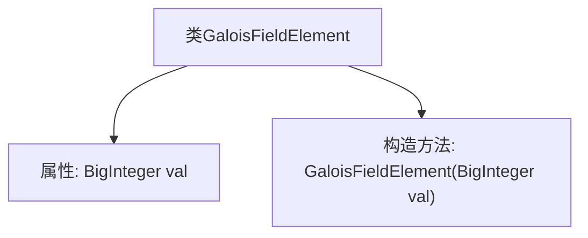

# 基础信息

|      |      |
|------|------|
| 名称 | GaloisFieldElement |
| 编码语言 | .java |
| 代码路径 | WeFe/mpc/mpc-common/src/main/java/com/welab/wefe/mpc/pir/protocol/nt/field/GaloisFieldElement.java |
| 包名 | com.welab.wefe.mpc.pir.protocol.nt.field |
| 依赖项 | ['java.math.BigInteger'] |
| 概述说明 | GaloisFieldElement类用BigInteger存储域元素值，构造函数初始化该值。 |

# 说明

该内容定义了一个名为GaloisFieldElement的公开类，用于表示伽罗瓦域中的元素。类中包含一个公开的BigInteger类型成员变量val，用于存储域元素的值。类提供了一个构造函数，接受一个BigInteger参数来初始化val。该结构简洁地封装了伽罗瓦域元素的核心数值表示。

# 类列表 Class Summary

| 名称   | 类型  | 说明 |
|-------|------|-------------|
| GaloisFieldElement | class | GaloisFieldElement类表示伽罗瓦域元素，包含一个BigInteger类型的val字段，通过构造函数初始化val值。 |

## 类 GaloisFieldElement

|      |      |
|------|------|
| 访问范围 | public |
| 类型 | class |
| 名称 | GaloisFieldElement |
| 说明 | GaloisFieldElement类表示伽罗瓦域元素，包含一个BigInteger类型的val字段，通过构造函数初始化val值。 |

### UML类图

这段类图描述了一个简单的GaloisFieldElement类，用于表示伽罗瓦域（有限域）中的元素。该类包含一个公开的BigInteger类型字段val存储元素值，以及一个公有构造函数用于初始化该值。Gal罗瓦域在密码学和纠错编码中有重要应用，该类的设计为后续实现域运算（如加法、乘法）提供了基础数据结构。类图清晰地展示了该类的单一职责——封装域元素的值。

### 内部方法调用关系图

该流程图描述了GaloisFieldElement类的结构，包含一个BigInteger类型的属性val和一个构造方法。构造方法用于初始化val属性，整个类用于表示伽罗瓦域（有限域）中的元素。流程图中清晰展示了类与成员之间的从属关系，符合简单数据封装模式的设计。

### 字段列表 Field List

| 名称  | 类型  | 说明 |
|-------|-------|------|
| val | BigInteger | 定义了一个公开的大整数变量val。 |

### 方法列表

| 名称  | 类型  | 说明 |
|-------|-------|------|

