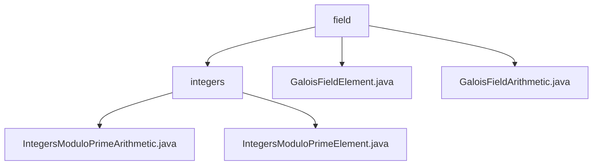

# 基础信息

|      |      |
|------|------|
| 名称 | field |
| 编码语言 | .java |
| 代码路径 | WeFe/mpc/mpc-common/src/main/java/com/welab/wefe/mpc/pir/protocol/nt/field |
| 包名 | docs.mpc.mpc-common.src.main.java.com.welab.wefe.mpc.pir.protocol.nt.field |
| 概述说明 | 该模块实现素数域算术运算，支持加减乘除、幂运算和开平方等操作，用于安全多方计算和密码学场景。核心类包括域元素和运算器，依赖BigInteger类。适用于隐私信息检索和零知识证明协议。 |

# 说明

## 概述  
该模块实现伽罗瓦域（素数域）的算术运算体系，核心职责是提供素数域上的数学运算和元素表示。接口规范包括元素构造、基本四则运算（add/subtract/multiply/divide）和扩展运算（negate/invert/pow/sqrt），通过GaloisFieldElement封装元素值，GaloisFieldArithmetic抽象类定义运算逻辑。关键数据结构为元素类（存储BigInteger值）和运算器类（维护模数属性）。外部依赖仅BigInteger类。例如求逆运算类似分数约分，开平方采用Tonelli-Shanks算法，类似密码学库的素数域实现。

## 主要业务场景  
模块支撑安全多方计算中的加密协议，典型应用于隐私信息检索和零知识证明。交互模式为运算器处理元素对象，例如通过模数约束确保结果有效性（类似抽象代数库）。完整API覆盖基础运算到高阶操作，如快速模幂和元素求逆。集成案例见于NT协议的字段计算层，构成类似有限域算术引擎的核心组件，支持多方安全计算场景下的隐私数据操作。

### 包内部结构视图

该流程图展示了MPC协议中NT字段相关的类结构。顶层是field目录，包含integers子目录和两个GaloisField相关类文件。integers目录下包含两个整数模素数运算相关的实现类，分别处理算术运算和元素表示。整个结构清晰地反映了密码学协议中字段运算的模块化设计。

# 文件列表

| 名称   | 类型  | 说明 |
|-------|------|-------------|
| [GaloisFieldElement.java](GaloisFieldElement.md) | file | GaloisFieldElement类用BigInteger存储域元素值，构造函数初始化该值。 |
| [GaloisFieldArithmetic.java](GaloisFieldArithmetic.md) | file | 抽象类GaloisFieldArithmetic定义伽罗瓦域算术运算，包含加减乘除、幂、开方等抽象方法及模数、单位元属性。 |
| [integers](integers/_module.md) | package | IntegersModuloPrimeArithmetic类实现素数模整数运算，包括加减乘除等基本运算和Tonelli-Shanks平方根算法。IntegersModuloPrimeElement类表示素数模整数域元素，提供构造函数和值校正功能。 |

